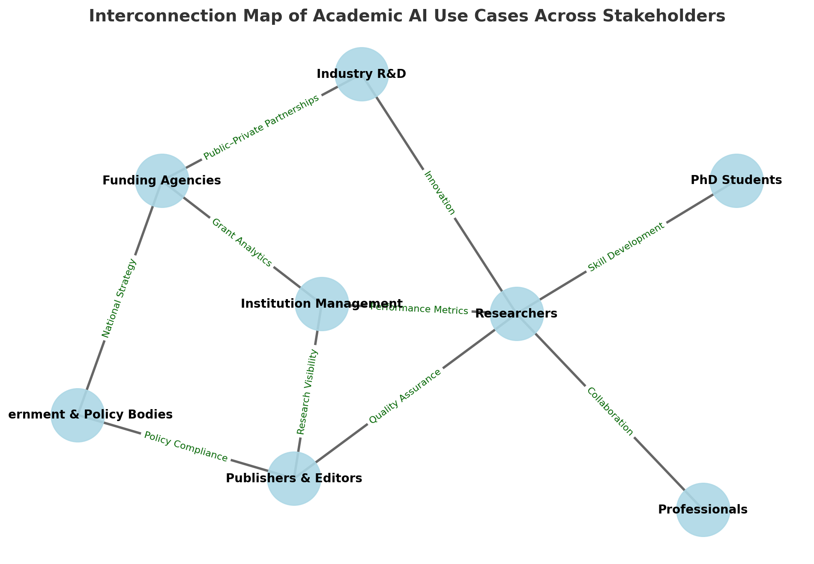
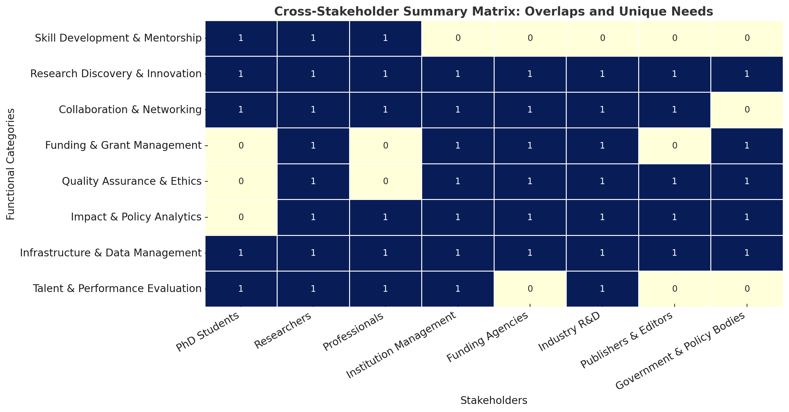

## Top 20 AI-powered Strategic or Long-term  Use Cases for Each Major Stakeholder


---

###  Use Cases by Stakeholder

🧑‍🎓 PhD Students / Early-Career Researchers

- **Research Topic Discovery:** Use AI to spot trending or emerging fields that match your expertise.
- **Automated Literature Review:** Summarize, cluster, and synthesize related research efficiently.
- **Novelty Gap Analysis:** Identify underexplored or unique subtopics for new contributions.
- **Paper Idea Validation:** Compare your concepts against existing literature and patents.
- **Experiment Design Assistant:** Get suggestions for methods, datasets, and evaluation metrics.
- **Code & Dataset Finder:** Locate open-source implementations and benchmark datasets.
- **Reference & Citation Manager:** Automatically generate accurate references and BibTeX entries.
- **Academic Writing Assistant:** Draft or refine abstracts, introductions, and discussion sections.
- **Plagiarism & Self-Plagiarism Checker:** Detect overlap or paraphrasing risks.
- **Reviewer Response Assistant:** Draft clear, polite replies to reviewer comments.
- **Publication Strategy Advisor:** Recommend suitable journals or conferences for your work.
- **Time & Progress Tracker:** Plan milestones and monitor deliverables.
- **Collaboration Recommender:** Find co-authors with complementary skills.
- **Skill Gap Analysis:** Map technical skill requirements for your research area.
- **Grant Application Support:** Suggest relevant calls, summarize eligibility, and auto-draft proposals.
- **Visualization Generator:** Turn data into charts or knowledge graphs.
- **Paper Quality Estimator:** Rate clarity, rigor, and reproducibility.
- **Citation Influence Tracker:** Monitor how your work is cited or extended.
- **Knowledge Base Builder:** Create a personal semantic library of papers and notes.
- **Career Path Advisor:** Align your research focus with post-PhD opportunities.

---

👩‍🔬 Academic Researchers / Faculty

- **Funding Opportunity Matching:** Align projects with upcoming grants.
- **Collaborator Discovery:** Identify cross-disciplinary or high-impact collaborators.
- **Research Impact Analytics:** Assess influence via citation networks and societal mentions.
- **Paper/Proposal Co-authoring Assistant:** AI-aided drafting and structuring.
- **Reviewer Recommendation:** Suggest suitable peer reviewers.
- **Citation Network Mapping:** Visualize influence and knowledge flow.
- **Trend Detection & Forecasting:** Monitor emerging research frontiers.
- **Reproducibility & Method Checker:** Detect missing experiment details.
- **Grant Proposal Critique Generator:** Simulate reviewer feedback.
- **Student Supervision Dashboard:** Monitor progress, papers, and timelines.
- **Conference Paper Recommender:** Find best venue based on topic.
- **Institutional Collaboration Analyzer:** Find inter-university synergies.
- **Open Access Compliance Checker:** Verify policies for funders or publishers.
- **Knowledge Graph Builder:** Integrate lab publications, datasets, tools.
- **Experiment Metadata Extractor:** Parse and structure methods from papers.
- **Research Impact Visualization:** Build network or Sankey diagrams.
- **Ethics & Policy Advisor:** Flag potential conflicts or sensitive data issues.
- **AI-Driven Lab Notebook Summarizer:** Extract insights from logs and notes.
- **Media & Press Summary Generator:** Create accessible summaries of papers.
- **Personal Research Dashboard:** Unified portal for impact, projects, and grants.

---

🏛️ Institution / University Management

- **Research Performance Analytics:** Measure productivity, citations, and impact.
- **Strategic Funding Intelligence:** Identify high-ROI research themes.
- **Collaboration Network Mapping:** Visualize internal and external partnerships.
- **Faculty Recruitment Intelligence:** Match candidates to institutional strengths.
- **Department Benchmarking:** Compare performance across peer universities.
- **Institutional Repository Automation:** Auto-ingest and categorize research outputs.
- **Grant Success Rate Prediction:** Analyze patterns of successful proposals.
- **Curriculum–Research Alignment:** Integrate research trends into courses.
- **Knowledge Asset Management:** Centrally manage data, IP, and publications.
- **Societal Impact Dashboard:** Link papers to policy, patents, and media mentions.
- **Interdisciplinary Research Clustering:** Detect cross-domain synergies.
- **Policy Compliance Checker:** Ensure adherence to open access and data sharing mandates.
- **Diversity & Inclusion Metrics:** Track representation in research teams.
- **Emerging Talent Detection:** Flag rising researchers.
- **Institutional Grant Recommender:** Surface relevant funding programs.
- **Strategic Partnership Finder:** Suggest international collaborations.
- **Faculty Evaluation Automation:** Holistic assessment of research quality.
- **Retraction & Quality Monitoring:** Detect questionable outputs.
- **Institutional Knowledge Graph:** Link authors, projects, outputs, and impacts.
- **Innovation Portfolio Tracker:** Monitor patents, startups, and tech transfer.

---

💰 Funding Agencies

- **Grant Application Scoring Assistant:** Use LLMs to evaluate proposals and reduce bias.
- **Reviewer Assignment Optimization:** Algorithmically match reviewers to proposals.
- **Duplicate / Overlap Detection:** Identify similar proposals or prior awards.
- **Impact Forecasting:** Estimate potential outcomes of funded research.
- **Portfolio Diversity Analysis:** Track balance across topics, gender, and geography.
- **Emerging Research Field Detection:** Guide funding priorities toward new areas.
- **Policy Impact Tracking:** Trace how funded work influences policies and patents.
- **Conflict-of-Interest Detection:** Automatically check reviewer–proposer linkages.
- **Narrative Quality Scoring:** Assess clarity and coherence of proposals.
- **Data-Driven Call Design:** Identify high-impact areas for new funding programs.
- **Funding Outcome Attribution:** Link research outputs to specific grants.
- **Cost-Benefit Analytics:** Analyze ROI of funding portfolios.
- **Cross-Agency Collaboration Mapping:** Find co-funding opportunities.
- **Proposal Plagiarism Detection:** Detect textual and idea-level similarities.
- **Reviewer Performance Analytics:** Track reliability and consistency.
- **AI-Generated Summary for Panels:** Provide executive-level proposal syntheses.
- **Long-Term Impact Visualization:** Map knowledge flow over time.
- **Public Transparency Dashboards:** Communicate funding impact to stakeholders.
- **Applicant Support Chatbot:** Guide applicants through calls and forms.
- **Equity & Accessibility Insights:** Ensure fair and inclusive funding distribution.

---

🧪 Industry R&D / Corporate Research Labs

- **Academic Collaboration Matching:** Identify best universities and labs for joint research.
- **Technology Trend Forecasting:** Detect emerging research-to-market shifts.
- **Competitive Intelligence:** Monitor rivals’ publications and patents.
- **Innovation Scouting:** Discover breakthrough technologies early.
- **Talent Identification:** Find top researchers for hiring or partnerships.
- **Research Impact Simulation:** Model potential outcomes of partnerships.
- **Patent–Paper Linkage Analysis:** Connect academic insights to the IP landscape.
- **Corporate Research Portfolio Optimization:** Diversify and evaluate R&D projects.
- **Tech Transfer Opportunity Finder:** Identify licensing or spin-off potential.
- **Benchmarking vs Academia:** Compare internal R&D to frontier science.
- **Automated Literature Digest:** Summarize research tailored to product domains.
- **Collaboration Proposal Generator:** Draft whitepapers with academic partners.
- **R&D Risk Assessment:** Detect replication issues or low maturity topics.
- **Innovation Gap Detection:** Highlight underexplored technology niches.
- **Cross-Sector Knowledge Graphs:** Link papers, patents, and products.
- **Ethical & Regulatory Alignment:** Monitor policy and compliance changes.
- **AI-Based Lab Report Summarizer:** Convert experiment logs into actionable insights.
- **Research Investment Return Tracker:** Tie research outputs to economic metrics.
- **Partner Ranking System:** Evaluate potential collaborators.
- **Corporate Research Repository:** Unified index of external and internal research.

---

📰 Publishers / Journals / Editors

- **Manuscript Quality Screening:** AI-assisted triage before review.
- **Reviewer Suggestion Engine:** Find best experts for submissions.
- **Plagiarism & Duplication Check:** Includes idea-level similarity detection.
- **Topic Trend Analytics:** Identify hot and under-represented fields.
- **Peer Review Quality Scoring:** Detect bias or superficial reviews.
- **Editorial Decision Support:** Summarize key pros/cons of reviews.
- **Retraction Risk Detector:** Flag statistical or ethical anomalies.
- **Open Access Policy Checker:** Ensure compliance with publishing policies.
- **Automated Metadata Extraction:** Extract authors, ORCID, institutions, funders.
- **Reviewer Load Balancer:** Manage reviewer workload distribution.
- **Reviewer–Author Conflict Detector:** Detect institutional overlap or conflicts.
- **Ethics Statement Validator:** Verify completeness of ethics statements.
- **Post-Publication Impact Tracker:** Monitor citation and social media reach.
- **Citation Integrity Checker:** Flag citation cartels or self-citation spikes.
- **Paper-to-Paper Influence Map:** Visualize topic evolution and connections.
- **Author Disambiguation System:** Unify name variants for accurate attribution.
- **AI-Assisted Copy Editing:** Improve clarity, grammar, and style.
- **Manuscript Recommender:** Match rejected papers to alternative journals.
- **Thematic Issue Planning:** Identify clusters for special issues.
- **Reviewer Performance Analytics:** Track accuracy, turnaround, and quality.

---

🏢 Government / Policy Makers

- **National Research Trend Mapping:** Detect emerging strategic areas.
- **Science Policy Impact Analysis:** Link funding to real-world outcomes.
- **Innovation Ecosystem Mapping:** Visualize collaboration among sectors.
- **R&D Investment Allocation:** Data-driven funding prioritization.
- **Policy Citation Tracker:** Measure influence of research on regulation.
- **Technology Readiness Assessment:** Track maturity of innovations.
- **Public-Private Partnership Finder:** Identify collaboration potential.
- **National Talent Landscape Dashboard:** Monitor researcher mobility.
- **Academic Ranking & Benchmarking:** Compare national vs international performance.
- **Grant Effectiveness Monitoring:** Evaluate societal and economic ROI.
- **Science Communication Optimization:** Simplify research for the public.
- **AI-Based Evidence Summarization:** Condense studies into policy briefs.
- **Ethical & Legal Compliance Monitoring:** Oversee research integrity.
- **Crisis Research Mobilization:** Rapidly identify experts during pandemics/disasters.
- **Knowledge Transfer Analytics:** Trace how academic work becomes innovation.
- **Open Science Policy Enforcement:** Monitor data and access compliance.
- **Research Equity Insights:** Track funding or output disparities.
- **Regulatory Horizon Scanning:** Anticipate tech requiring policy updates.
- **Cross-National Collaboration Analytics:** Monitor global partnerships.
- **Public Engagement Measurement:** Track science influence in media and education.


---

### 📘 Full Structured JSON


```json
[
  {
    "stakeholder": "PhD Student / Early-Career Researcher",
    "category": "Research Discovery & Ideation",
    "use_cases": [
      {
        "name": "Research Topic Discovery",
        "description": "Identify trending and emerging topics aligned with the student's background or advisor's expertise.",
        "example_workflow": "Use literature trend analysis + LLM summarization + keyword clustering to generate personalized topic maps."
      },
      {
        "name": "Novelty Gap Analysis",
        "description": "Find under-explored research questions by comparing existing literature to proposed ideas.",
        "example_workflow": "Run semantic similarity search + citation density analysis + LLM-based gap summarization."
      },
      {
        "name": "Paper Idea Validation",
        "description": "Check whether a proposed idea or hypothesis is already well-covered or still novel.",
        "example_workflow": "Combine embedding-based paper retrieval + LLM summarization + novelty score estimation."
      },
      {
        "name": "Experiment Design Assistance",
        "description": "Suggest methods, datasets, and evaluation metrics based on topic and research objective.",
        "example_workflow": "Use LLM to extract methods from similar papers + match experimental designs from repositories."
      },
      {
        "name": "Code & Dataset Finder",
        "description": "Locate open-source codebases or datasets related to a given paper or method.",
        "example_workflow": "Query APIs (e.g., Papers With Code, Hugging Face) + rank by relevance + summarize in plain English."
      }
    ]
  },
  {
    "stakeholder": "PhD Student / Early-Career Researcher",
    "category": "Writing & Publication",
    "use_cases": [
      {
        "name": "Literature Review Automation",
        "description": "Summarize and cluster related papers into coherent themes for writing literature review sections.",
        "example_workflow": "Fetch top N relevant papers → cluster embeddings → LLM synthesis by theme."
      },
      {
        "name": "Academic Writing Assistant",
        "description": "Improve clarity, logic, and tone in academic drafts.",
        "example_workflow": "LLM fine-tuned on scientific style + context from related papers to rewrite sections."
      },
      {
        "name": "Plagiarism / Self-Plagiarism Check",
        "description": "Detect overlapping ideas or text reuse across manuscripts.",
        "example_workflow": "Compute text similarity using embeddings + highlight semantic overlap for revision."
      },
      {
        "name": "Reviewer Comment Response Assistant",
        "description": "Draft polite and structured responses to peer review comments.",
        "example_workflow": "Pair review comments with rebuttal generator prompt using tone and evidence templates."
      },
      {
        "name": "Publication Strategy Advisor",
        "description": "Recommend suitable journals or conferences based on topic and impact goals.",
        "example_workflow": "Match paper embeddings to indexed journal scopes + predict acceptance likelihood."
      }
    ]
  },
  {
    "stakeholder": "Academic Researcher / Faculty",
    "category": "Funding & Collaboration",
    "use_cases": [
      {
        "name": "Funding Opportunity Matching",
        "description": "Identify grant calls aligned with research interests and eligibility.",
        "example_workflow": "Match researcher profile and topic embeddings to funding database announcements."
      },
      {
        "name": "Collaborator Discovery",
        "description": "Find researchers with complementary expertise or shared research goals.",
        "example_workflow": "Use author embeddings + co-authorship network analysis + topic overlap scoring."
      },
      {
        "name": "Institutional Collaboration Analyzer",
        "description": "Map institutional partnerships and joint outputs across projects.",
        "example_workflow": "Construct co-publication graphs + cluster by discipline or funding source."
      },
      {
        "name": "Interdisciplinary Research Clustering",
        "description": "Detect intersections of multiple research domains for new project ideas.",
        "example_workflow": "Run topic modeling + semantic clustering across publication corpora."
      },
      {
        "name": "Open Access Compliance Checker",
        "description": "Ensure papers meet funder and institutional OA requirements.",
        "example_workflow": "Extract metadata + match against funder OA policies using rule-based logic."
      }
    ]
  },
  {
    "stakeholder": "Institution / University Management",
    "category": "Research Performance & Strategy",
    "use_cases": [
      {
        "name": "Research Performance Analytics",
        "description": "Track faculty productivity, citations, and influence metrics.",
        "example_workflow": "Aggregate publication metadata + compute h-index and field-normalized indicators."
      },
      {
        "name": "Strategic Funding Intelligence",
        "description": "Identify high-return thematic areas for institutional investment.",
        "example_workflow": "Analyze global grant trends + compare with institutional strengths."
      },
      {
        "name": "Department Benchmarking",
        "description": "Compare departments with peer institutions using publication and funding metrics.",
        "example_workflow": "Use bibliometric APIs (InCites/WoS) + automated benchmarking dashboards."
      },
      {
        "name": "Emerging Talent Detection",
        "description": "Detect rising researchers showing rapid citation or publication growth.",
        "example_workflow": "Time-series analysis of output growth + LLM commentary for context."
      },
      {
        "name": "Interdisciplinary Research Clustering",
        "description": "Identify high-impact cross-department projects or centers.",
        "example_workflow": "Cluster co-authorship + topic networks by department."
      }
    ]
  },
  {
    "stakeholder": "Funding Agency",
    "category": "Grant Management & Evaluation",
    "use_cases": [
      {
        "name": "Grant Application Scoring Assistant",
        "description": "Support reviewers by summarizing and scoring proposals.",
        "example_workflow": "Parse proposal text + evaluate using LLM rubric prompts + output structured feedback."
      },
      {
        "name": "Reviewer Assignment Optimization",
        "description": "Automatically match reviewers to proposals based on expertise.",
        "example_workflow": "Compute semantic similarity between reviewer publication history and proposal content."
      },
      {
        "name": "Duplicate / Overlap Detection",
        "description": "Identify similar or resubmitted proposals across cycles.",
        "example_workflow": "Text similarity + vector search on previous applications."
      },
      {
        "name": "Impact Forecasting",
        "description": "Predict likely academic or societal outcomes of proposed research.",
        "example_workflow": "Train regression models on historical grant–outcome data."
      },
      {
        "name": "Conflict-of-Interest Detection",
        "description": "Detect hidden links between applicants and reviewers.",
        "example_workflow": "Cross-reference co-authorship, institutional, or grant relationships."
      }
    ]
  },
  {
    "stakeholder": "Industry R&D / Corporate Research",
    "category": "Innovation & Collaboration",
    "use_cases": [
      {
        "name": "Academic Collaboration Matching",
        "description": "Find academic partners or labs relevant to corporate research goals.",
        "example_workflow": "Semantic matching between internal R&D topics and university expertise maps."
      },
      {
        "name": "Innovation Scouting",
        "description": "Discover early-stage research breakthroughs with commercial potential.",
        "example_workflow": "Monitor preprints, patents, and grant data + rank by novelty and maturity."
      },
      {
        "name": "Technology Trend Forecasting",
        "description": "Predict upcoming innovations from academic signals.",
        "example_workflow": "Time-series topic modeling + LLM synthesis of trend reports."
      },
      {
        "name": "Patent–Paper Linkage Analysis",
        "description": "Connect academic publications to related patents.",
        "example_workflow": "Cross-embed patent claims and paper abstracts + cluster by technology."
      },
      {
        "name": "Cross-Sector Knowledge Graphs",
        "description": "Visualize relationships between academic, industrial, and policy outputs.",
        "example_workflow": "Integrate paper, patent, and grant data into Neo4j graph schema."
      }
    ]
  },
  {
    "stakeholder": "Publisher / Journal Editor",
    "category": "Peer Review & Editorial",
    "use_cases": [
      {
        "name": "Manuscript Quality Screening",
        "description": "Automate triage of submissions before full peer review.",
        "example_workflow": "LLM evaluation on clarity, structure, and methodological soundness."
      },
      {
        "name": "Reviewer Suggestion Engine",
        "description": "Recommend qualified reviewers based on expertise and neutrality.",
        "example_workflow": "Author disambiguation + topic-matching between paper and reviewer corpus."
      },
      {
        "name": "Peer Review Quality Scoring",
        "description": "Evaluate review completeness and bias.",
        "example_workflow": "Text sentiment + content coverage metrics on reviewer feedback."
      },
      {
        "name": "Editorial Decision Support",
        "description": "Summarize reviewer opinions into structured decision summaries.",
        "example_workflow": "LLM summarization of multi-review input + recommendation synthesis."
      },
      {
        "name": "Reviewer–Author Conflict Detector",
        "description": "Detect institutional or co-authorship overlap.",
        "example_workflow": "Match reviewer metadata with author affiliations + co-publication graph."
      }
    ]
  },
  {
    "stakeholder": "Government / Policy Maker",
    "category": "National Research & Innovation Strategy",
    "use_cases": [
      {
        "name": "National Research Trend Mapping",
        "description": "Track key scientific directions and emerging fields nationally.",
        "example_workflow": "Aggregate national publication datasets + topic modeling visualization."
      },
      {
        "name": "Science Policy Impact Analysis",
        "description": "Measure how funded research influences laws, standards, or regulations.",
        "example_workflow": "Link policy documents to citations of academic research."
      },
      {
        "name": "Innovation Ecosystem Mapping",
        "description": "Visualize interactions between universities, firms, and agencies.",
        "example_workflow": "Build graph models linking co-funding and co-publication networks."
      },
      {
        "name": "R&D Investment Allocation",
        "description": "Prioritize funding areas based on scientific momentum and ROI.",
        "example_workflow": "Combine bibliometric trend data with economic impact modeling."
      },
      {
        "name": "Technology Readiness Assessment",
        "description": "Assess the maturity level of research for industrial adoption.",
        "example_workflow": "Map papers to TRL scale using NLP classification of methods/results."
      }
    ]
  }
]

```


---

⚙️ Integration Ideas

-For your LangGraph agent:
    -Each stakeholder → a node or persona;
    -Each category → subgraph of tasks;
    -Each use case → retriever or tool call.
  
-For Streamlit UI:
    -Dropdown filters: stakeholder → category → list of actionable tasks.
    -Click on a use case → generate LLM plan or workflow.

-For DB or API schema:
    -Store in SQLite or MongoDB under academic_usecases table/collection
    -for easy retrieval by role.


---

⚙️ Usage

- Load this JSON into your RAG or LangGraph node to generate workflows or plans.
- Each example_workflow can trigger a tool chain, API pipeline, or retrieval strategy.
- You can extend this easily by adding "tools": ["retriever_faiss", "wos_api", "llm_summarizer"] fields per use case.


---


### A Visual Knowledge Map

Here’s the visual knowledge map showing how the 7 key stakeholder groups interconnect through shared AI use case themes — like innovation, collaboration, policy strategy, and research quality assurance.





---


### Cross-stakeholder Summary Matrix



Here’s the cross-stakeholder summary matrix comparing overlaps and unique focus areas across the eight major academic ecosystem actors.

- ✅ Heatmap above shows shared AI priorities (dark = strong overlap)
- ✅ Table lists where each group is active (1 = relevant, 0 = less relevant)

This matrix lets you quickly see:

- *Shared domains*: “Research Discovery & Innovation” and “Collaboration & Networking” are almost universal.

- *Unique domains*:
  - PhD Students → Mentorship & Skill development
  - Funding Agencies & Policy Bodies → Grant management & Policy analytics
  - Publishers & Editors → Quality assurance focus
  - Industry R&D → Strong overlap across innovation and collaboration, weaker on mentorship.

Would you like me to produce a summary report (text + visual) describing:

- common intersections,
- distinctive needs per stakeholder, and
- AI opportunity gaps across the ecosystem? 


---

##  Toolchain Blueprint - Top 20 AI Use Cases


To extend this further with a “toolchain blueprint” for each use case — i.e. which APIs, retrievers, and LLM roles each use case would call (ideal for LangGraph or MCP agent planning)


### 🎓  Part 1: PhD Students / Early-Career Researchers


Perfect 👍 Let’s start with Part 1: PhD Students & Early-Career Researchers — their Top 20 AI-powered academic research use cases, organized by category (discovery · analysis · writing · career · collaboration · impact).


🔍 Research Discovery & Ideation

1. Topic Gap & Novelty Finder – identify underexplored or emerging topics based on citation and trend analysis.
2. Smart Literature Map – auto-cluster related papers and visualize conceptual evolution (e.g., “idea trails”).
3. Personalized Paper Recommender – suggest key readings by aligning a PhD’s project scope and prior papers.
4. Research Question Generator – propose novel hypotheses or follow-up questions grounded in current literature.
5. Trend & Frontier Tracker – detect fast-rising keywords, authors, and techniques in the field.

🧠 Research Design & Methodology

1. Experimental Design Advisor – suggest study designs, data collection methods, and control variables.
2. Dataset & Benchmark Finder – locate open datasets relevant to the problem domain.
3. Code & Method Suggester – retrieve and explain code snippets or methods used in similar research.
4. Ethics & Compliance Assistant – flag possible IRB or data privacy issues before proposal submission.

✍️ Writing & Synthesis

1. Automated Literature Summary – condense large corpora into structured overviews (methods, findings, gaps).
2. Citation Contextualizer – explain how a cited work supports, contradicts, or extends your study.
3. Draft-to-Publication Pipeline – transform outlines → structured drafts → camera-ready manuscripts.
4. Style & Clarity Reviser – improve academic tone, grammar, and logical flow while preserving meaning.
5. Reference Consistency Checker – match references to canonical records and DOIs automatically.

🤝 Collaboration & Career

1. Potential Collaborator Finder – identify researchers with complementary expertise or co-citation links.
2. Mentorship & Peer Feedback Bot – simulate peer review and critique sections for clarity and contribution.
3. Conference & Journal Recommender – suggest venues aligned with the paper’s scope and impact level.
4. Grant Proposal Assistant – generate targeted proposal drafts matching call requirements and impact goals.
5. Academic Profile Summarizer – synthesize 5-year publication highlights, metrics, and research themes.
6. Career-Path Planner – map trajectory of top scholars in the field to inform one’s own research roadmap.


---


### 👩‍🔬 Part 2: Researchers (Faculty, Postdocs, Senior Scientists) 

These are advanced users leading labs, managing projects, mentoring students, and publishing at scale. Below are their Top 20 AI-powered academic research use cases, grouped by function.


🔍 Research Discovery & Strategic Direction

1. Emerging Topic Radar – continuously monitor new subfields, keywords, and citation bursts for early opportunities.
2. Competitor & Peer Landscape Map – visualize who’s publishing or funding in overlapping areas.
3. Interdisciplinary Bridge Finder – identify concepts connecting multiple research domains for high-impact work.
4. Idea-to-Grant Alignment Engine – match evolving ideas to active funding programs and strategic priorities.
5. Novelty & Redundancy Analyzer – evaluate how distinct a proposed paper or project is from prior art.

🧠 Project Design & Data Intelligence

1. Automated Literature Audit – assess comprehensiveness of a team’s literature coverage before submission.
2. Methodology Synthesizer – compare experimental designs, algorithms, or statistical models used in top papers.
3. Data Reuse & Integration Tool – recommend compatible datasets, instruments, or collaborators with shared infrastructure.
4. Ethical & Reproducibility Checker – scan manuscripts for bias, missing details, or insufficient statistical rigor.
5. Lab Knowledge Memory – central AI that stores methods, results, code, and protocols for lab continuity.

✍️ Writing, Reviewing, & Publication

1. Manuscript-to-Insight Summarizer – extract highlights, contributions, and potential reviewers from draft.
2. Reviewer & Editor Recommendation – find suitable reviewers and suggest editors using semantic similarity and networks.
3. Grant Proposal Assistant – generate structured drafts (aims, significance, innovation) and link to citation evidence.
4. Paper Impact Forecaster – predict likely citation or media impact based on topic novelty and author networks.
5. Citation Network Analyzer – trace influence and identify critical gaps or missing references.

🤝 Mentoring, Networking & Collaboration

1. PhD & Postdoc Progress Dashboard – track mentee publication progress and topic diversity.
2. Collaborator & Consortium Builder – detect potential co-PIs with complementary expertise or funding track records.
3. Reputation & Outreach Optimizer – suggest strategic conferences, journals, and open science contributions.
4. Knowledge Transfer Assistant – auto-generate slide decks, public summaries, or teaching material from research outputs.
5. Grant Performance Tracker – measure productivity, collaboration breadth, and citation outcomes per grant.


---


### 🏛️  Part 3:  Academic Institution Management

Let’s continue with Part 3: Institution Management (Universities / Research Centers) — focusing on leadership, research offices, and analytics units that oversee performance, strategy, and visibility.


📊 Strategic Planning & Research Intelligence

1. Institutional Research Landscape Map – visualize all ongoing research areas, labs, and collaborations.
2. Emerging Strengths Detector – identify fast-growing topics or groups showing exceptional momentum.
3. Benchmarking Engine – compare institutional performance (citations, funding, impact) vs. peer universities.
4. Strategic Opportunity Recommender – suggest new interdisciplinary centers or focus areas based on global trends.
5. Reputation Growth Forecaster – model how strategic investments (faculty, grants, partnerships) affect rankings.

💰 Funding & Resource Optimization

1. Grant Portfolio Analyzer – evaluate funding diversity, success rates, and ROI across units.
2. Funding Opportunity Matching – align open calls with internal research strengths and teams.
3. Collaborative Proposal Builder – automatically form multi-PI consortia across departments for large-scale grants.
4. Resource Allocation Optimizer – recommend lab space, computing, or seed funding distribution by impact potential.
5. Donor & Philanthropy Insight Engine – match institutional priorities with potential external sponsors or alumni.

🧩 Research Quality & Compliance

1. Integrity & Retraction Monitor – detect potential plagiarism, data irregularities, or low-quality outputs.
2. Diversity & Inclusion Analyzer – assess gender, geographic, and disciplinary balance in research teams.
3. Open Access & Policy Tracker – monitor compliance with OA, FAIR data, and ethical research policies.
4. Publication Quality Benchmark – classify papers by quality tier (journal rank, citations, peer influence).
5. Research Risk Predictor – identify projects at risk of delay, underperformance, or ethics issues.

🌐 Collaboration, Outreach & Impact

1. Global Collaboration Map – visualize institutional partnerships by field, geography, and funding source.
2. Industry–Academia Bridge Finder – match internal research strengths with industry R&D needs.
3. Societal Impact Dashboard – track policy, patent, and media citations to measure real-world influence.
4. Research Communication Assistant – generate press releases and summaries for top institutional papers.
5. Talent Attraction & Retention AI – identify promising scholars, postdocs, or visiting researchers to recruit.


---


### 💰 Part 4: Funding Agencies / Foundations

These include national research councils, private foundations, and philanthropic organizations that manage grant calls and track funding outcomes.


📊 Grant Evaluation & Management

1. Proposal Scoring Assistant – use AI/LLM to summarize and score grant proposals according to predefined criteria.
2. Reviewer Assignment Optimizer – match proposals to reviewers based on expertise and prior publications.
3. Duplicate & Overlap Detector – detect similar or resubmitted proposals to avoid redundancy.
4. Conflict-of-Interest Analyzer – automatically flag potential conflicts between reviewers and applicants.
5. Funding Eligibility Checker – ensure proposals meet all criteria for the grant call.

📈 Portfolio & Policy Analytics

1. Impact Forecasting – predict potential academic or societal impact of proposed research.
2. Portfolio Diversity Tracker – monitor balance across disciplines, geography, gender, and career stage.
3. Grant Outcome Attribution – link funded projects to resulting publications, patents, or policy changes.
4. Cost-Benefit & ROI Analytics – evaluate return on investment for various funded programs.
5. Strategic Call Design – analyze trends to propose new funding priorities.

🌐 Collaboration & Transparency

1. Cross-Agency Collaboration Mapper – identify co-funding opportunities and overlapping calls.
2. Reviewer Performance Tracker – monitor reviewer consistency, reliability, and timeliness.
3. Applicant Support Chatbot – guide applicants through grant submission, eligibility, and documentation.
4. Equity & Accessibility Monitor – ensure fair distribution of funding across institutions and demographics.
5. Public Impact Reporting – generate dashboards showing funded research outcomes for transparency.

🧠 Research & Innovation Insights

1. Emerging Field Detector – identify fast-growing scientific areas for proactive funding.
2. Trend Analytics for Policy Decisions – inform funding allocations using bibliometrics and patent data.
3. Proposal Text Analytics – detect gaps, strengths, and novelty in submitted applications.
4. Long-Term Impact Mapping – trace knowledge flow over years from funded research.
5. AI-Driven Scenario Simulation – model how different funding strategies affect scientific outcomes.


---


### 🧪 Part 5: Industry R&D / Corporate Research Labs


These are corporate research teams, industrial labs, or private innovation units focused on technology development, product innovation, and strategic collaborations with academia.


🔬 Innovation & Technology Discovery

1. Academic Collaboration Matching – identify universities or labs aligned with company research goals.
2. Innovation Scouting – detect early-stage breakthroughs in preprints, patents, and conferences.
3. Technology Trend Forecasting – predict emerging tech based on publication and patent signals.
4. Patent–Paper Linkage Analysis – connect academic publications to relevant patents or IP.
5. Cross-Sector Knowledge Graphs – integrate research, patents, and regulatory data for insight discovery.

🧠 R&D Portfolio Management

1. Corporate Research Portfolio Optimization – evaluate and prioritize R&D projects for ROI and novelty.
2. Research Investment Return Tracker – measure impact of internal and sponsored research on products or IP.
3. Benchmarking vs Academia – compare company R&D output against top academic research in relevant domains.
4. Innovation Gap Detection – highlight underexplored areas with commercial potential.
5. Risk Assessment for R&D – detect reproducibility issues or low maturity topics.

🤝 Collaboration & Talent

1. Partner Ranking System – evaluate potential academic or industry collaborators by expertise and impact.
2. Talent Identification & Recruitment – find leading researchers, postdocs, or teams for hiring or joint projects.
3. Corporate–Academia Consortium Builder – assemble multi-party collaborations for grants or tech development.
4. External Dataset & Tool Recommender – identify usable datasets, methods, or open-source tools.
5. Collaborative Proposal Generator – draft whitepapers or joint research proposals with partners.

📊 Insights & Knowledge Utilization

1. Automated Literature Digest – summarize latest research tailored to product domains.
2. Experiment Metadata Extractor – structure experimental details from academic publications.
3. Regulatory & Policy Alignment Monitor – track changes in compliance, safety, or tech regulations.
4. R&D Knowledge Repository – central knowledge graph of internal + external research for discovery.
5. Decision Support Dashboard – visualize R&D progress, collaboration networks, and innovation metrics.


---


### 📰 Part 6: Publishers / Journals / Editors

These stakeholders focus on manuscript management, peer review, editorial quality, and post-publication analytics.


✍️ Manuscript Management & Quality Control

1. Manuscript Quality Screening – automatically triage submissions for clarity, novelty, and methodological soundness.
2. Plagiarism & Redundancy Detection – flag text overlap or duplicate submissions.
3. Reviewer Suggestion Engine – recommend qualified, neutral reviewers based on expertise and prior work.
4. Editorial Decision Support – summarize reviews into structured recommendations for editors.
5. Reviewer–Author Conflict Detection – detect co-authorship, affiliation, or funding conflicts.

🧠 Peer Review & Publication Analytics

1. Peer Review Quality Scoring – evaluate completeness, fairness, and rigor of reviews.
2. Topic Trend Analytics – monitor emerging topics and hot research areas in the journal’s scope.
3. Citation Integrity Checker – identify incorrect, missing, or potentially manipulated references.
4. Retraction & Risk Detection – flag submissions or published papers at risk of future retraction.
5. Reviewer Performance Analytics – track timeliness, reliability, and review quality metrics.

🌐 Post-Publication Insights & Impact

1. Influence Mapping (Paper-to-Paper) – visualize citation networks and idea propagation.
2. Altmetric & Media Impact Tracker – measure societal attention through social media, news, and policy mentions.
3. Open Access & Compliance Monitor – track adherence to funder and institutional OA mandates.
4. Author Collaboration Network – map co-authorship trends and potential reviewer pools.
5. Post-Publication Peer Review Analyzer – summarize public commentary or post-publication reviews.

📊 Strategic Editorial Planning

1. Emerging Field Detection – suggest new topical sections or special issues.
2. Journal Portfolio Benchmarking – compare journal performance vs. competitors (impact, citations, submission trends).
3. AI-Assisted Copyediting – improve readability, formatting, and consistency in manuscripts.
4. Reviewer Recruitment Strategy – identify underutilized experts or potential reviewer diversity gaps.
5. Content Recommendation Engine – suggest related articles to readers or authors for citation or engagement.

---


### 🏛️ Part 7: Government / Policy Bodies

These are the daily operational use cases that government agencies, science policy bodies, and regulatory organizations would apply to manage research programs, allocate resources, and inform policy decisions.

📊 Research & Program Monitoring

1. National Research Dashboard – track funded projects, publications, patents, and innovation metrics across sectors.
2. Program Performance Analyzer – compare outcomes of government-funded research programs.
3. Policy Impact Tracker – monitor the influence of funded research on legislation, regulations, or societal outcomes.
4. Emerging Technology & Trend Scanner – detect novel technologies and research directions relevant to national priorities.
5. Strategic Investment Analyzer – identify areas needing government funding or policy support.

💰 Funding & Resource Management

1. Grant & Program Allocation Optimizer – distribute government research funds efficiently based on strategic priorities.
2. Budget Monitoring & Anomaly Detection – track spending against planned allocations and detect inconsistencies.
3. ROI & Impact Forecasting – predict societal, economic, or technological returns of funded initiatives.
4. Compliance & Audit Support – ensure adherence to regulations, ethical standards, and reporting requirements.
5. Funding Opportunity Digest – provide curated updates on open grants, calls, and deadlines for researchers and institutions.

👩‍💼 Stakeholder Engagement & Collaboration

1. Research Network & Collaboration Mapper – visualize connections between institutions, researchers, and government programs.
2. Expert & Advisory Panel Recommender – suggest subject-matter experts for program review or advisory committees.
3. Public Consultation Analyzer – summarize input from stakeholders, public comments, or surveys.
4. Cross-Agency Collaboration Detector – highlight opportunities for inter-agency projects and initiatives.
5. Talent & Workforce Insights – monitor skills gaps, emerging expertise, and workforce planning needs.

🌐 Policy & Knowledge Management

1. Policy Brief Generator – produce concise summaries of research findings and recommendations for decision-makers.
2. Knowledge Extraction from Reports & Publications – distill key insights from academic, industrial, and governmental outputs.
3. Legislative & Regulatory Monitor – track relevant policy changes, laws, or compliance requirements.
4. Trend & Scenario Analysis – simulate future research, technology, or societal trends for policy planning.
5. AI Decision Assistant – provide evidence-based insights to support strategic and policy decisions.


---


