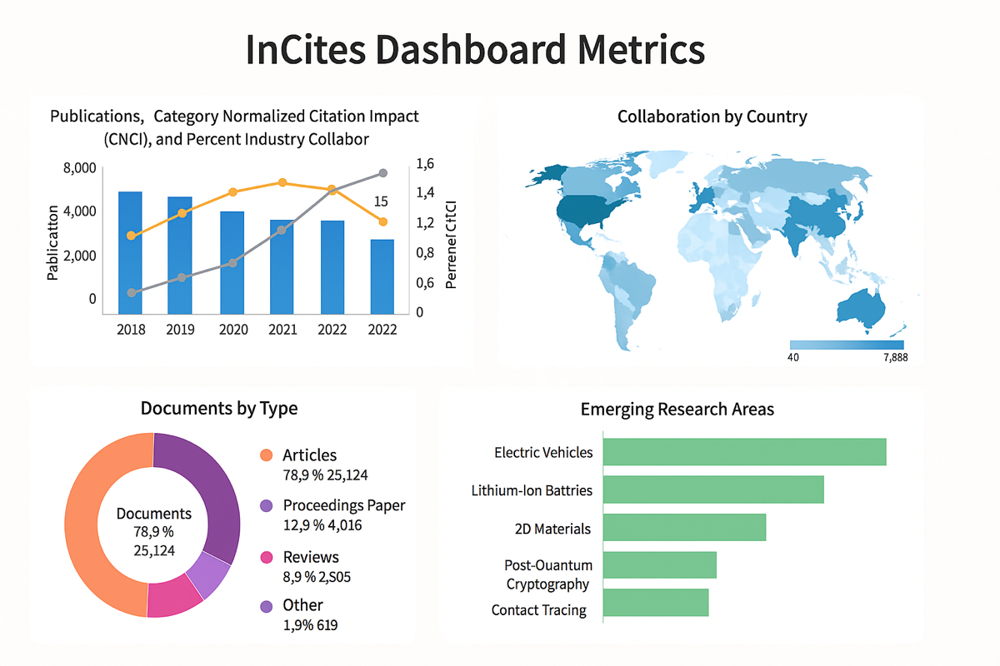

## InCites Benchmarking & Analytics – Research Capabilities

Here is a comprehensive list of research and analytical capabilities supported by the InCites Benchmarking & Analytics platform (developed by Clarivate). InCites is designed for advanced research evaluation and benchmarking using data from the Web of Science Core Collection.

### ✅ Full List of Research Tasks Supported by InCites

| **Category**                  | **Tasks**                                                                 |
|------------------------------|---------------------------------------------------------------------------|
| **Institutional Analysis**   | - Analyze total publication output across years and subject areas        |
|                              | - Benchmark an institution’s performance globally                        |
|                              | - View normalized citation impact metrics (CNCI)                          |
|                              | - Assess collaboration rates (domestic, international, industry)         |
|                              | - Identify top research areas by output or impact                        |
| **Author Performance**       | - Evaluate researcher productivity, h-index, and CNCI                    |
|                              | - Identify top-performing researchers in specific fields                 |
|                              | - Analyze co-author networks and output trends                           |
| **Department & Unit Metrics**| - Compare performance of internal units (e.g., departments, faculties)   |
|                              | - Support program review and strategic hiring                            |
| **Collaboration Analysis**   | - Map institutional or country-level research collaboration              |
|                              | - Measure output from international or corporate partnerships            |
|                              | - Identify emerging collaboration opportunities                          |
| **Journal Analysis**         | - Determine where an institution publishes most frequently               |
|                              | - Benchmark journal impact and relevance to institutional goals          |
|                              | - Analyze open access publishing trends by journal or discipline         |
| **Funding Analysis**         | - Track which agencies fund research at an institution                   |
|                              | - Measure impact of funded publications (e.g., CNCI of funded papers)    |
|                              | - Identify trends in funding sources and acknowledge grant performance   |
| **Subject Area Trends**      | - Identify trending or emerging topics at the global, regional, or institutional level |
|                              | - Compare research volume and impact across disciplines                  |
|                              | - Detect shifts in institutional research focus                          |
| **Strategic Planning**       | - Create KPI dashboards for research offices                             |
|                              | - Track institutional progress against peers or benchmarks                |
|                              | - Identify areas for investment or strategic partnerships                |
| **Ranking Preparation**      | - Support submissions for global rankings (THE, QS, ARWU)                |
|                              | - Provide normalized data aligned with ranking metrics                   |
| **Custom Group Benchmarking**| - Benchmark against a custom set of institutions or researchers          |
|                              | - Create and manage comparison groups for detailed analysis              |

---

### 🧠 Advanced Features & Capabilities

| **Feature**                        | **Purpose**                                                                 |
|------------------------------------|-----------------------------------------------------------------------------|
| **Category Normalized Metrics**    | Adjusts for subject area differences, enabling fair comparisons            |
| **Benchmarking Toolkit**           | Custom dashboards, charts, and filters for KPI reporting                   |
| **Hierarchical Filtering**         | Drill down from institution → faculty → department → individual researcher |
| **Open Access Insights**           | Track growth and impact of open access research                            |
| **Global Collaboration Map**       | Visualize collaboration by region or institution                           |
| **Export & API Access**            | Export visualizations, metrics, and reports in XLS, CSV, and API formats  |
| **Research Area Schemas**          | Use WoS-defined or user-defined categories for customized views            |
| **Institutional Profiles**         | Curated organizational summaries with metrics and historical data          |
| **Custom Baseline Settings**       | Define custom date ranges, document types, regions for consistent reporting|
| **Linked to Web of Science**       | One-click to view underlying publications in WoS                           |

---

### 🎯 Key Users and Use Cases

| **User Type**              | **Use Case**                                                                 |
|---------------------------|------------------------------------------------------------------------------|
| **Research Office**       | Strategic planning, rankings, funding analysis, performance dashboards       |
| **University Admin**      | Benchmarking, policy development, reporting for accreditations               |
| **Faculty/Department Head**| Hiring, internal benchmarking, program review                               |
| **Researcher**            | Understand visibility and impact, identify collaborators or venues           |
| **Library/Analytics Team**| Data exports, citation normalization, open access analysis                   |
| **Government Agency**     | National research assessment, funding allocation, institutional comparisons  |
| **Funder**                | Track outcomes of funded research, align future investments                  |

---

### 📌 Summary

**InCites** is a purpose-built evaluation tool focused on:
- **Benchmarking** performance across institutions, researchers, and disciplines
- **Strategic research planning** using **normalized citation data**
- **Supporting rankings**, funding decisions, and collaborations
- **Exploring global research trends and partnerships**

---

### Visual Diagrams or Sample Dashboards

---

### ✅ Use Case Walkthrough: Benchmark My University vs Peers in AI Research (InCites)

####  🎯 Objective  
Compare your university’s **research performance in Artificial Intelligence (AI)** with selected **peer institutions** using **InCites Benchmarking & Analytics**.

---

####  🧭 Step-by-Step Instructions

####  Step 1: Log in to InCites
- Visit: [https://incites.clarivate.com](https://incites.clarivate.com)
- Sign in with your institutional credentials.

---

####  Step 2: Create or Select an Entity Group
1. Navigate to **“Organization”** in the top menu.
2. Select your university from the dropdown.
3. Click **“Add to Group”** and name it (e.g., `AI Benchmark Group`).
4. Add peer institutions:
   - Search and add institutions such as:
     - Stanford University
     - Tsinghua University
     - ETH Zurich
     - University of Toronto

---

#### Step 3: Apply Research Area Filter for AI
1. Open the **Filters Panel** on the left.
2. Under **Research Areas**, select:
   - `Computer Science, Artificial Intelligence` (WoS Category)
3. Set **Timespan**: Last 5 years (e.g., 2019–2023)

Optional filters:
- **Document Type**: Articles
- **Open Access**: Include or exclude
- **Region** or **Funding Agency**

---

####  Step 4: Select Key Metrics for Benchmarking

Choose metrics from the **Indicators** panel:

| **Metric**                         | **Purpose**                                             |
|-----------------------------------|---------------------------------------------------------|
| Document Count                    | Number of AI publications                               |
| CNCI (Category Normalized Citation Impact) | Field-normalized citation impact              |
| % Documents in Top 10%            | Proportion of top-cited papers                          |
| Collaboration (International, Industry) | Collaboration profile                            |
| Highly Cited Papers               | Output in global top 1%/10% by citation                 |

---

####  Step 5: Visualize and Analyze
1. Use the main data table or **charts** to:
   - Compare institutions
   - Sort by CNCI, Top 10%, or output
2. Use visualization tools:
   - **Line Chart**: Performance trends
   - **Stacked Bar**: Document types
   - **Collaboration Map**: Visualize partners by country

---

### Step 6: Save or Export Results
- Click **Export** to save:
  - Excel, CSV, or PDF format
  - Charts as PNG or SVG
- Save filters and views as a **custom dashboard**

---

## 🧠 Interpretation Example

| Institution          | AI Docs (2019–2023) | CNCI | % Top 10% Cited | Intl. Collaboration |
|----------------------|---------------------|------|------------------|----------------------|
| Your University      | 1,200               | 1.03 | 15.2%            | 42%                  |
| Stanford University  | 1,950               | 2.45 | 34.7%            | 51%                  |
| Tsinghua University  | 2,400               | 1.22 | 18.5%            | 29%                  |

> Use this data to support decision-making in strategic investments, hiring, or collaboration.

---

####  📌 Summary

This walkthrough enables:
- Strategic insights into your institution’s **AI research performance**
- Evidence-based **comparisons with peer institutions**
- Preparation for **funding proposals, ranking submissions, or internal reviews**

--