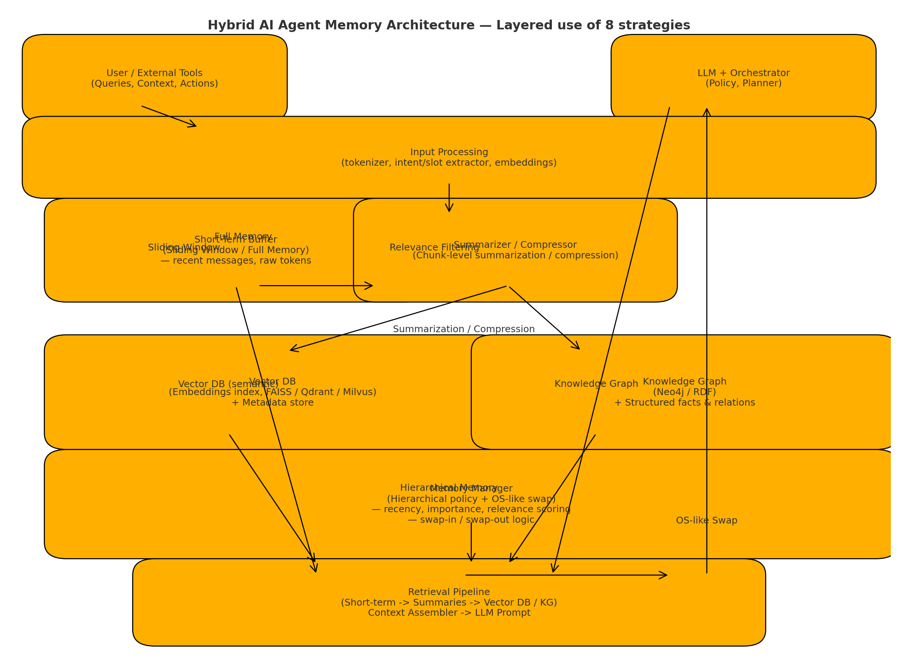
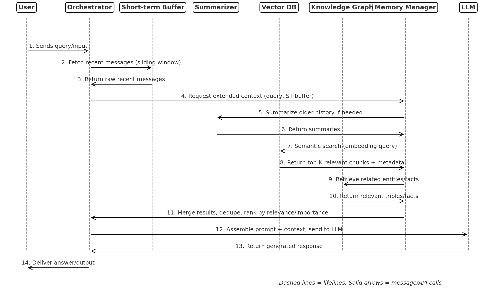

### AI Agent – 8 Common Memory Strategies & Implementation Techniques


Memory is the cornerstone for building efficient, personalized AI agents.
However, the inherent context length limitation of LLMs makes long conversations prone to information loss and cost escalation.
To address this, the industry has explored a range of memory strategies, evolving from simple context management → intelligent content compression → externalized database retrieval → hybrid brain–computer memory systems.

--

#### 1️⃣ Full Memory – Keep Everything

Principle: Store all past interactions in the prompt so the LLM has complete history.

Design & Implementation:
- Store every message in chronological order.
- Always append to the prompt before sending to the LLM.
- Maintain a simple list or JSON log.

Advantages:
- No risk of forgetting.
- Works for short-term, small-scale conversations.

Disadvantages:
- Context length overflows quickly.
- High token cost.

Best For:
- Demos, short-lived sessions, debugging.

Example Implementation (Python):

```python

conversation_history = []
def add_message(role, content):
    conversation_history.append({"role": role, "content": content})

def get_prompt():
    return conversation_history  # send full to LLM
```


---

#### 2️⃣ Sliding Window – Fixed Length Truncation

Principle: Only keep the last N tokens or messages, discarding older ones.

Design & Implementation:
- Use token count to maintain window size.
- Automatically drop the oldest messages when exceeding the limit.

Advantages:
- Simple, efficient.
- Avoids context overflow.

Disadvantages:

- Loses old but potentially important info.
- Poor for long-term personalization.

Best For:
- Chatbots where only recent context matters.

Example Implementation:


```python
MAX_TOKENS = 2000
def sliding_window(history):
    while token_count(history) > MAX_TOKENS:
        history.pop(0)
    return history
```

---

#### 3️⃣ Relevance Filtering – Forget the Irrelevant

Principle: Keep only messages relevant to the current topic.

Design & Implementation:
- Use semantic similarity (e.g., embeddings) to measure relevance.
- Filter out unrelated history before sending to LLM.

Advantages:
- Reduces token usage.
- Retains meaningful context.

Disadvantages:
- May accidentally drop useful context if relevance scoring is imperfect.

Best For:
- Multi-topic conversations.
- Agents that switch tasks frequently.
  
Example:
```python
from sentence_transformers import util

def filter_relevant(history, query, threshold=0.7):
    relevant = []
    query_vec = embed(query)
    for msg in history:
        if util.cos_sim(embed(msg['content']), query_vec) > threshold:
            relevant.append(msg)
    return relevant
```

---


#### 4️⃣ Summarization / Compression – Extract Key Information

Principle: Condense older messages into summaries and keep raw details for recent messages.

Design & Implementation:
- When history gets too long, use the LLM to summarize older chunks.
- Replace raw text with the summary in the context.

Advantages:
- Keeps important info while saving tokens.
- Enables long conversations without losing meaning.

Disadvantages:
- Summarization may miss details.
- Additional LLM calls add cost.

Best For:
- Assistants that need persistent context across long sessions.

Example:
```python

def summarize(history):
    summary = call_llm(f"Summarize the following:\n{history}")
    return [{"role": "system", "content": f"Summary: {summary}"}]
```

---

#### 5️⃣ Vector Database – Semantic Search Memory

Principle: Store all past messages/documents in an embedding index for retrieval when needed.

Design & Implementation:
- Use FAISS, Milvus, Weaviate, or Qdrant.
- For each user query, perform semantic search to fetch top-K relevant history.

Advantages:
- Scales to millions of memories.
- Retrieves relevant context without sending all history.

Disadvantages:
- Requires external DB and embedding computation.
- Retrieval latency if DB is large.

Best For:
- Knowledge-intensive agents.
- Long-term personalized assistants.

Example:
```python

from faiss import IndexFlatL2

def store_memory(vector, metadata):
    index.add(vector)
    meta_store.append(metadata)

def retrieve(query, k=5):
    vec = embed(query)
    D, I = index.search(vec, k)
    return [meta_store[i] for i in I[0]]
```


---

#### 6️⃣ Knowledge Graph – Structured Memory

Principle: Represent information as entities and relationships, allowing structured queries.

Design & Implementation:
- Store facts in Neo4j or RDF triple store.
- Link people, places, events, tasks, etc.
- Retrieve relevant facts via graph queries.

Advantages:
- Enables reasoning over relationships.
- Persistent and explainable memory.

Disadvantages:
- Higher implementation complexity.
- Needs schema design.

Best For:
- Expert systems, research assistants, multi-agent reasoning.

Example:
``` cypher
MATCH (u:User {id: "123"})-[:MENTIONED]->(t:Topic)
RETURN t.name
```

---

#### 7️⃣ Hierarchical Memory – Short-term + Long-term

Principle: Combine fast, small memory for immediate context with large, slow memory for history.

Design & Implementation:
- Short-term: sliding window or summarization.
- Long-term: vector DB or knowledge graph.
- Retrieval pipeline: short-term first, then augment with long-term search.

Advantages:
- Balances speed and persistence.
- Mimics human memory layers.

Disadvantages:
- Requires synchronization between layers.

Best For:
- Complex agents with ongoing relationships with users.

Example Pipeline:

```markdown
1. Query → Search short-term memory.
2. If missing context → Search vector DB.
3. Merge and feed to LLM.
```
---

#### 8️⃣ OS-like Memory Management – Swap Simulation

Principle: Simulate operating system paging/swapping for AI memory.

Design & Implementation:
- Active memory = context window.
- Inactive memory = stored externally.
- Swap in relevant segments dynamically.
- Prioritize based on recency + importance score.

Advantages:
- Fine-grained memory control.
- Optimized for cost and performance.

Disadvantages:
- Complex scheduling logic.
- Requires importance scoring algorithm.

Best For:
- Large-scale, multi-session agents.
- Cost-sensitive production systems.

Example Scheduling Logic:

```python

def importance_score(msg):
    return 0.6 - recency_score(msg) + 0.4 - relevance_score(msg)

def swap_in(query):
    top_segments = sorted(memory_store, key=importance_score, reverse=True)[:N]
    return top_segments

```

---

If you want, I can make a single architecture diagram showing how all 8 strategies can be layered into one hybrid AI agent memory system — this is actually the way most production-grade AI assistants (like Claude, ChatGPT, or Perplexity) manage memory under the hood. That would give you a blueprint for implementation.
Do you want me to prepare that?


Nice — I made a layered architecture diagram showing how the 8 memory strategies combine into a single hybrid AI-agent memory system.




Below is a compact walkthrough of the diagram and next steps you can take to implement this in a production system.

### Walkthrough — Components & Integration (practical design + implementation notes)

1. Input Processing
    - Role: tokenization, intent/slot extraction, and producing embeddings for new messages.
    - Tech: fast tokenizer, SentenceTransformers or OpenAI embeddings (depending on infra), lightweight intent classifier.
    - Notes: compute and store embeddings for every message at ingest time to enable cheap relevance checks.
2. Short-Term Buffer (Full Memory / Sliding Window)
    - Role: keep recent raw messages for immediate context and recency-sensitive reasoning.
    - Implementation:
        - Use in-memory store (Redis, process memory) with token-aware sliding window eviction.
        - Option: keep both raw text and pointers to summarized chunks stored externally.
    - Tradeoffs: very low-latency; limited capacity.
3. Relevance Filtering
    - Role: pre-filter content by semantic similarity against the current query before assembly.
    - Implementation:
        - Use cosine similarity on embeddings (fast ANN via FAISS/Qdrant).
        - Threshold + top-K retrieval; include metadata checks (speaker, channel).
    - Caveat: tune threshold to avoid dropping critical but low-similarity context (use fallback).
4. Summarizer / Compressor (Summarization / Compression)
    - Role: condense older conversations into summaries or extract structured facts.
    - Implementation:
        - Periodic background job that chunks history (time or size based), calls LLM to summarize, and stores compressed summary.
        - Store both abstractive summary and extractive highlights (bullet facts).
        - Keep provenance metadata (time range, source IDs).
    - Cost/Quality: extra LLM calls but large token savings; maintain periodic re-summarization when new info changes the gist.
5. Vector Database (Semantic Memory)
    - Role: store embeddings + metadata for long-term retrieval (all messages, summaries, documents).
    - Implementation:
        - Qdrant/FAISS/Milvus for embeddings; metadata in small DB (Postgres/Elastic/Key-Value).
        - Index both raw message embeddings and summary embeddings (multi-granularity).
        - Retrieval pipeline: short-list by ANN → re-rank by exact cosine + recency/importance features.
    - Scale: handles millions of vectors; shard/replicate for production.
6. Knowledge Graph (Structured Memory)
    - Role: store canonical entities, relations, tasks, and persistent facts for reasoning and explainability.
    - Implementation:
        - Neo4j or RDF store. Populate via entity extraction + relation extraction (NER, OpenIE).
        - Connect KG nodes to vector DB entries via IDs for hybrid retrieval (KG → vectors → raw).
    - Use-cases: fact lookup, task management, multi-turn planning.
7. Hierarchical Memory Manager (Short-term + Long-term)
    - Role: orchestrate when to read from short-term vs long-term, merge results, apply policies.
    - Implementation:
        - Controller that runs a retrieval cascade: (1) short-term buffer → (2) summaries → (3) vector DB → (4) KG facts.
        - Merge strategy: dedupe by ID, rank by composite score = α·relevance + β·recency + γ·importance.
        - Importance signals: user-flag, system-detected actions, repeated mentions, high-confidence facts.
    - Behavior: fast path for most queries; deep path for complex reasoning.
8. OS-like Memory Management (Swap)
    - Role: simulate paging—keep “active” memory in the prompt, “inactive” externally; swap segments in/out as needed.
    - Implementation:
        - Maintain segments (time/chunk/entity). Each has metadata: recency, importance, size, compressed form.
        - Scheduler prioritizes which segments to swap-in based on importance_score = w1recency + w2relevance + w3*manual_flags.
        - Use lazy fetching and streaming to assemble prompt only with required segments.
    - Benefit: fine-grained cost control and dynamic context size management.
9. Retrieval Pipeline & Context Assembler
    - Role: run the retrieval cascade, dedupe, trim to LLM-safe token budget, and assemble final prompt.
    - Implementation:
        - Prompt composer that respects system messages, tool outputs, and persona.
        - Token-aware trimming: prefer to keep summaries and KG facts over raw low-value messages.
        - Optionally include citations and provenance for traceability.
10. LLM + Orchestrator
    - Role: planner, policy engine, and the consumer of the assembled context. Also issues actions (writes to memory, schedules summarization).
    - Implementation:
        - LLM calls via API or local model. Orchestrator enforces safety, tool calls, and memory-write policies.
        - LLM outputs may include structured commands to update KG, flag importance, or ask for human confirmation.
11. Feedback Loop & Writeback
    - Role: after LLM action, write important derived facts into KG / vector DB; update summaries and recency metadata.
    - Implementation:
        - Transactional writes with provenance; incremental embedding updates for new summaries.
        - Human-in-the-loop flags for high-value edits.

---

### Practical rollout plan (realistic phased implementation)

1. Prototype (weeks)
    - Implement Short-term buffer + Sliding Window + simple Summarizer.
    - Add a small vector DB for long-term retrieval (one index).
    - Simple retrieval pipeline + prompt composer.
2. Mid-stage (1–3 months)
    - Add relevance filtering, advanced summarization (chunked + compression strategies).
    - Introduce KG with minimal schema (people, tasks, preferences).
    - Implement hierarchical manager and composite scoring.
3. Production (3–9 months)
    - Full-scale vector DB sharding, robust KG, OS-like swap manager, monitoring, and metrics.
    - Add automated re-summarization, periodic consolidation jobs, and user-facing memory controls (view, forget, pin).

---

### Metrics & monitoring you should instrument

- Retrieval latency (short-term vs long-term)
- Token cost per session / per user
- Recall of important facts (via gold queries)
- Memory growth vs compression ratio (before/after summaries)
- User satisfaction / accuracy for tasks requiring long-term context

If you want, I can:

- produce a detailed component-level sequence diagram (messages, API calls) for the retrieval pipeline, or
- write a starter repo (Python + Redis + Qdrant + Neo4j) with skeleton code for each component, or
- generate a prompt template and memory schema (JSON) for storing summaries + provenance.


---


Here’s the component-level sequence diagram for the retrieval pipeline, showing the messages and API calls step-by-step.





It follows the exact flow from user query → multi-layer memory retrieval → LLM prompt assembly → response, with clear boundaries between short-term memory, summarization, vector search, and knowledge graph lookups.


--- 


### Starter repo: ai-memory-agent

Stack: Python, Redis (short-term), Qdrant (vector DB), Neo4j (knowledge graph), OpenAI-compatible LLM API (placeholder)

Goal: realistic, working skeleton code for each component: ingestion, short-term buffer, summarizer, vector store, knowledge graph, memory manager, retrieval pipeline, and orchestrator. This is a starting point — production hardening (auth, retries, schema evolution, monitoring) is left as next steps.


#### Project layout

```text
ai-memory-agent/
├─ README.md
├─ requirements.txt
├─ docker-compose.yml
├─ app/
│  ├─ __init__.py
│  ├─ main.py                # simple HTTP entry (FastAPI)
│  ├─ orchestrator.py       # top-level flow
│  ├─ short_term.py         # Redis-based sliding window
│  ├─ summarizer.py        # summarization helpers (LLM wrapper)
│  ├─ vector_store.py      # Qdrant client wrapper
│  ├─ kg.py                # Neo4j wrapper
│  ├─ memory_manager.py    # hierarchical policies + swap logic
│  ├─ retrieval.py         # retrieval pipeline implementation
│  └─ config.py
├─ scripts/
│  └─ init_qdrant.py
└─ tests/
   └─ test_pipeline.py

```

#### requirements.txt

```text
fastapi==0.95.2
uvicorn[standard]==0.22.0
redis==4.5.5
qdrant-client==1.7.4
neo4j==5.13.0
httpx==0.24.1
python-dotenv==1.0.0
pydantic==2.5.1
tqdm==4.66.1
pytest==7.4.2
# optional embedding provider
openai==0.27.8
sentence-transformers==2.2.2
```


#### Next steps & notes

This skeleton prioritizes clarity and a working dev loop. In production, add:

- Authentication and secure secrets management
- Robust LLM client with retries and rate-limit handling
- Persistent summary store (DB table or vector collection for summary embeddings)
- Background workers (Celery/RQ) for summarization jobs and re-embedding
- Monitoring, metrics, and observability (Prometheus + Grafana)
- Tests covering edge cases and large-scale load


---

### Here’s a concrete prompt template and memory storage schema you can integrate into your skeleton to store conversation summaries with provenance.

Prompt Template

```jinja
SYSTEM: You are a helpful assistant. Use the following retrieved context to answer the user accurately.

CONTEXT:
Short-term context:
{{ short_term_context }}

Relevant summaries (with dates & sources):

- ({{ summary.date }}, source: {{ summary.source_id }}): {{ summary.text }}


Related vector hits:

- {{ hit.text }}


Knowledge graph facts:

- {{ fact.subject }} {{ fact.predicate }} {{ fact.object }}


USER: {{ user_query }}

ASSISTANT:


```

memory schema

```json
{
  "prompt_template": {
    "name": "retrieval_prompt",
    "description": "Template for integrating retrieved context into LLM queries",
    "template": "You are an assistant. Use the provided context when answering the user's query.\n\nContext:\n{context}\n\nUser: {user_input}\n\nAssistant:",
    "variables": ["context", "user_input"]
  },
  "memory_schema": {
    "type": "object",
    "properties": {
      "id": {"type": "string", "description": "Unique identifier for the memory"},
      "summary": {"type": "string", "description": "LLM-generated summary of the memory chunk"},
      "range": {
        "type": "array",
        "items": {"type": "number"},
        "description": "Start and end timestamps for the summarized conversation range"
      },
      "provenance": {
        "type": "object",
        "properties": {
          "source": {"type": "string", "description": "Origin of the memory (e.g., short_term, vector_store, KG)"},
          "original_ids": {"type": "array", "items": {"type": "string"}, "description": "IDs of original messages or facts"},
          "created_at": {"type": "string", "format": "date-time"}
        },
        "required": ["source", "created_at"]
      },
      "embedding": {"type": "array", "items": {"type": "number"}, "description": "Vector embedding for semantic search"},
      "metadata": {"type": "object", "additionalProperties": true, "description": "Custom metadata fields"}
    },
    "required": ["id", "summary", "range", "provenance"]
  }
}

```

Key fields

- conv_id — links summary to a conversation.
- range — message timestamp range covered by the summary.
- source_id / source_type — points back to original context (e.g., Redis key, vector ID).
- embedding — ready for vector search.
- provenance — full audit trail (origin, method, confidence).


Notes

- The summaries section embeds provenance (date, source_id).
- The template allows the orchestrator to pass structured retrieval results directly.
- The system message is fixed; other sections are filled dynamically.

