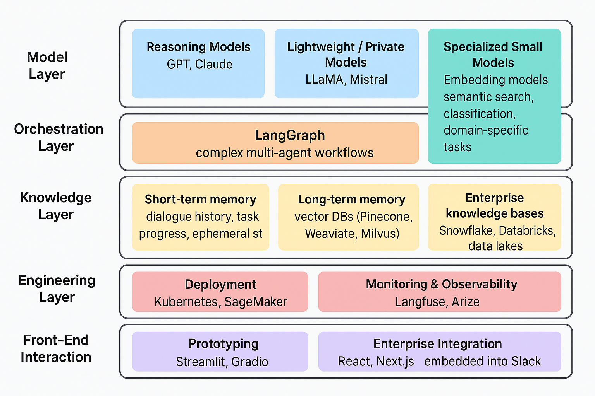

### Multi-Agent Systems Achieve Tech Stack


### How Multi-Agent Systems Achieve Tech Stack Integration

Lately, everyone is talking about multi-agent systems. In the comments you often see: “But how do big companies actually make this work in production?”

The short answer: multi-agent ≠ just throwing a few models into a group chat. It’s about building a full-stack ecosystem where models, orchestration, knowledge, engineering, and interfaces work together.

---

### 1️⃣ Model Layer – Moving Beyond the “One Big Model” Myth

Large enterprises no longer rely on a single model. They play a portfolio strategy:

- Reasoning Models: GPT, Claude → best at complex reasoning and natural language tasks.
- Lightweight / Private Models: LLaMA, Mistral → used for cost-sensitive or compliance-critical scenarios (e.g., internal data privacy).
- Specialized Small Models: Embedding models for semantic search, classification, or domain-specific tasks.

👉 The secret: models are tools, not religions. The smart move is combining them for the right job.

---

### 2️⃣ Orchestration Layer – LangGraph as the Core Capability

Having models isn’t enough; the question is: how do they collaborate?

- LangGraph: purpose-built for designing complex multi-agent workflows (routing, delegation, stateful reasoning).
- Ray / Prefect: handle distributed task scheduling and scaling, ensuring thousands of agents don’t trip over each other.

Think of it like this: LangGraph sets the rules, Ray enforces order.

---

### 3️⃣ Knowledge Layer – Preventing Agents from Being “Goldfish”

One of the biggest complaints about agents is that they “forget” context. Enterprises fix this with memory + knowledge integration:

- Short-term memory: dialogue history, task progress, ephemeral state.
- Long-term memory: stored in vector DBs like Pinecone, Weaviate, Milvus for semantic retrieval.
- Enterprise knowledge bases: Snowflake, Databricks, data lakes that unify structured + unstructured corpora for agents.

👉 The goal: agents that can converse, remember tasks, and understand organizational context.

---

### 4️⃣ Engineering Layer – Where Things Get Real (and Painful)

Running agents at scale requires real engineering discipline:

- Deployment: Kubernetes, SageMaker to support large-scale concurrent execution.
- Monitoring & Observability: Langfuse, Arize to trace each agent’s decision path and prevent black-box behavior.

👉 Without observability, multi-agent is just experimental alchemy.

---

### 5️⃣ Front-End Interaction – From Labs to Real Workflows

Agents aren’t meant to stay in research demos; enterprises turn them into “virtual colleagues.”

- Prototyping: Streamlit, Gradio for quick POCs.
- Enterprise Integration: React, Next.js, embedded into Slack / Teams so agents sit alongside employees in daily workflows.

👉 The trick: make the tech powerful, but the interaction warm and human.

---

### 🔑 Key Takeaway

Enterprise-grade multi-agent systems = Model + Orchestration + Knowledge + Engineering + Front-end.
The real breakthrough is not just “more agents,” but stitching together a complete stack that runs reliably, scales elastically, and integrates safely into production.

---

Would you like me to also diagram this as a full-stack architecture (layers + tools) so you can show it visually, e.g., for a presentation or technical doc?


---

### A Full-stack Architecture (layers + tools)





---


Here’s a highlighted summary of the full-stack multi-agent architecture and an implementation boilerplate with project structure you can base your system on:


### ⚙️ Full-Stack Multi-Agent Architecture — Key Highlights


| Layer                  | Purpose                                         | Typical Tools / Components                        | Core Highlights                                                      |
|------------------------|-------------------------------------------------|---------------------------------------------------|---------------------------------------------------------------------|
| **1️⃣ Model Layer*-     | Diverse model portfolio for reasoning, efficiency, and specialization | GPT, Claude, LLaMA, Mistral, Embedding models     | - Combine reasoning, small, and private models<br>- Use embeddings for retrieval/classification<br>- Treat models as modular tools, not monoliths |
| **2️⃣ Orchestration Layer*- | Coordination, routing, and planning            | LangGraph, LangChain, Ray, Prefect                | - Agents collaborate via LangGraph flows<br>- Ray handles distributed scheduling<br>- Supports multi-step reasoning and delegation |
| **3️⃣ Knowledge Layer*- | Memory and context grounding                    | Pinecone, Weaviate, Milvus, Snowflake, Databricks | - Short-term: task context<br>- Long-term: vector memory<br>- Integrate enterprise data lakes |
| **4️⃣ Engineering Layer*- | Production infrastructure                      | Kubernetes, SageMaker, Langfuse, Arize            | - Safe deployment and scaling<br>- Trace and monitor agent decisions |
| **5️⃣ Front-End Layer*- | Human interaction and workflow embedding        | Streamlit, React, Next.js, Slack, Teams           | - Agents as “virtual colleagues”<br>- Blend LLMs into enterprise UI  |

---

### 🧱 Implementation Boilerplate — Project Structure

```text
multi-agent-system/
├── README.md
├── requirements.txt
├── config/
│   ├── settings.yaml          # API keys, model routing, vector DB configs
│   └── env.example
│
├── src/
│   ├── models/                # Model wrappers
│   │   ├── reasoning_model.py
│   │   ├── small_model.py
│   │   └── embeddings.py
│   │
│   ├── orchestration/         # Agent orchestration (LangGraph flows)
│   │   ├── agent_nodes/
│   │   │   ├── retriever_agent.py
│   │   │   ├── summarizer_agent.py
│   │   │   └── planner_agent.py
│   │   └── workflow_graph.py
│   │
│   ├── knowledge/             # Memory + retrieval layer
│   │   ├── vector_store.py
│   │   ├── memory_manager.py
│   │   └── data_connector.py
│   │
│   ├── engineering/           # Deployment, logging, tracing
│   │   ├── monitor.py
│   │   ├── telemetry.py
│   │   └── scheduler.py
│   │
│   ├── frontend/              # UI or API interface
│   │   ├── app_streamlit.py
│   │   └── app_react_api.py
│   │
│   ├── utils/                 # Shared utilities
│   │   ├── prompts.py
│   │   ├── logger.py
│   │   └── helpers.py
│   │
│   └── main.py                # System entrypoint / orchestrator
│
├── tests/
│   ├── test_agents.py
│   ├── test_memory.py
│   └── test_workflows.py
│
└── docker/
    ├── Dockerfile
    └── docker-compose.yml

```

---

### 🚀 Quick Implementation Notes


- Start small: implement 2–3 core agents (Retriever, Planner, Synthesizer).
- Add LangGraph orchestration to connect agents with defined message schemas.
- Integrate vector DB (Weaviate/Pinecone) early for contextual recall.
- Deploy on Kubernetes or ECS with observability (Langfuse/Arize).
- Embed UI (React/Streamlit) in Slack/Teams for natural enterprise use.

Would you like me to generate a ready-to-run GitHub repo template (with stub code and folder structure) for this architecture?


---


### 🧩 Key Files — Highlights

**src/main.py**

```python
from orchestration.workflow_graph import build_agent_graph

def main():
    graph = build_agent_graph()
    result = graph.invoke({"query": "Find recent AI ethics research trends"})
    print(result)

if __name__ == "__main__":
    main()
```


**orchestration/workflow_graph.py**

```python
from langgraph.graph import StateGraph
from orchestration.planner_agent import planner
from orchestration.retriever_agent import retriever
from orchestration.summarizer_agent import summarizer

def build_agent_graph():
    graph = StateGraph()
    graph.add_node("planner", planner)
    graph.add_node("retriever", retriever)
    graph.add_node("summarizer", summarizer)
    graph.set_entry("planner")
    graph.connect("planner", "retriever")
    graph.connect("retriever", "summarizer")
    return graph

```

**knowledge/vector_memory.py**

```python
from weaviate import Client
import os

client = Client(os.getenv("WEAVIATE_URL", "http://localhost:8080"))

def query_memory(query_vector):
    return client.query.get("Document", ["text"]).with_near_vector({"vector": query_vector}).do()
```

**frontend/app_streamlit.py**

```python
import streamlit as st
from src.main import main

st.title("🧠 Multi-Agent Research Assistant")
query = st.text_input("Enter a research question:")
if st.button("Run"):
    st.write("Processing...")
    result = main()
    st.success(result)
```


---

### 🧰 Requirements (partial)

```text
langchain
langgraph
openai
weaviate-client
pinecone-client
streamlit
fastapi
uvicorn
langfuse
prefect
ray
```

--- 

### 🚀 Next Steps


1. Clone & Install

```bash
git clone https://github.com/yourname/multi-agent-stack-template.git
cd multi-agent-stack-template
pip install -r requirements.txt
```

2.  Run locally

```bash 
streamlit run src/frontend/app_streamlit.py
```

3.  Deploy

```bash
docker compose up --build
# or use Kubernetes YAML in docker/k8s-deployment.yaml
```


