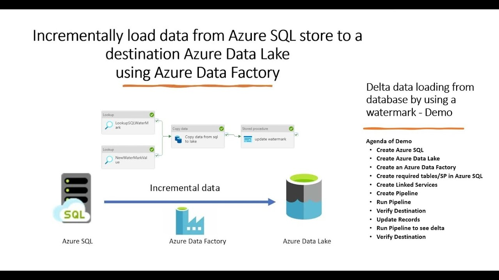
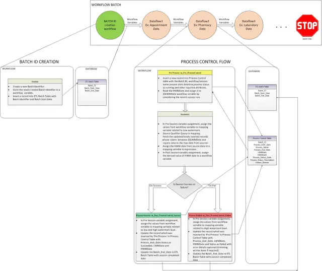
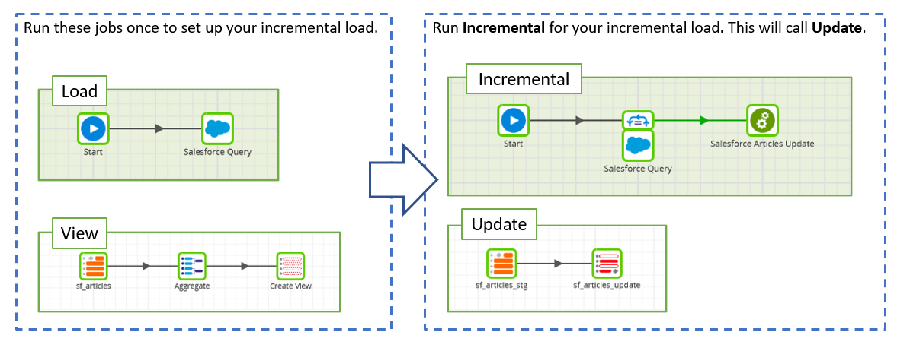

## Summary of Incremental‑processing Logic for a Watermark Table


Good idea — here’s a clean, organized summary of the incremental‑processing logic for a watermark table + pipeline, along with a few missing/optional logic steps I’d add to make it more robust and production‑ready. Think of this as a “spec sheet” for your watermark + incremental‑load framework.


### ✅ Core Watermark + Incremental Processing Logic: Summary


#### 🎯 Purpose of Watermark Table

- The watermark table holds per‑upstream‑table metadata: last processed version, planned start/end version, pipeline run ID/status, etc.
- It functions as the “source of truth” (checkpoint store) so that subsequent runs know where to resume, avoiding reprocessing or missing data. This is akin to a "high‑watermark" or "control table" as commonly used for incremental/CDC loads. 


---

#### 🔄 Workflow & State Transitions


- *When to start a batch process**

1. Trigger batch run (manual or scheduled).
2. Call prepareProcessingPlanForSchemas(...) (or equivalent) to build or resume the plan:
    - Fetch the latest watermark entries for relevant upstream tables.
    - Examine the status of existing watermark records:
        - If status = COMPLETED, treat as “previous run finished” → generate a new watermark record with new run ID and plan.
        - If status = PLANNED, it means a previous run was scheduled/planned but not yet executed (or potentially failed) → reuse that planned version range (do not create a new plan).
    - The result is a set of upstream tables with associated (start_version, end_version) to process.

- *During batch process**

- For each upstream table in the plan, read data incrementally (e.g. using Delta change‑data‑feed or Delta versioning) between start_version and end_version.
- Perform transformations, upserts/deletes, or other downstream logic.

- *After batch process completes**

- If successful: call markRunCompleted() (or equivalent) to update watermark table — set status = “COMPLETED”, set last_processed_version = end_version, update timestamps/run_id, etc.
- If failed (or aborted/partial): do not mark as completed. This preserves the planned version range so that subsequent run can either retry or resume from that plan.

---

#### 📥 Watermark / Checkpoint Read Functions


- loadCheckpoints(tableNames: Seq[String]) — retrieves checkpoint information (table_name, last_processed_version) for the specified upstream tables. Only returns the most recent completed versions.
- loadVersionRanges(...) / fetchCurrentProcessingPlan(...) — retrieves the currently planned version ranges (start/end) from watermark table where status = “PLANNED”. Used by downstream consumers or orchestration logic to know what to process next.


---


### ⚙️ Additional / Recommended Logic (Missing or Useful Enhancements)

To make the watermark + pipeline logic more robust and production‑ready, consider adding the following:

#### 1. History / Audit Logging
    - Keep a separate history table (e.g. pipeline_watermark_history) to log all runs (planned, completed, failed) with timestamps, run IDs, status, error messages. This helps debugging, backfills, compliance, and monitoring.

#### 2. Failure Handling & Retry Logic
    - If a run fails, mark its watermark status to "FAILED" (or leave as "PLANNED"), record an error_message, failed_at timestamp.
    - Provide a method to retry a failed run (reuse the same planned version range) — avoid data loss or version gaps.

#### 3. Concurrency / Multiple Pipeline Support
    - If multiple pipelines may operate on overlapping upstream tables, include a pipeline_name (or job_name) in watermark metadata so records are scoped per pipeline.
    - Prevent collisions by ensuring upserts/merges consider (table_name, pipeline_name, run_id) when matching rows.

#### 4. Watermark Table Initialization / First-Time Run Handling
    - On first-ever run (when watermark table doesn’t exist or is empty), create watermark entries with e.g. last_processed_version = null or default 0, so pipeline treats them as “never processed before.”
    - Optionally allow configuration of an initial baseline version (e.g. start from full history or a safe baseline) rather than 0.

#### 5. Support for Deletes / Full History / Snapshot Consistency
    - If upstream supports deletes or you need to preserve history, ensure your incremental read + downstream merge logic handles delete operations (or full replays) properly.
    - Optionally include a “snapshot‑id” or “commit timestamp” watermark instead of just version number, if using a system like Delta Lake + CDC to ensure consistency across tables. tabular.io+2TECHCOMMUNITY.MICROSOFT.COM+2

#### 6. Monitoring / Observability
    - Include columns like update_ts, run_id, status, error_message, and possibly execution_duration, records_processed — helps for auditing, alerting, and performance tracking.

#### 7. Schema / Metadata Versioning (if upstream schema changes)
    - Track upstream schema version or model version in watermark metadata; if schema evolves, watermark logic may need to be reset or audited.

#### 8. Atomicity Between Data Load and Watermark Update
    - Ensure that updating watermark status/checkpoint happens after data load commit (and ideally in the same transaction if possible) to avoid mismatches (i.e. watermark moved up but data load failed). This is core to safe incremental/CDC pipelines. tabular.io+1


---

### 🧠 Why This Watermark Pattern Works (and Why It’s a Best Practice)

- The “watermark / high‑watermark + checkpoint / control‑table” pattern is widely used for incremental loads & CDC to avoid reprocessing or missing data — ensures idempotent, efficient ingestion.
- Using a control table (watermark table) with per‑table metadata enables scalable processing across many upstream tables (100+), while keeping state centralized and easy to manage.
- Storing plan status (PLANNED / COMPLETED / FAILED) helps orchestration and monitoring: you know what’s planned, what’s done, what failed — critical for automated pipelines.


---


## Watermark + Incremental Processing — State Diagram & Lifecycle


Good idea — here’s a state‑transition diagram (text + ASCII-style) for the watermark + incremental data‑processing lifecycle in your pipeline design. It includes main states, transitions on success/failure, and what happens on first run or re‑runs. I also highlight where some of the optional/missing logic (from earlier suggestions) fits in.




---



---



---


### 🔄 Watermark + Incremental Processing — State Diagram & Lifecycle

```css
[Start / Trigger pipeline run]
             │
             ▼
 ┌─────────┐  Prepare plan  ┌────────────────────────────┐
 │ Watermark │ ───────────▶ │ Check watermark entries    │
 │ table empty? ─ yes ───┐  │ for each upstream table   │
 └─────────┘             │  └────────────────────────────┘
                         │
                         │ No / not first run
                         │
                         ▼
             ┌────────────────────────────┐
             │ Existing entries found     │
             │ For each upstream table:  │
             │  if status = COMPLETED    │ → new plan (new run_id) │
             │  if status = PLANNED      │ → reuse existing plan   │
             └────────────────────────────┘
                         │
                         ▼
           ┌───────────────────────────────┐
           │ Write “plan” to watermark      │  (status = PLANNED) │
           │ table (table_name, run_id,     │                     │
           │ start_version, end_version,    │                     │
           │ metadata ...)                  │                     │
           └───────────────────────────────┘
                         │
                         ▼
              [Batch / Incremental Processing]
                         │
                         ▼
           ┌───────────────────────────┐
           │ Process each upstream    │
           │ table: read changes       │
           │ from start_version →      │
           │ end_version               │
           └───────────────────────────┘
                         │
           ┌─────────────┴─────────────┐
           │ success? / all tables processed │
           ▼                               ▼
 ┌────────────────────┐           ┌──────────────────────┐
 │ Batch succeeded    │           │ Batch failed / abort │
 └────────────────────┘           └──────────────────────┘
           │                               │
           ▼                               │
 ┌──────────────────────────────────┐     │
 │ Run markCompleted():             │     │  -- Do not update watermark status --
 │ Update watermark rows:           │     │  (status remains PLANNED) — can retry  │
 │   status = COMPLETED             │     │                                        │
 │   last_processed_version = end_version │ │
 │   update metadata (timestamp, run_id, etc.) │ │
 └──────────────────────────────────┘     │
           │                               │
           ▼                               │
  Next run or schedule future run        │
                                         │
  (start again, using latest checkpoints) │
```


---


### 📌 Flow Description & Key Logic

| Step | Description |
|------|-------------|
| **First time / empty watermark table** | If watermark table doesn't exist or has no entries, pipeline treats all upstream tables as needing a full initial import (e.g. start_version = 0 or baseline), and writes a "PLANNED" record for each table with a new run ID. |
| **Plan creation** | For each upstream table: check latest available version (via getLatestVersions), join with existing watermark to get last processed version (if any), then set start_version and end_version. If previous run was completed, start from last_processed_version + 1; if previous run is still "PLANNED," reuse that plan. |
| **Plan persistence** | Write plan metadata into watermark table (status = PLANNED). This makes which version ranges will be processed explicit and visible. |
| **Batch / incremental processing** | Process upstream changes (CDF or delta versions) between start and end for each table. This can be done table-by-table or in parallel, depending on downstream logic. |
| **On success** | Once processing completes for all upstream tables: call markCompleted() to update watermark entries: set status = COMPLETED, update last_processed_version = end_version, update run metadata (timestamps, run_id). |
| **On failure / abort** | Do not update watermark — leave status as PLANNED. That preserves the plan so you can retry the same version range, avoiding data loss or duplication. |
| **Next run** | On next pipeline trigger, logic inspects watermark: for tables with status = COMPLETED → create a new plan; for tables still PLANNED → either resume or alert (depending on how you want to handle). |


---

### ✅ Optional / Recommended Enhancements (State Extensions)

- History / audit log: Maintain a separate history table logging every plan and run (with status, run_id, timestamps, number of records processed, errors if any). Helps debugging, backfill, metrics.
- Failure tracking / retry logic: If a run fails, mark status as “FAILED” (or leave as PLANNED), capture error_message, and support retries.
- Concurrency / pipeline‑name scoping: If multiple pipelines run over overlapping upstream tables, include pipeline_name in watermark metadata so they don’t clash.
- Schema‑evolution / migration handling: If upstream table schema changes, logic to detect and optionally reinitialize or backfill full history (or alert).
- Atomic commit between data load and watermark update — ensure that data load and watermark update happen together (or in a fault-tolerant manner) to prevent inconsistent state (watermark advanced but data not applied).
- Monitoring / alerting — detect stuck PLANNED entries (e.g. plan created but not completed for a long time), missing runs, or repeated failures.

---

###🧩 Why This Pattern Works (Watermark + Plan + State Machine)


- The watermark pattern is widely used for incremental and CDC-based data synchronization. It lets you “resume where you left off” safely, without reprocessing all data or risking missed changes. Wikipedia+2Microsoft Learn+2
- Having explicit plan and status (PLANNED / COMPLETED / FAILED) gives clarity and control — you know exactly what version ranges are scheduled, what’s done, and what’s pending.
- This model supports both initial full loads (first run) and incremental (subsequent runs), enabling efficient ingestion at scale, even with 100+ upstream tables.


---


## Why Central Watermark Table?


Nice problem — thanks for the clear background. I’ll be direct: Option-1 (central watermark table keyed by upstream table + Delta version) is the better default when your upstreams are Delta/ACID-backed or otherwise expose a monotonic version (or CDF). It’s more deterministic, idempotent, and simpler to reason about for correctness, retries, replays and incremental joins across multiple upstreams.

That said, there are sensible hybrids and operational details to make it robust and efficient. Below I give a recommendation, tradeoffs, practical schemas, atomic/transactional patterns, failure/retry rules, and concrete Spark/Delta snippets you can drop in.

---

### Recommendation (short)

-  Prefer a central watermark table that stores per-upstream: last_processed_version, latest_available_version (at batch creation), start_version, end_version, last_processed_ts, cdf_enabled, and batch_id.
-  Have a batch coordinator job that creates a single batch_id and writes a row (or rows) for each upstream used in that batch into the watermark table (with start_version and end_version). Use Delta transactions (MERGE/UPSERT) so batch creation is atomic.
-  Each pipeline reads the watermark rows by batch_id and processes using the exact versions (or version ranges). After successful processing the pipeline writes to a pipeline_checkpoint table the batch_id, pipeline name, status, processed_ts, metrics, etc.
-  Use versions when possible. If an upstream doesn’t support versions / CDF, fall back to timestamp-based fetch for that upstream only; record that in watermark (e.g., version = -1 and use_timestamp = true plus start_ts/end_ts).

---

### Why Option-1 wins

-  Deterministic & idempotent: versions let you re-read the exact snapshot (Delta VERSION AS OF) or read commit ranges. Re-processing the same version range yields the same input.
-  Precise join windows: when a pipeline consumes multiple upstreams you can coordinate exact versions per table so join semantics are consistent.
-  Retry / backfill friendly: you can re-run a batch given its batch_id and versions.
-  Auditability: you keep a single source of truth about what was processed and when.
-  Supports CDF: easier to wire change-data-capture workflows using version ranges.

---

### When timestamp approach (Option-2) makes sense

-  Upstreams are non-Delta systems that only expose ingestion timestamps and you cannot or will not use CDF or versions.
-  Your pipelines can tolerate duplicates or non-deterministic ordering and you prefer a simple time window model.
-  If you pick time windows, still store them in a central table (per-upstream + batch_id) to allow pipeline checkpoints and auditing.

---

### Recommended logical schema (Delta tables)

#### 1) watermark table (per upstream per batch)

-  Table name: gold.watermarks (Delta)
-  Partitioning: partition by batch_date (optional) for pruning
-  Columns:
    -  batch_id STRING — unique batch id (e.g. batch_20251206T123456_…)
    -  table_name STRING — upstream qualified name or path
    -  start_version LONG — inclusive (use -1 if not applicable)
    -  end_version LONG — inclusive or exclusive depending on convention
    -  last_processed_version LONG — the prior committed processed version for that upstream (for info)
    -  latest_available_version LONG — latest version discovered when the batch was created
    -  start_ts TIMESTAMP — optional, useful if using timestamp-based reads
    -  end_ts TIMESTAMP
    -  cdf_enabled BOOLEAN
    -  update_ts TIMESTAMP — when watermark row was written
    -  updated_by STRING
    -  status STRING — PENDING, LOCKED, COMPLETED, FAILED
    -  error_message STRING
    -  notes STRING — optional
-  Primary key semantic: (batch_id, table_name)


#### 2) pipeline_checkpoint table (per pipeline per batch)

-  Table name: gold.pipeline_checkpoints
-  Columns:
    -  pipeline_name STRING
    -  batch_id STRING
    -  processed_ts TIMESTAMP
    -  status STRING — RUNNING, SUCCESS, FAILED
    -  rows_read LONG
    -  rows_written LONG
    -  metrics MAP<STRING,STRING>
    -  error_message STRING

---

### Batch coordinator flow (high level)

1. Coordinator lists all upstream tables relevant for upcoming scheduled runs (or all upstreams used by pipelines for targeted pipeline).
2. For each upstream table:
    -  Query latest version (DESCRIBE HISTORY or deltaTable.history() or deltaTable.detail()), and detect delta.enableChangeDataFeed property.
    -  Decide start_version = last_processed_version + 1 (or from pipeline-specific policy), end_version = latest_version (or compute a maximum window size). If start > end, mark as no-op for that upstream (still write a watermark row with status PENDING or SKIP).
3. Create a unique batch_id (timestamp + uuid) and write all watermark rows for the batch in a single Delta transaction (append/merge). Mark rows as PENDING or LOCKED.
4. Pipelines read watermark rows with batch_id and process each upstream according to the start_version/end_version or start_ts/end_ts.
5. Pipeline writes to pipeline_checkpoints with RUNNING then SUCCESS/FAILED. On success, coordinator may update last_processed_version (or pipeline does) in watermark table or maintain a separate table that records per-upstream committed watermark (depends on desired ownership).
6. A cleanup/retention job compacts and retains past watermark/checkpoint history per policy.

---

### Concurrency / Ownership notes

-  Decide ownership of last_processed_version for each upstream: Does the batch coordinator update the per-upstream committed watermark after all pipelines that depend on that upstream have successfully consumed the batch? Or do pipelines individually confirm and a separate aggregator marks the upstream as fully processed?
    -  Common pattern: coordinator writes batch_id and target end_version. Pipelines set their status. A finalizer job checks that all pipelines that depend on that upstream have SUCCESS for the batch_id, then atomically advances last_processed_version for that upstream to end_version. This avoids losing data if one pipeline fails.
-  Prevent double-processing: use MERGE with batch_id/table_name as keys and rely on Delta ACID for atomic updates.

---

### Handling pipelines that use multiple upstreams

-  Pipelines should read the list of watermark rows for their batch_id and treat each upstream's input as the exact snapshot range to use.
-  If an upstream has no new data (start > end), pipeline should skip reads for that upstream but still execute join logic accordingly (e.g., no-op branch or load empty df).

---

### Late-arriving data and replays

-  Keep historical watermarks and pipeline_checkpoints to support replays/backfills.
-  If late data arrives and you must reprocess older ranges:
    -  Create a new batch_id and set start_version/end_version to the older versions and run pipelines.
    -  Do not monotonically advance last_processed_version until the late batch is confirmed and finalizer runs.

---

### Performance and efficiency tips

-  Compute end_version with a maximum window size (e.g., max 10k commits or X hours) to bound input size.
-  Partition watermarks by batch_date (yyyy-MM-dd) for efficient scans.
-  Use cdf_enabled flag: when CDF is on, pipelines should use change ranges (table.changes(startVersion, endVersion)) which are smaller than full snapshot reads.
-  Use VACUUM retention and OPTIMIZE on watermark/checkpoint tables to keep metadata healthy.


---

### Example Delta SQL to create tables

```sql
-- Watermark table
CREATE TABLE IF NOT EXISTS gold.watermarks (
  batch_id STRING,
  table_name STRING,
  start_version LONG,
  end_version LONG,
  last_processed_version LONG,
  latest_available_version LONG,
  start_ts TIMESTAMP,
  end_ts TIMESTAMP,
  cdf_enabled BOOLEAN,
  update_ts TIMESTAMP,
  updated_by STRING,
  status STRING,
  error_message STRING,
  notes STRING
) USING DELTA
PARTITIONED BY (date(update_ts))  -- optional partitioning
```

```sql
-- Pipeline checkpoint
CREATE TABLE IF NOT EXISTS gold.pipeline_checkpoints (
  pipeline_name STRING,
  batch_id STRING,
  processed_ts TIMESTAMP,
  status STRING,
  rows_read LONG,
  rows_written LONG,
  metrics MAP<STRING,STRING>,
  error_message STRING
) USING DELTA
```

---

### Concrete Scala/Spark snippets


#### 1) Coordinator: discover latest version & write watermark rows atomically

```scala
import org.apache.spark.sql.functions._
import java.util.UUID
import java.sql.Timestamp

case class WatermarkRow(
  batch_id: String,
  table_name: String,
  start_version: Long,
  end_version: Long,
  last_processed_version: Long,
  latest_available_version: Long,
  start_ts: java.sql.Timestamp,
  end_ts: java.sql.Timestamp,
  cdf_enabled: Boolean,
  update_ts: java.sql.Timestamp,
  updated_by: String,
  status: String,
  error_message: String
)

def discoverLatestVersion(spark: SparkSession, tableIdentifier: String): (Long, Boolean) = {
  try {
    // DESCRIBE HISTORY returns column "version". We take max
    val hist = spark.sql(s"DESCRIBE HISTORY $tableIdentifier")
    val maxVersion = hist.agg(max(col("version")).cast("long")).as[Long].collect().headOption.getOrElse(-1L)
    // Read properties from DESCRIBE DETAIL
    val detail = spark.sql(s"DESCRIBE DETAIL $tableIdentifier")
    val props = if (detail.columns.contains("properties")) {
      detail.select("properties").collect().headOption
        .map(_.getMap.toMap).getOrElse(Map.empty[String,String])
    } else Map.empty[String,String]
    val cdf = props.get("delta.enableChangeDataFeed").exists(_.toLowerCase == "true")
    (maxVersion, cdf)
  } catch {
    case e: Throwable => (-1L, false)
  }
}

def createBatchAndWriteWatermarks(spark: SparkSession, upstreams: Seq[(String, Long)], createdBy: String) = {
  // upstreams: Seq[(tableName, lastProcessedVersion)] - coordinator knows last processed
  val batchId = s"batch_${java.time.Instant.now.toString}_${UUID.randomUUID.toString.take(8)}"
  val now = new java.sql.Timestamp(System.currentTimeMillis())
  val wmRows = upstreams.map { case (tableName, lastProcessed) =>
    val (latestVersion, cdfEnabled) = discoverLatestVersion(spark, tableName)
    val startV = lastProcessed + 1
    val endV = if (latestVersion >= startV) latestVersion else lastProcessed
    WatermarkRow(
      batch_id = batchId,
      table_name = tableName,
      start_version = startV,
      end_version = endV,
      last_processed_version = lastProcessed,
      latest_available_version = latestVersion,
      start_ts = now,
      end_ts = now,
      cdf_enabled = cdfEnabled,
      update_ts = now,
      updated_by = createdBy,
      status = if (endV >= startV) "PENDING" else "NOOP",
      error_message = ""
    )
  }

  import spark.implicits._
  val wmDF = wmRows.toDF()
  // Atomically append watermark rows (single transaction)
  wmDF.write.format("delta").mode("append").saveAsTable("gold.watermarks")
  batchId
}

```

---

#### 2) Pipeline: read watermark by batch_id and process each upstream

```scala
def runPipelineForBatch(spark: SparkSession, pipelineName: String, batchId: String) = {
  import org.apache.spark.sql.functions._
  val wmDF = spark.table("gold.watermarks").filter(col("batch_id") === batchId && col("status").isin("PENDING","NOOP"))
  val wmRows = wmDF.collect()

  // Mark pipeline as RUNNING in checkpoint
  spark.sql(s"INSERT INTO gold.pipeline_checkpoints VALUES ('${pipelineName}', '${batchId}', current_timestamp(), 'RUNNING', 0, 0, map(), '')")

  try {
    wmRows.foreach { r =>
      val tableName = r.getAs[String]("table_name")
      val startV = r.getAs[Long]("start_version")
      val endV = r.getAs[Long]("end_version")
      val cdf = r.getAs[Boolean]("cdf_enabled")

      val inputDF = if (startV > endV) {
        // no-op: empty df with schema if needed
        spark.emptyDataFrame
      } else if (cdf) {
        // use Delta CDF
        spark.read.format("delta").option("readChangeData", "true")
          .option("startingVersion", startV.toString)
          .option("endingVersion", endV.toString)
          .table(tableName)
      } else {
        // snapshot read of end_version
        spark.read.format("delta").option("versionAsOf", endV).table(tableName)
      }

      // do pipeline-specific transforms on inputDF...
    }

    // on success update checkpoint
    spark.sql(s"MERGE INTO gold.pipeline_checkpoints pc USING (SELECT '${pipelineName}' AS pipeline_name, '${batchId}' AS batch_id) src ON pc.pipeline_name=src.pipeline_name AND pc.batch_id=src.batch_id WHEN MATCHED THEN UPDATE SET processed_ts=current_timestamp(), status='SUCCESS'")
  } catch {
    case e: Throwable =>
      // update checkpoint to FAILED
      val msg = e.getMessage.replace("'", "''")
      spark.sql(s"MERGE INTO gold.pipeline_checkpoints pc USING (SELECT '${pipelineName}' AS pipeline_name, '${batchId}' AS batch_id) src ON pc.pipeline_name=src.pipeline_name AND pc.batch_id=src.batch_id WHEN MATCHED THEN UPDATE SET processed_ts=current_timestamp(), status='FAILED', error_message='$msg'")
      throw e
  }
}
```

---

### Failure handling / finalizer

-  Don’t advance last_processed_version in an upstream until all dependent pipelines report SUCCESS for that batch_id. Implement a finalizer job that MERGEs gold.watermarks or a gold.committed_watermarks table to update last_processed_version = end_version once all pipelines depending on the upstream show SUCCESS.
-  If any pipeline FAILED, keep batch rows for diagnostics and allow retry of the failing pipeline. When retry succeeds, same batch_id should be reprocessed (idempotent since you use exact version ranges). Only after all success do you advance.

---

### Schema evolution and column/DDL changes

-  If upstream schema changes happen within the version range, using versionAsOf ensures the snapshot schema matches that version. If using CDF, ensure your CDF-based processing can handle schema changes (add nulls/migrations). Record schema hash in watermark row if you want schema-level auditing.

---

### Monitoring & observability

-  Expose metrics: rows read/written per pipeline per upstream, durations, retry counts. Store in pipeline_checkpoints.metrics.
-  Build dashboards that display watermarks by status and which pipelines are lagging.
-  Alert if average end_version - last_processed_version > threshold (big lag).

---

### Summary (concise)

-  Pick Option-1 (version-based watermark table) as primary for determinism, idempotence, and good join semantics across multiple upstreams.
-  Fallback to timestamp for upstreams without versions. Record both kinds in watermark so pipelines know how to read.
-  Use a coordinator + finalizer + per-pipeline checkpoints pattern.
-  Rely on Delta transactions (MERGE/append) for atomicity and on per-batch batch_id for traceability and retries.

If you want I can:
-  produce a ready-to-run full Scala object implementing coordinator, finalizer, and pipeline helper functions (with MERGE semantics and example tests), or
-  produce an ERD of the watermark/checkpoint tables and example SQL to do the finalizer/advance step.


--


