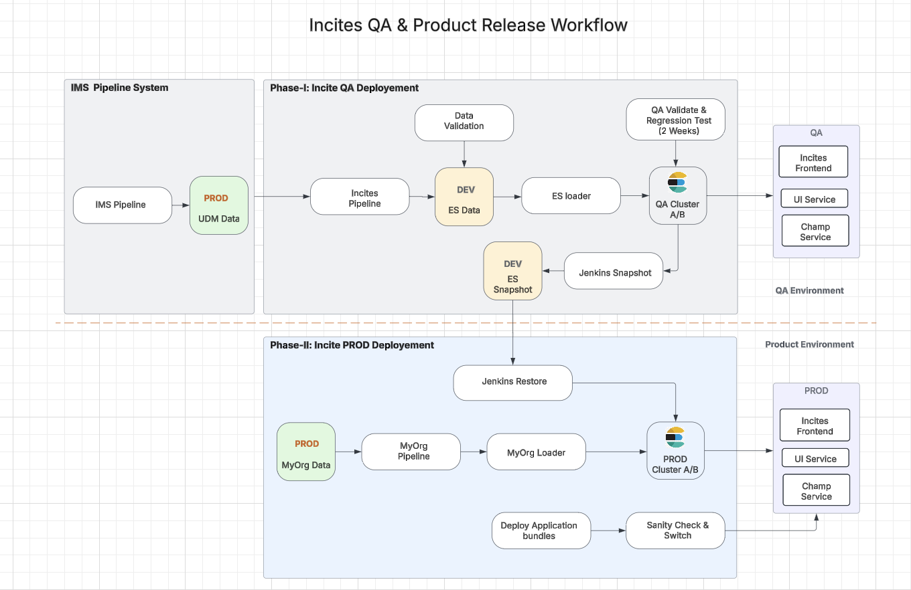

### Incites QA & Product Release Workflow
---

#### Overview

The Incites QA & Product Release Workflow outlines the structured process for deploying data and applications from the IMS Pipeline System to both QA and Production (PROD) environments. The process is divided into two phases:

1.	Phase-I: Incite QA Deployment – Focuses on validating and testing data in a controlled QA environment.
2.	Phase-II: Incite PROD Deployment – Ensures a seamless transition to production with rigorous checks.

This workflow guarantees data integrity, application stability, and smooth releases through automated processes and validation checkpoints.

---

#### Phase-I: Incite QA Deployment

This phase is designed to ingest, validate, and test data within the QA environment before it is promoted to production.

**Process Steps**

1.	Data Ingestion
	-	The IMS Pipeline System generates PROD UDM Data.
	-	This data is processed through the Incites Pipeline, where it is transformed and prepared.

2.	Data Validation
	-	The transformed data is loaded into the DEV ES Data repository.
	-	A validation step ensures that the data meets predefined quality standards before further processing.

3.	ES Loader & QA Cluster Deployment
	-	The validated data is loaded into QA Cluster A/B using the ES Loader.
	-	This ensures that the data structure and indexing are optimized for further testing.

4.	QA Validation & Regression Testing
	-	The QA team performs a two-week validation and regression testing phase.
	-	QA tests the data across various components:
	-	Incites Frontend
	-	UI Service
	-	Champ Service
	-	This ensures that changes do not introduce regressions or performance bottlenecks.

5.	Jenkins Snapshot
	-	Once the QA phase is completed, a Jenkins Snapshot is created from DEV ES Snapshot.
	-	This snapshot serves as the data backup for production deployment.

---

#### Phase-II: Incite PROD Deployment

After successful QA validation, data and application updates are deployed into the production environment.

**Process Steps**

1.	Jenkins Restore
	-	The Jenkins Restore process retrieves the DEV ES Snapshot and prepares it for production deployment.

2.	MyOrg Pipeline Processing
	-	The PROD MyOrg Data is ingested into the MyOrg Pipeline.
	-	The pipeline processes the data, ensuring it is formatted correctly for final deployment.

3.	Data Loading & Deployment
	-	The processed data is loaded into PROD Cluster A/B using the MyOrg Loader.
	-	Simultaneously, application bundles are deployed, ensuring alignment between data and services.

4.	Sanity Check & Production Switch
	-	A final Sanity Check is conducted to verify system stability.
	-	Upon successful validation, a Production Switch is executed to transition the environment into full production mode.

---

#### Key Environments & Components

| **Environment**      | **Components**                                      |
|----------------------|-----------------------------------------------------|
| **QA Environment**   | Incites Frontend, UI Service, Champ Service, QA Cluster A/B |
| **Product Environment** | Incites Frontend, UI Service, Champ Service, PROD Cluster A/B |

## Conclusion

This workflow ensures a structured and controlled release of data and applications from development to production. By leveraging QA validation, regression testing, automated snapshots, and Jenkins-based deployment, this process minimizes risks and ensures system integrity.