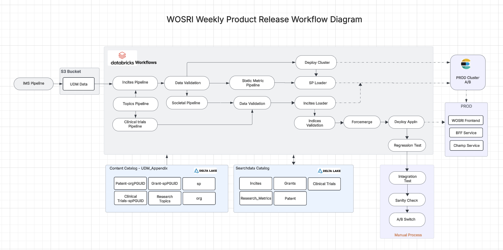

### WOSRI Weekly Product Release Workflow Diagram

---
#### Overview

The WOSRI Weekly Product Release Workflow Diagram is a visual representation of the process involved in the weekly release of products within the WOSRI (Workflow of Software Release Integration) framework. This diagram outlines the various stages, tasks, and decision points that are part of the weekly product release cycle.

---

#### Key Components

####  1. Start of Workflow

- The workflow begins with the initiation of the weekly product release process.
- Key stakeholders and teams are notified of the start of the release cycle.

####  2. Preparation Phase

- Code Freeze: Development teams finalize and freeze the codebase to ensure no further changes are made before the release.
- Testing: Comprehensive testing is conducted, including unit tests, integration tests, and user acceptance tests (UAT).
- Documentation: Release notes, user guides, and other relevant documentation are prepared and reviewed.

####  3. Build and Packaging

- Build Process: The code is compiled and built into deployable packages.
- Packaging: The built code is packaged into release artifacts, which may include binaries, libraries, and configuration files.

####  4. Deployment

- Staging Environment: The release artifacts are deployed to a staging environment for final verification.
- Smoke Testing: Basic tests are conducted to ensure the deployment was successful and the application is running as expected.

####  5. Approval and Sign-off

- Review Meeting: A review meeting is held with key stakeholders to discuss the release readiness.
- Sign-off: Once all tests are passed and stakeholders are satisfied, the release is approved for production deployment.

####  6. Production Deployment

- Deployment to Production: The approved release artifacts are deployed to the production environment.
- Post-Deployment Testing: Additional tests are conducted in the production environment to ensure everything is functioning correctly.

####  7. Monitoring and Feedback

- Monitoring: Continuous monitoring of the production environment is conducted to identify and resolve any issues that arise post-release.
- Feedback Collection: Feedback from users and stakeholders is collected to improve future releases.

####  8. End of Workflow

- The workflow concludes with the successful deployment and stabilization of the release in the production environment.
- A retrospective meeting may be held to discuss what went well and what could be improved for future releases.

---

####  Detailed Description

- Code Freeze: This step ensures that no new features or changes are introduced that could destabilize the release. It allows the team to focus on stabilizing the current codebase.

- Testing: Various levels of testing are crucial to ensure the quality and reliability of the release. This includes automated tests, manual tests, and user acceptance tests.

- Documentation: Proper documentation is essential for both internal teams and end-users. It includes release notes that detail new features, bug fixes, and known issues.

- Build and Packaging: The build process compiles the code into executable formats, while packaging ensures that all necessary components are bundled together for deployment.

- Deployment: Deployment to staging allows for a final round of testing in an environment that closely mirrors production. Smoke testing ensures that the basic functionality is intact.

- Approval and Sign-off: This step involves a formal review and approval process to ensure that all stakeholders are confident in the release's readiness.

- Production Deployment: The final step involves deploying the release to the live production environment, where it will be used by end-users.

- Monitoring and Feedback: Post-deployment monitoring helps in quickly identifying and resolving any issues. Feedback collection is crucial for continuous improvement.

---

#### Visual Elements

- Flow Arrows: Indicate the direction of the workflow and the sequence of tasks.

- Decision Points: Represented by diamond shapes, these points require a decision to be made before proceeding to the next step.

- Process Boxes: Rectangular boxes represent individual tasks or steps in the workflow.

- Start/End Points: Oval shapes indicate the beginning and end of the workflow.

---

#### Conclusion

The WOSRI Weekly Product Release Workflow Diagram provides a clear and structured overview of the steps involved in the weekly product release process. It ensures that all necessary tasks are completed in a systematic manner, leading to a successful and stable product release.

New

