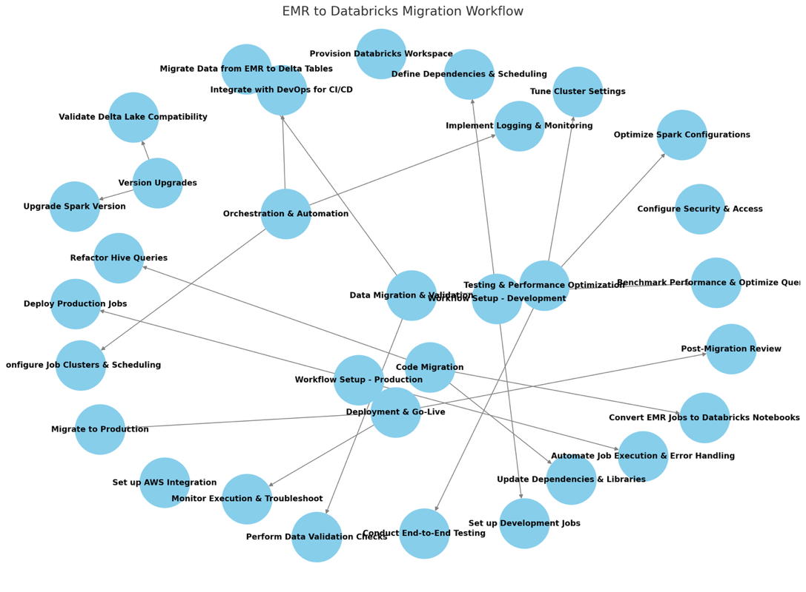

### Objective:

Migrate the existing Incites data pipeline from AWS EMR to Databricks to enhance performance, scalability, and maintainability while ensuring compatibility with updated Spark and Delta Lake versions.

#### 1. Business Requirements:

- Improve processing efficiency and reduce job execution time.
- Leverage Databricks' managed Spark environment to simplify infrastructure maintenance.
- Implement workflow orchestration using Databricks Jobs for better monitoring and scheduling.
- Ensure compatibility with updated Spark versions and Delta Lake.
- Maintain data integrity and consistency during migration.
- Optimize costs by utilizing Databricks’ auto-scaling capabilities.

#### 2. List of Tasks Required for Migration:

##### Infrastructure Setup:

- Provision Databricks workspace and clusters.
- Configure access controls and security settings.
- Set up networking and integration with existing AWS services (S3, Glue, etc.).

##### Version Upgrades:

- Upgrade from the current EMR Spark version to the latest supported Databricks Spark version.
- Validate Delta Lake compatibility and implement necessary schema changes.

##### Code Migration:

- Convert EMR Spark jobs (PySpark/Scala) to Databricks notebooks or Jobs API.
- Refactor Hive queries and scripts to run efficiently in Databricks SQL.
- Update dependencies, libraries, and environment configurations.

##### Workflow Setup:

**Development Environment:**

- Set up workflow jobs in Databricks for development and testing.
- Define dependencies and scheduling in Databricks Workflows.

**Production Environment:**

- Deploy production-ready jobs with proper monitoring and alerting.
- Automate job execution and error handling.

##### Data Migration & Validation:

- Ensure seamless data migration from EMR (HDFS/S3) to Databricks Delta tables.
- Implement data validation checks to ensure accuracy and completeness.
- Perform performance benchmarking and optimize queries.

##### Orchestration & Automation:

- Configure Databricks Job clusters and workflows for scheduling.
- Integrate with DevOps tools for CI/CD pipeline automation.
- Implement logging, monitoring, and alerting using Databricks and AWS services.

##### Testing & Performance Optimization:

- Conduct end-to-end testing of migrated jobs.
- Optimize Spark configurations for better performance.
- Tune cluster settings based on workload analysis.

###### Deployment & Go-Live:

- Migrate the final workflow to production.
- Monitor execution and troubleshoot issues.
- Conduct a post-migration review and finalize documentation.

##### Expected Outcomes:

- Improved pipeline performance and reduced execution time.
- Seamless integration with Databricks-managed Spark environment.
- Enhanced monitoring, error handling, and maintainability.
- Cost optimization with Databricks’ auto-scaling capabilities.
- Streamlined workflow execution with minimal operational overhead.

This structured migration approach ensures a smooth transition from EMR to Databricks while addressing technical and business objectives effectively.

