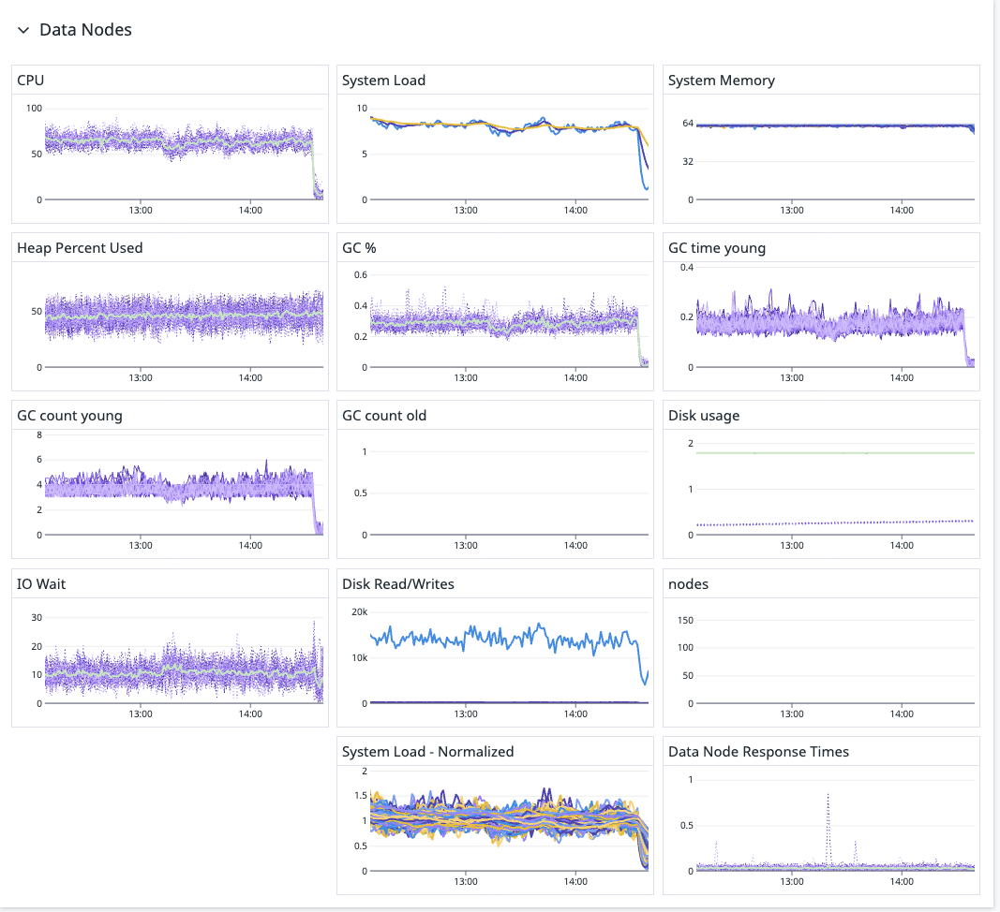
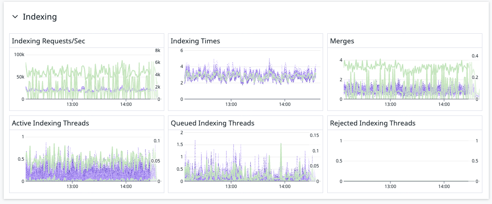

### Prompt for ES Resource & Performance Analysis  - Indexing  Incites

Analyze the Datadog monitor graphs for key resource metrics (CPU, memory, disk I/O, garbage collection, etc.) of Elasticsearch data nodes during the offline loading and indexing of a large volume of documents. Summarize overall resource utilization and performance trends, and evaluate whether all available resources were effectively utilized for indexing. The goal is to maximize indexing throughput by fully utilizing the data node resources, without reserving capacity for search queries or other operations.

 #### The Datadog monitor graphs for Elasticsearch data nodes during the offline indexing operation:

#### Summary of Resource Utilization and Performance Trends

1. CPU Usage
- Observation: CPU usage across data nodes consistently stayed around 50–70%, with some variability.
- Implication: CPU resources were moderately utilized but not saturated. There is potential headroom to push indexing load further.

2. System Load and Normalized Load
- Observation: System Load remained stable (~5–7), and normalized load per core hovered between 1.0 and 1.5.
- Implication: System load is healthy and balanced across cores, suggesting the system is not overloaded but still actively working. This supports potential for increased parallelization.

3. Memory and Heap Usage
- System Memory: Steady around the maximum available (~64 GB), indicating memory allocation is stable.
- Heap Percent Used: Averaged ~40–50%, with no signs of high heap pressure.
- Implication: Plenty of headroom remains in heap usage; GC events are not overly aggressive, which means memory tuning may help boost throughput.

4. Garbage Collection (GC)
- GC % and GC Time Young: Remain consistently low (~0.2–0.3%).
- GC Count (Young): Steady around 2–4/sec, increasing slightly toward the end.
- GC Count (Old): Near-zero throughout.
- Implication: GC is not a bottleneck. Young generation collections are light and infrequent. No signs of full GC or memory churn.

5. Disk I/O
- Disk Read/Writes: Write throughput remained steady between 10k–15k ops/sec; reads were minimal.
- Disk Usage: Flat and low, indicating sufficient storage headroom.
- IO Wait: Hovered around 10–20%, which is moderate.
- Implication: Disk write bandwidth is actively used but not maxed out. Moderate IO wait suggests there might be some disk contention — potentially a minor bottleneck depending on disk type (e.g., HDD vs SSD).

6. Node Count and Stability
- Node Count: Stable throughout, no evidence of node failures or flapping.
- Data Node Response Times: Mostly flat with low latency, occasional minor spikes.
- Implication: Cluster health is stable. Response times are acceptable for an indexing-only workload.

#### Evaluation: Were All Resources Fully Utilized for Indexing?

- CPU: Underutilized (~50–70%). More headroom exists.
- Memory/Heap: Sufficient heap available. Potential to reduce heap size slightly and reallocate resources elsewhere.
- GC: Minimal overhead. Not a limiting factor.
- Disk I/O: Actively used, moderate IO wait indicates slight contention.
- Network and Threads: Not visible here, but likely not a bottleneck based on response times.

#### Recommendations to Maximize Indexing Throughput

- Increase parallelism: Increase bulk indexing concurrency (threads or workers) to utilize available CPU and heap better.
- Adjust thread pool settings: Specifically bulk, indexing, and refresh related pools if needed.
- Evaluate disk type: If IO wait remains an issue, consider upgrading to faster disks (e.g., NVMe).
- Disable/Delay refresh: Temporarily disable or delay refresh during bulk indexing to reduce write amplification.
- Tune merge settings: Optimize Lucene merge and segment settings for bulk ingest.
- Heap optimization: Consider slightly reducing heap to allow more OS page cache if memory is overprovisioned.

#### 🔍 Combined Resource & Performance Analysis

| **Category**               | **Observation (from both graphs)**         | **Insight**                          | **Opportunity / Bottleneck**                                       |
|---------------------------|--------------------------------------------|--------------------------------------|---------------------------------------------------------------------|
| **CPU**                   | Averaged 50–70% usage                      | Not saturated                        | Indexing load can be increased to utilize full CPU capacity         |
| **Memory / Heap**         | Heap usage ~40–50%, stable memory          | Plenty of memory headroom            | No GC pressure; consider tuning heap size or increasing parallelism |
| **GC Activity**           | Young GC steady, GC% ~0.2–0.3%             | No GC bottleneck                     | Memory handling is healthy                                          |
| **Disk I/O**              | Write throughput ~10–15k ops/sec, IO Wait ~10–20% | Moderate IO pressure         | Some IO wait hints at slight contention; worth monitoring           |
| **Indexing Rate**         | ~30k–70k indexing requests/sec             | Healthy throughput                   | Room to push further given CPU & memory headroom                   |
| **Indexing Time**         | ~2–5 ms per request                        | Consistent latency                   | Acceptable; no major slowdowns                                     |
| **Indexing Threads (Active)** | Mostly <1 per node                     | Low thread usage                     | Threadpool underutilized—major opportunity to increase concurrency |
| **Queued Threads**        | Occasionally spikes to 1–2                 | Occasional short queue               | Not a consistent issue but should be monitored                     |
| **Rejected Threads**      | Always 0                                   | No backpressure                      | Good—no indexing pressure at threadpool limits                     |
| **Merges**                | Frequent activity, ~2–4 concurrent merges  | Normal during indexing               | Indicates healthy background merging                               |
| **System Load**           | Normalized load ~1–1.5                     | Balanced workload                    | No CPU starvation                                                  |

#### ✅ Updated Summary & Insights

- Cluster Stability: Nodes, memory, GC, and response times are all stable. No instability or backpressure.
- Indexing Efficiency: Indexing request rate is good, but active indexing threads are underutilized. This is a clear indication that the cluster is capable of handling more parallel bulk operations.
- Threadpool Settings: Almost no thread rejections, but low active threads → thread pool capacity is not being saturated. You can safely increase client-side concurrency or indexing workers.
- IO Wait: Moderate (10–20%)—not immediately dangerous, but continued scaling should consider this to avoid disk bottlenecks.
- Merge Activity: Normal and consistent with a write-heavy workload.

#### 📌 Refined Recommendations Based on Both Graphs

## Actionable Recommendations for Elasticsearch Indexing Optimization

| **Action**                                             | **Justification**                                                                                  |
|--------------------------------------------------------|-----------------------------------------------------------------------------------------------------|
| Increase bulk indexing concurrency (client-side)       | Active indexing threads are consistently <1; CPU is not maxed; scaling parallel indexing will improve throughput. |
| Adjust `threadpool.bulk.size` if needed                | Threadpool appears underutilized. Ensure Elasticsearch nodes are configured to allow higher concurrency. |
| Monitor disk IO wait                                   | IO wait is acceptable, but future scaling should watch for rising contention. Consider disk upgrades (e.g., SSDs or NVMe). |
| Leave GC & memory settings as-is                       | GC performance is optimal. No memory pressure observed.                                              |
| Keep refresh interval disabled during indexing (`-1`)  | Still valid. Improves write throughput by avoiding unnecessary segment refreshes.                   |
| Maintain current merge settings unless segment count grows | Merges are active but not throttling indexing. Adjust only if segment count grows excessively.       |

---

#### 📊 Disk Type Comparison for Elasticsearch Clusters

#### 🧠 Key Considerations

1. I/O Throughput and Latency
- NVMe SSDs dramatically outperform SATA SSDs and HDDs in both throughput and latency.
- For indexing-heavy Elasticsearch clusters, high random write performance and low latency are critical.

2. Durability
- Ephemeral storage is erased when the instance stops/reboots. Suitable only for testing or stateless nodes (e.g., coordinating-only).
- Persistent SSDs (SATA/NVMe/EBS) are essential for production ES data nodes.

3. Cost Tradeoffs
- SATA SSDs are cost-effective for mid-size clusters.
- NVMe SSDs cost more per GB, but their performance is worth it for write-heavy or low-latency use cases.

4. Cloud Environments
- On AWS: gp3 is cost-effective if you configure IOPS correctly; io2/io2 Block Express is best for enterprise-scale clusters.
- On GCP/Azure: Look for Local SSDs (NVMe) or Premium SSDs for similar performance.

#### ✅ Recommendation Summary

| **Workload**                            | **Recommended Disk Type**                        |
|-----------------------------------------|--------------------------------------------------|
| Dev / Testing / Coordinating Node       | Ephemeral or SATA SSD                            |
| General purpose indexing & search       | SATA SSD or gp3 (tuned)                          |
| Heavy indexing / time-series ingest     | NVMe SSD or io2/io2 Block Express (AWS)          |
| Low-latency + high-availability         | NVMe SSD with high IOPS provisioning (e.g., io2) |

---

