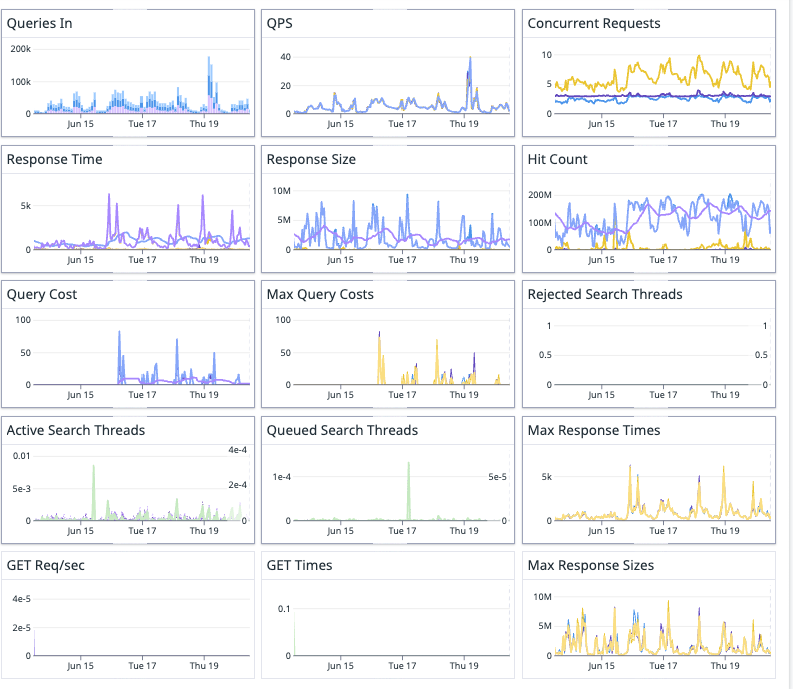
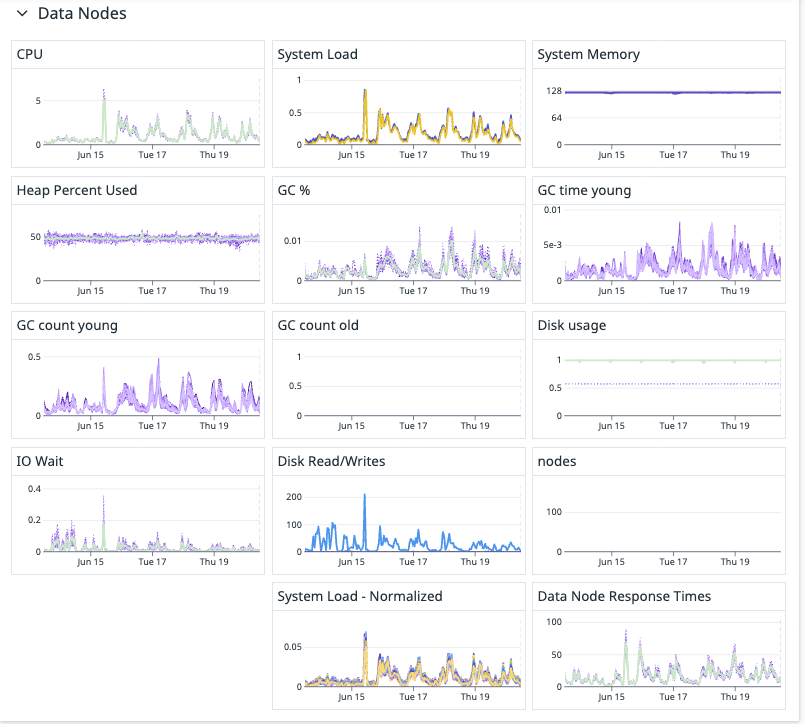
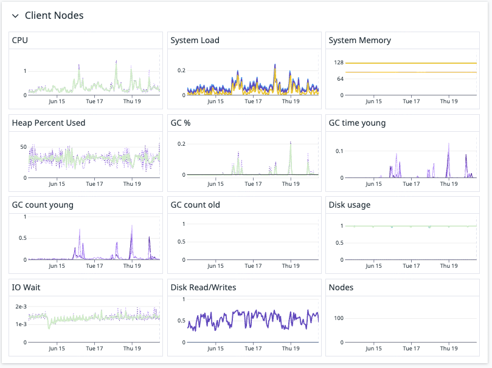

### Prompt for ES Resource & Performance Analysis  - Searching Incites

Analyze the Datadog monitor graphs for key resource metrics (CPU, memory, disk I/O, garbage collection, etc.) of Elasticsearch heavy aggrgagtion & search of a large volume of documents. Summarize overall resource utilization and performance trends, and evaluate whether all available resources were effectively utilized for heavy aggrgagtion & search  queires. The goal is to maximize QPS, response latency,  throughput by fully utilizing the data node resources, without reserving capacity for data indexing or other operations.

---

Based on the provided Datadog monitor graphs for Elasticsearch during heavy aggregation and search queries, here’s a detailed analysis of resource usage, performance trends, and optimization opportunities.

 #### The Datadog monitor graphs for Elasticsearch Search Overview on live:

---

#### 📊 Elasticsearch Resource & Query Performance Analysis (Search-Heavy Workload)

✅ Summary Table

| **Category**             | **Observation**                                                                 | **Insight**                                                                                   | **Opportunity / Bottleneck**                                                       |
|--------------------------|----------------------------------------------------------------------------------|-----------------------------------------------------------------------------------------------|-------------------------------------------------------------------------------------|
| **Query Volume (Queries In / QPS)** | QPS generally < 20 with brief spikes to 40+; queries steadily incoming | Elasticsearch handles sustained volume with headroom                                          | QPS can be increased by scaling concurrency or optimizing query paths              |
| **Concurrent Requests**  | Moderate concurrency (4–10 across nodes)                                        | Load balancing and shard targeting look effective                                              | Opportunity to scale up threadpool if CPU/heap not maxed                          |
| **Response Time**        | Consistent spikes up to 5s+ under peak load                                     | Some queries cause latency spikes                                                              | Possible optimization in query design or caching                                   |
| **Response Size**        | 3M–10M per request typical                                                       | Result sets are large (e.g., aggregations or scrolls)                                          | Enable pagination or fetch throttling                                              |
| **Hit Count**            | High total doc hits (~100M–200M)                                                | Search space is large, but hit rates are stable                                                | Consider targeted filtering to reduce search scope                                 |
| **Query Cost / Max Cost**| Peaks > 100 in some cases                                                       | Certain queries are much more expensive                                                        | Indicates need to review and optimize specific high-cost queries                   |
| **Rejected Search Threads** | 0                                                                             | No search thread pressure observed                                                             | Threadpool capacity is sufficient currently                                        |
| **Active / Queued Search Threads** | Very low (~0.01 and below)                                              | Underutilized search threadpool                                                               | Significant opportunity to increase concurrency                                    |
| **Max Response Times**   | Periodic peaks > 5s                                                              | Latency spikes align with query cost spikes                                                    | Optimize aggregation structure and index usage                                     |
| **GET Req/sec & Times**  | Near-zero                                                                       | Not used for standard search workloads                                                         | No action needed                                                                   |

---

🧠 Interpretation

🔹 Resource Utilization
- 	CPU / Threads: Underutilized. Thread usage is extremely low.
- 	No thread rejections or queues → resources are not stressed.
- 	Memory/GC info not included here, but based on zero rejections and low active threads, there’s room to grow.

🔹 Performance
- 	Sustained QPS under 20 is modest for production-grade clusters.
- 	Latency spikes (up to 5s) suggest some expensive aggregations or poorly optimized queries.
- 	Query cost graphs confirm that some searches are unusually expensive — indicating a few outliers driving response time.

---

✅ Actionable Recommendations

| **Action**                                                  | **Justification**                                                                 |
|-------------------------------------------------------------|-----------------------------------------------------------------------------------|
| Increase search concurrency (threadpool.search.size)        | Search threads are underutilized (<0.01 active); cluster can handle more load    |
| Profile & rewrite heavy queries                              | Query cost & latency spikes imply specific inefficient aggregations or filters   |
| Introduce caching for repeated aggregations                 | Reduce cost/latency for repeatable queries                                       |
| Enable circuit breakers or cost-based query limits          | Prevent excessive load from high-cost aggregations                              |
| Reduce response size if possible                            | Avoid sending full result sets when not necessary                               |
| Tune `index.sort`, `doc_values`, or `eager_global_ordinals` | If aggregations are slow on text fields, sorting/indexing config may help       |
| Temporarily disable indexing workloads (if any)             | Maximize node availability for search during peak analytics                      |

---

🎯 Final Evaluation

The cluster appears underutilized for the search load it’s handling. There’s a significant opportunity to increase QPS, reduce latency, and scale throughput by:
- 	Increasing concurrency
- 	Optimizing or caching heavy queries
- 	Possibly improving indexing structure to support fast aggregations

---

#### ✅ Elasticsearch Performance Optimization Checklist (Search & Aggregation)

##### 🔧 Threading & Concurrency
- [ ] Increase `threadpool.search.size` if active threads consistently < 1
- [ ] Tune `threadpool.search.queue_size` to avoid spikes under load
- [ ] Monitor and scale based on `concurrent_search_requests` trends

##### 🔍 Query Design
- [ ] Profile high-cost queries using `search slowlog` and cost metrics
- [ ] Rewrite expensive aggregations or nested queries to reduce load
- [ ] Add filters to reduce total document hit count before aggregation
- [ ] Use `doc_values` for fields involved in aggregations
- [ ] Avoid `scripted_fields` in filters or aggregations unless necessary

##### 🧠 Caching & Reuse
- [ ] Enable or review Elasticsearch query cache (`request_cache`)
- [ ] Cache results of frequently repeated queries or dashboards
- [ ] Use terms filters with keyword fields to leverage filter cache

##### 📉 Response Size & Payload
- [ ] Use `size: 0` for aggregation-only queries to reduce payload
- [ ] Paginate results with `from`/`size` or `search_after` if large
- [ ] Minimize number of returned fields via `_source` filtering

##### 🧪 Monitoring & Alerting
- [ ] Track `QPS`, `response time`, and `query cost` over time
- [ ] Watch `max query cost` spikes and investigate
- [ ] Alert on `rejected search threads` or high queue times

##### 💽 Index Tuning
- [ ] Use `index.sort` for frequently sorted fields
- [ ] Set `eager_global_ordinals` on aggregation-heavy keyword fields
- [ ] Periodically force merge if segment count becomes excessive

##### 🚫 Resource Isolation
- [ ] Disable or deprioritize indexing during heavy search workloads
- [ ] Allocate dedicated data nodes for search-only traffic if needed

##### 🧾 Governance & Control
- [ ] Set cost-based limits using `search.max_buckets`, `max_terms_count`
- [ ] Implement query whitelisting or templates in UI-facing systems

---

 #### The Datadog monitor graphs for Elasticsearch Data Node on live:

---

#### 📊 Elasticsearch Data Node Resource Analysis (Search-Heavy Workload)

✅ Summary Table

| **Category**         | **Observation**                                                             | **Insight**                                                                 | **Opportunity / Bottleneck**                                                   |
|----------------------|------------------------------------------------------------------------------|----------------------------------------------------------------------------|--------------------------------------------------------------------------------|
| **CPU**              | Usage mostly < 50%, occasional peaks around 60%                             | Underutilized CPU                                                           | Cluster has headroom; can increase search concurrency                         |
| **System Load**      | Load normalized < 0.05 across nodes                                         | System not overloaded                                                       | Indicates balanced workloads                                                  |
| **Memory (Heap)**    | Heap usage stable around 45–50%                                             | No signs of memory pressure                                                 | Room to increase parallel search/aggregation                                 |
| **GC Activity**      | Low GC %, low young/old GC count and time                                  | Healthy GC behavior                                                         | JVM tuning is sufficient                                                     |
| **Disk I/O**         | Write throughput under 200 ops/sec, low IO Wait (<0.1)                     | Low disk pressure                                                           | Disk not a bottleneck for search operations                                  |
| **Disk Usage**       | Flat and stable                                                             | No storage issues                                                           | No impact on performance                                                     |
| **Node Response Times** | Spikes seen periodically; baseline remains low (<50 ms)                  | Some heavy queries cause latency spikes                                     | Possible query-level inefficiencies                                          |
| **Data Node Count**  | Constant                                                                    | No node churn or autoscaling behavior observed                              | Consistent performance expected                                              |

---

🧠 Key Takeaways

🔹 Resource Utilization
- 	CPU & heap memory are moderately used, meaning there’s headroom to increase concurrency or reduce latency.
- 	Disk I/O and IO Wait are minimal, confirming that the workload is read-heavy, not storage-bound.
- 	GC performance is optimal: no JVM pressure, which is critical during aggregation-heavy queries.

🔹 Performance
- 	Node response times show occasional spikes → these likely align with high-cost queries or broad aggregations.
- 	Overall system load and thread activity are low, suggesting more aggressive tuning is possible to push QPS higher.

---

✅ Optimization Recommendations

| **Action**                                             | **Justification**                                                                 |
|--------------------------------------------------------|-----------------------------------------------------------------------------------|
| Increase search threadpool size (threadpool.search.size) | CPU and memory are underutilized; can safely support higher concurrency          |
| Analyze and optimize high-latency queries              | Response time spikes suggest costly aggregations or filters                      |
| Implement or tune query result caching                 | Reduce latency and CPU for repeated aggregations                                 |
| Use eager global ordinals for high-cardinality fields  | Improve aggregation performance for keyword fields                               |
| Consider sorting/indexing optimization (index.sort)    | Speeds up queries with frequent sort patterns                                    |
| Monitor per-query metrics with `search slowlog`        | Identify and tune top N slow or expensive queries                                |
| Keep indexing workloads isolated or disabled           | Prevent interference with search-focused performance                             |

---

📈 Final Evaluation

The Elasticsearch cluster is not fully utilized under current search/aggregation workloads. There is clear capacity to increase throughput, QPS, or reduce latency by:
- 	Scaling concurrency
- 	Optimizing aggregation structure
- 	Enabling query caching
- 	Fine-tuning threadpools and memory

---

#### 📊 Elasticsearch Data Node Resource Performance Summary (Search-Heavy Workload)

##### 📌 Context
**Objective:** Maximize QPS, throughput, and minimize search response time during heavy aggregation queries. All resources are dedicated to search (no indexing load).

---

#####  ✅ Key Insights

| **Metric Group**     | **Observation**                                                             | **Implication**                                                   |
|----------------------|------------------------------------------------------------------------------|--------------------------------------------------------------------|
| **CPU & Load**        | CPU usage mostly < 50%, normalized load < 0.05                              | Nodes are underutilized → room for more concurrency               |
| **Memory & Heap**     | Heap usage stable around 45–50%, GC % very low                              | No memory pressure or GC bottleneck                               |
| **Disk I/O**          | Disk writes minimal (<200 ops/sec), IO wait very low                        | Not disk-bound; can support higher read/aggregation throughput   |
| **Node Response Time**| Mostly <50ms, occasional spikes                                              | Heavy queries present; identify outliers                          |

---

##### 🛠️ Optimization Checklist

| ✅ Optimization Area                        | Recommended Action                                                                 |
|--------------------------------------------|-------------------------------------------------------------------------------------|
| Search Concurrency                         | Increase `threadpool.search.size` and monitor `active search threads`              |
| Aggregation Query Performance              | Use `search slowlog` to find and optimize long-running queries                      |
| Caching                                    | Enable request cache for aggregation-heavy queries                                 |
| Field & Index Settings                     | Apply `eager_global_ordinals` to frequently aggregated keyword fields              |
| Sorting Optimizations                      | Use `index.sort` for common sort use cases                                         |
| Isolation from Indexing                    | Ensure no indexing jobs run during critical search periods                         |

---

##### 📈 Suggested Dashboard Panels

> Include these panels for better monitoring and decision-making:

- Active vs. Queued Search Threads
- Search Query Cost Distribution
- Top N Slow Queries (via search slowlog)
- Heap Usage vs. GC Count Overlay
- Max Response Time Trend (Zoomed View)

---

##### 📎 Notes

- Based on Datadog metrics for Elasticsearch data nodes between **Jun 15 – Jun 19**.
- Ensure monitoring continues during scaling tests or query optimization rollouts.

---

Here is a detailed analysis of the Elasticsearch Client Node performance under heavy aggregation and search workloads, based on your Datadog graphs. The focus is on evaluating resource utilization and identifying optimization opportunities to maximize QPS, response latency, and throughput.

 #### The Datadog monitor graphs for Elasticsearch Client Node on live:

---

📊 Elasticsearch Client Node Performance Analysis (Search-Heavy Workload)

✅ Summary Table

| **Category**         | **Observation**                                                             | **Insight**                                                                 | **Opportunity / Bottleneck**                                                |
|----------------------|------------------------------------------------------------------------------|------------------------------------------------------------------------------|-----------------------------------------------------------------------------|
| **CPU**              | Low usage (~0.3–0.5), peaks ~1 core                                          | Significantly underutilized                                                  | Room to scale query routing/concurrency                                     |
| **System Load**      | < 0.2 on average                                                             | Very light load                                                              | Minimal compute load observed                                               |
| **Memory (Heap)**    | Heap usage stable ~45–50%                                                   | No memory pressure                                                           | JVM memory health is good                                                  |
| **GC Activity**      | Minor spikes in young GC, GC% ~0.05–0.2% at times                            | Short GC cycles; not sustained                                               | No impact on performance                                                   |
| **Disk I/O**         | Very low IO wait (<0.002), read/write < 1 ops/sec                           | Client nodes barely use disk                                                | Disk performance irrelevant to client role                                 |
| **Disk Usage**       | Flat, static                                                                 | No storage variation                                                         | As expected for client nodes                                               |
| **Response Metrics** | Not included here (client-side metrics only)                                | -                                                                            | Evaluate alongside coordinating node/search dashboards                     |

---

🧠 Key Takeaways

🔹 Resource Utilization
- 	CPU and memory are significantly underutilized, which is expected as client nodes primarily route queries and coordinate responses.
- 	No JVM pressure or GC bottlenecks, indicating smooth coordination of requests.
- 	Disk usage is irrelevant in client nodes unless used for local caching or logging, which is not apparent here.

🔹 Performance
- 	Since these are client nodes, their main role is request routing, aggregation coordination, and load balancing.
- 	Based on low CPU, load, and GC activity, they are not saturated, which means there is no bottleneck at the client layer.

---

🛠️ Optimization Checklist (Client Node Focused)

| ✅ Optimization Area                    | Recommended Action                                                                    |
|----------------------------------------|----------------------------------------------------------------------------------------|
| Client Concurrency                     | Safe to increase parallel requests through client nodes                               |
| Circuit Breaking / Thread Queues       | Ensure settings like `search.max_buckets` and query breakers are tuned                |
| Client-to-Data Node Distribution       | Check `search.preference` and `shard awareness` to ensure balanced query routing      |
| Load Distribution                      | Monitor QPS per node to detect uneven client pressure                                 |
| Aggregation Complexity                 | If response latency is high, analyze coordinating cost (may shift load to client)     |
| JVM Settings                           | Continue default heap config unless coordinating queries show heap stress             |

---

📈 Final Evaluation

The client nodes are healthy, underutilized, and not a bottleneck. They provide ample headroom for increasing query throughput and concurrent aggregation processing. Focus tuning efforts on:

- 	Search and data nodes
- 	Query structure and complexity
- 	Cache usage and result reuse

----

Here is the full analysis of the Elasticsearch Client Node performance for heavy aggregation & search workloads, output in Markdown format so you can directly use it in your performance documentation or dashboards:

#### 📊 Elasticsearch Client Node Performance Analysis (Search-Heavy Workload)

##### 📌 Context
**Objective:** Evaluate client node performance under heavy aggregation & search query load to ensure resources are fully utilized and not a bottleneck. Client nodes are responsible for query routing, aggregation coordination, and response merging.

---

##### ✅ Summary Table

| **Category**         | **Observation**                                                             | **Insight**                                                                 | **Opportunity / Bottleneck**                                                |
|----------------------|------------------------------------------------------------------------------|------------------------------------------------------------------------------|-----------------------------------------------------------------------------|
| **CPU**              | Low usage (~0.3–0.5), peaks ~1 core                                          | Significantly underutilized                                                  | Room to scale query routing/concurrency                                     |
| **System Load**      | < 0.2 on average                                                             | Very light load                                                              | Minimal compute load observed                                               |
| **Memory (Heap)**    | Heap usage stable ~45–50%                                                   | No memory pressure                                                           | JVM memory health is good                                                  |
| **GC Activity**      | Minor spikes in young GC, GC% ~0.05–0.2% at times                            | Short GC cycles; not sustained                                               | No impact on performance                                                   |
| **Disk I/O**         | Very low IO wait (<0.002), read/write < 1 ops/sec                           | Client nodes barely use disk                                                | Disk performance irrelevant to client role                                 |
| **Disk Usage**       | Flat, static                                                                 | No storage variation                                                         | As expected for client nodes                                               |
| **Response Metrics** | Not applicable here                                                         | Focus on coordinating/search node dashboards                                | Must correlate with QPS/response time trends from full cluster view        |

---

##### 🧠 Key Takeaways

- **Client nodes are healthy and underutilized.**
- **CPU, memory, and disk I/O usage is minimal**, showing these nodes are not a performance bottleneck.
- **Heap and GC metrics are stable**, confirming no JVM pressure or tuning need.

---

##### 🛠️ Optimization Checklist (Client Node Focused)

| ✅ Optimization Area                    | Recommended Action                                                                    |
|----------------------------------------|----------------------------------------------------------------------------------------|
| Client Concurrency                     | Safe to increase parallel requests through client nodes                               |
| Circuit Breaking / Thread Queues       | Ensure `search.max_buckets`, circuit breaker limits, and `threadpool.search.queue_size` are tuned |
| Client-to-Data Node Distribution       | Check `search.preference`, shard awareness, and cross-zone query routing              |
| Load Distribution                      | Monitor QPS per node to detect uneven query pressure                                  |
| Aggregation Complexity                 | Evaluate slow aggregations; offload coordination if needed                            |
| JVM Heap                               | No changes needed unless memory pressure observed                                     |

---

##### 📈 Suggested Dashboard Enhancements

- Add panels for:
  - Search coordination latency (per client)
  - Aggregation size vs. response time correlation
  - Client node QPS and circuit breaker stats
- Correlate with:
  - Data Node response time
  - Max query costs and slowlogs