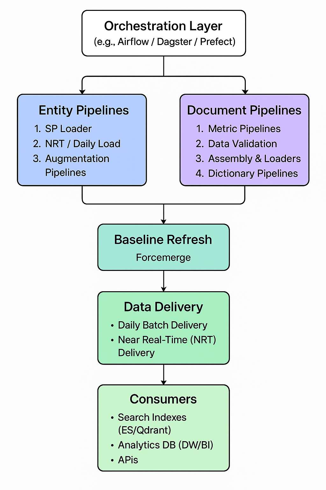

### Database Modeling Terminoogy


In database modeling—especially in data warehousing and analytics—the terms facts, dimensions, and metrics are closely related but describe different parts of the data model:

#### 1. Facts

- What they are: Core quantitative events or measurements about the document.
- Stored in: Fact tables.
- Characteristics:
  - Usually numeric and additive (can be summed or aggregated).
  - Linked to dimensions through foreign keys.
  - Often time-variant (e.g., daily sales).

- Examples:

  - citation_count (number of times cited)
  - download_count
  - views_count
  - reference_count
  - page_count

📌 These go in the fact table in a star schema. Each row might represent “document X in year Y” or “document X as of date Z.”

---


#### 2. Dimensions

- What they are: Context or descriptive attributes that give meaning to facts.
- Stored in: Dimension tables.
- Characteristics:
  - Textual or categorical data.
  - Provide filtering, grouping, and labeling for analysis.
  - Typically have a primary key referenced by fact tables.
- Purpose:
    - Provides context to facts (measures) so you can filter, group, and analyze data.
- Usage:
    - Used in joins with fact tables, and in filters/group-bys in reports.

- Examples:
  - Document dimension: document_id, title, publication_year, document_type (journal article, conference paper, etc.)
  - Author dimension: author_id, author_name, affiliation, country
  - Journal dimension: journal_id, journal_name, ISSN, publisher
  - Subject dimension: field, subfield, keywords
  - Date dimension: date_id, year, month, day

📌 These let you filter and group facts: e.g., “total citations by subject field” or “downloads by country.”


---

#### 3. Metrics

- What they are: Business-defined measurements, often calculated values from facts.
- Relationship to facts:
  - Metrics are formulas or aggregations applied to fact data.
  - Can be direct (e.g., total_sales = SUM(sales_amount)) or calculated (e.g., average_order_value = SUM(sales_amount) / COUNT(order_id)).

-  Example:
   - cnci
   - percentile
   - average_citations_per_year = citation_count / years_since_publication
   - collaboration_index = number_of_international_coauthors / total_authors
   - impact_factor_contribution = citations_in_year / documents_in_journal
- 

📌 These are derived from facts and often computed on the fly in analytics tools.


---

#### 4. Metadata

- What they are: Descriptive data about the document itself — not necessarily numerical, and not meant for aggregation.
- Purpose:
    - Describes the data itself — its meaning, origin, format, and properties.
- Usage:
    - Used for data discovery, lineage, governance, and search, rather than aggregations.

- Examples:
  - DOI (10.1234/abcd.efgh)
  - ORCID IDs of authors
  - Abstract text
  - Keywords list
  - funding acknowledgements
  - Language


📌 This is typically stored alongside dimensions or in separate metadata repositories for search/discovery.


---

#### How They Relate

Think of it as a star schema:

```yaml
           Dimension: Date
           Dimension: Product
           Dimension: Customer
                   |
                   v
     Dimension <-- Fact Table --> Metrics


```

- Facts are the raw measurable events.
- Dimensions describe those events.
- Metrics are the meaningful business numbers you calculate from the facts.

--- 

### Putting It Together — Star Schema Example

```less
                 [Author Dimension]
                        |
[Date Dimension] - [Fact: Paper Metrics] - [Journal Dimension]
                        |
                 [Document Dimension] --> Metadata (DOI, Abstract, Keywords)
                        |
                 [Subject Dimension]

```

- Fact table: citations, downloads, references (linked by document_id, author_id, date_id…)
- Dimension tables: authors, journals, dates, subjects
- Metrics: calculated KPIs like average citations/year
- Metadata: rich descriptive info like DOI, abstract, funding info

---

#### Automation Workflow Logic

- Trigger: Daily schedule + event-based triggers for NRT loads.
- Parallel execution of:
  - Entity Pipelines (SP Loader → NRT/Daily Load → Augmentation)
  - Document Pipelines (Metrics → Validation → Assembly → Dictionary)
- Merge & Optimize: Baseline Refresh + Forcemerge step consolidates data.
- Delivery: Publish datasets to search/analytics layers.
- Continuous Loop for daily and NRT updates.





---

#### Quick Comparison Table

| Aspect    | Dimension                              | Metadata                                      |
|-----------|----------------------------------------|-----------------------------------------------|
| Purpose   | Add context for analysis               | Describe the meaning/properties of data       |
| Storage   | Dimension tables in a warehouse        | Metadata repository or alongside data         |
| Structure | Structured, predefined attributes      | Can be structured, semi-structured, or text   |
| Usage     | Joins, filters, grouping in analytics  | Search, lineage, governance, documentation    |
| Example   | Author name, journal name, country     | DOI, abstract, keywords, license type         |
