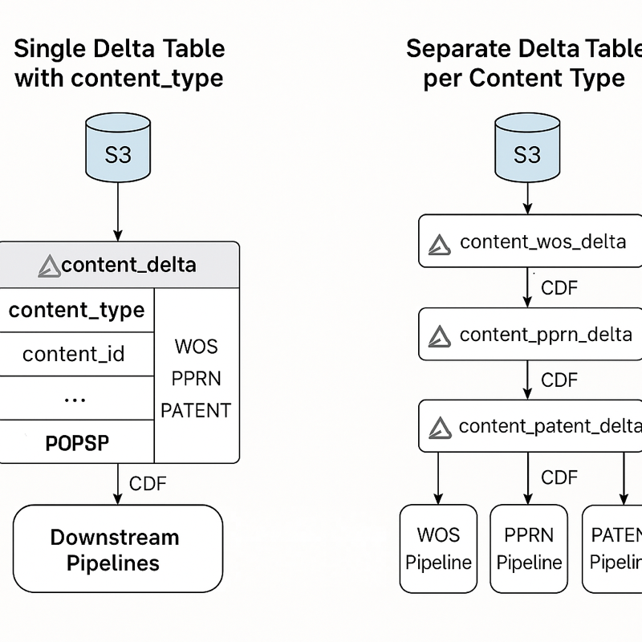
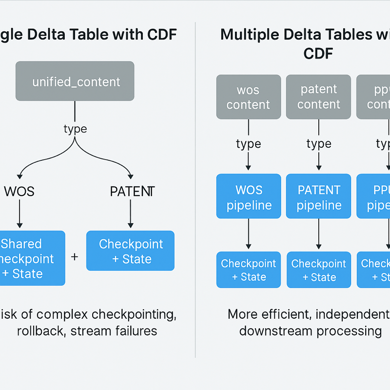

##  Delta Data Optimization Technology


### 1. Steps to partition and add Z-ordering:

**Partitioning**: Use the partitionBy() method to partition the data when writing the Delta table. Choose columns that will benefit from partitioning (e.g., time or categorical columns).

**Z-Ordering**: After writing the data to the Delta table, you can apply Z-ordering using the optimize() method to improve query performance for specific columns that you frequently filter on.


```python
# Partition the data by a column (e.g., 'column_name') and save as Delta table
dfSizeNorm.write \
  .format("delta") \
  .mode("overwrite") \
  .partitionBy("partition_column") \
  .saveAsTable("tb_size_normalized_indicators")

# Now, apply Z-ordering for specific columns (e.g., 'column_name') for optimization
spark.sql("""
  OPTIMIZE tb_size_normalized_indicators
  ZORDER BY (column_name)
""")
```

Notes:
- Partitioning should be done on columns with a high cardinality and frequent filtering. Common partition columns are date or categorical variables.
- Z-ordering works well with columns that are used in query filters often (e.g., column_name).
- Z-ordering is typically applied after the data is written to the Delta table.

---

### 2. Partitioning Strategy:

When partitioning a large dataset (like your 80 million articles), the goal is to choose a partition column that helps with query performance while minimizing shuffle during computations. Here are key considerations for selecting the best partitioning strategy:

1. Partition by a column with high cardinality and evenly distributed values.

- Date-related columns: If your data contains a timestamp or publication date, partitioning by date (e.g., year, month, day) is often effective.
- Categorical columns: If articles are categorized into a small number of categories (e.g., article_type, publication, or topic), these can be good partitioning candidates, as long as the number of unique values isn't too large.

2. Avoid over-partitioning (too many partitions)

3. Composite partitioning (multi-column)

```python
df.write \
  .format("delta") \
  .mode("overwrite") \
  .partitionBy("year", "article_type") \
  .saveAsTable("tb_articles")
```

4. Consider your queries


**Recommendations for Partitioning Strategy:**

1. Partition by Date (year, month, or day):
- Best for: Time-series data, queries that filter on time ranges.
- Example: Partition by year or month if your articles span multiple years or months.

2. Partition by a Balanced Categorical Column (e.g., article_type or publication):
- Best for: Articles grouped into categories with an even distribution.
- Example: Partition by article_type or publication if these have a reasonable number of categories.
  
3. Composite Partitioning (e.g., year and article_type):
- Best for: Complex queries filtering by both time and category.
- Example: Partition by both year and article_type for optimal performance on queries filtering by either.


---


### 3. Parquet file or a Delta Lake table 

When deciding between saving data as a Parquet file or a Delta Lake table for intermediate DataFrame data, the choice depends on your specific use case, performance requirements, and additional features you need. Here's a breakdown of the factors to consider:


**Parquet vs Delta Lake for Intermediate DataFrame Storage**

| **Aspect**                     | **Parquet**                                                                 | **Delta Lake**                                                              |
|-------------------------------|------------------------------------------------------------------------------|-----------------------------------------------------------------------------|
| **Format Type**               | Open columnar file format                                                   | Storage layer on top of Parquet with transactional capabilities            |
| **Performance (Read)**        | Fast, especially for batch processing and columnar reads                    | Slightly slower due to transaction overhead, but optimized for updates     |
| **Performance (Write)**       | Very fast for append-only workloads                                         | Slightly slower due to transaction log maintenance                         |
| **Support for Updates/Deletes** | ❌ Not natively supported                                                   | ✅ ACID-compliant, supports updates, deletes, merges                        |
| **Schema Evolution**          | Basic support, manual handling required                                     | Built-in support for automatic schema evolution                            |
| **Data Versioning / Time Travel** | ❌ Not supported                                                         | ✅ Supported (query historical versions of data)                            |
| **Concurrency / Consistency** | ❌ No concurrency support                                                   | ✅ ACID transactions ensure consistency in concurrent writes                |
| **Use Cases**                 | - Batch processing  <br> - Long-term storage <br> - Lightweight data exchange | - ETL pipelines <br> - Data lakes with frequent updates <br> - ML feature stores |
| **When to Use**               | - Append-only, immutable datasets <br> - Interchange across systems         | - Need update/delete/merge <br> - Complex ETL with rollback/versioning     |
| **Tooling Support**           | Widely supported by Spark, Pandas, Dask, etc.                               | Requires Delta Lake engine (Databricks, Spark with Delta support)          |
| **Storage Overhead**          | Minimal                                                                     | Slight overhead due to transaction logs                                    |
| **Cost Consideration**        | Lower compute/storage costs                                                 | Slightly higher due to metadata and log storage                            |


---

### Summary Recommendations

- **Use Parquet**:
  - When you don’t need to update or delete data.
  - For lightweight intermediate data in pipelines.
  - For portability across tools.

- **Use Delta Lake**:
  - When the data is frequently modified (update/delete/merge).
  - For robust pipeline development with rollback/versioning.
  - If you're using Spark or Databricks and want reliability and scalability.

```python

df.write \
  .format("parquet") \
  .mode("overwrite") \
  .save("path_to_parquet_files")

df.write \
  .format("delta") \
  .mode("overwrite") \
  .partitionBy("year", "article_type") \
  .saveAsTable("delta_table")

```

**Optional**: You can use .repartition(numPartitions, $"pguid") to control partition count and avoid creating too many small files.

**Conclusion**:

- For intermediate data, if your processing is straightforward (e.g., reading and writing immutable data), Parquet is simpler and more efficient.
- If you expect your schema to evolve, or if you're performing complex transformations, Delta Lake will provide more flexibility and optimization over time, especially as your data scales.


---

### 4. Key Considerations for Optimal Partition Size


The optimal partition size for best performance in Spark (and by extension, in Databricks) depends on several factors, including the number of available workers, the number of CPUs, the size of your data, and the type of operations you're performing.


1. Partition Size Relative to Available Resources:

- Number of Workers: The number of workers determines the number of nodes available to process your data in parallel. Each worker can process a subset of data, and the partition size should allow for efficient parallelism without overwhelming any worker.

- Number of CPUs: The number of CPUs per worker affects the parallelism within a single node. Ideally, you want to have one task per CPU, which allows Spark to utilize the CPU effectively.


2. Size of the Data:

- Ideally, each partition should be large enough to amortize the overhead of partitioning and task scheduling but not too large to cause memory issues or slow task execution.

- General guideline: A partition size between 100 MB to 200 MB is often recommended for efficient parallelism in Spark. This size is large enough to allow Spark to avoid excessive scheduling overhead but small enough to fit into memory and avoid memory spill.


3. Avoiding Too Many Partitions:

- Too many partitions: If the partition size is too small, you'll end up with too many tasks, causing high scheduling overhead, inefficiency, and underutilization of resources.

- Too few partitions: If the partition size is too large, Spark may not efficiently distribute work across all available CPU cores, leading to suboptimal performance.


---

### Key Rules of Thumb for Partitioning:


1. Total Size of Data / Number of Cores = Ideal Number of Partitions:

- The ideal number of partitions can be roughly estimated by dividing the total size of your dataset by the size of each partition.
- For example, if your dataset is 1 TB (1024 GB) and you want partitions of 100 MB each:
```yml
1024 GB / 100 MB = 1024 * 1024 MB / 100 MB ≈ 10,240 partitions
```

2. Adjust Based on Worker and CPU Count:

- Partition per CPU core: For optimal parallelism, try to ensure that there are as many partitions as there are CPU cores across all workers.
- For example, if you have 50 workers and 8 CPUs per worker, then you have a total of 400 CPU cores. Ideally, you’d want at least 400 partitions to utilize all cores efficiently, though this number might vary based on your dataset size.


3. Avoid Too Small or Too Large Partitions:

- Too small partitions: If the partitions are too small (e.g., less than 10-20 MB), it increases the overhead due to task scheduling, and Spark may not fully utilize resources effectively.
- Too large partitions: If partitions are too large (e.g., > 1 GB), you risk running out of memory or causing longer task durations that impact the overall performance.

4. Dynamic Partitioning:

- Spark has a feature called dynamic partitioning that automatically adjusts the number of partitions based on the size of the input data. However, this doesn’t always lead to optimal results, especially for large datasets, so manual tuning is often necessary.

---

### Example of Tuning Partition Size:

1. Scenario 1: Writing Data

When saving data, you can control the partitioning manually by specifying the number of partitions using repartition() or coalesce():

- Repartition: Increases the number of partitions, useful when you're performing an operation that requires more parallelism
```scala
df.repartition(400)  // Adjust partition size to 400 partitions
```
- Coalesce: Reduces the number of partitions, useful for operations like saving or writing output when there’s no need for many small partitions.
```scala
df.coalesce(100)  // Reduce partitions to 100 for writing the output
```

2. Scenario 2: Reading Data

When reading large datasets, you can specify the number of partitions directly or let Spark infer it. If you have a large dataset and want to partition it efficiently for parallelism:

```scala
val df = spark.read
  .option("maxPartitionBytes", "134217728")  // Set partition size to 128 MB
  .parquet("path_to_parquet_data")
```

---

### Factors Affecting Optimal Partition Size:


- Data Skew: Ensure that partitions are evenly distributed. If a partition contains more data than others (data skew), some workers may finish early while others still process their large partitions.

- Task Execution Time: If tasks take too long, you may want to reduce the partition size to speed up execution. On the other hand, too small tasks will result in excessive overhead from too many small tasks.

- Shuffle Operations: If your Spark job involves a lot of shuffle operations (e.g., joins, groupBy), larger partitions may result in more data being shuffled across the network. In such cases, fine-tuning partition size is even more critical.

- Cluster Resource Availability: Ensure that your cluster has enough memory and CPU capacity to handle the number of partitions you're using. Over-partitioning can cause overhead, while under-partitioning may lead to inefficient resource utilization.

---

### Final Thoughts:

- **Partition Size**: Aim for 100 MB - 200 MB per partition, depending on your dataset size and available resources.
- **Number of Partitions**: Divide the total data size by the ideal partition size and adjust based on the number of worker nodes and CPUs.
- **Consider Job Type**: More partitions are ideal for compute-heavy operations, while fewer partitions are better for data shuffling or writing operations.


---

### 5. Repartitioning


✅ Why repartitioning may help:

- **Improved parallelism**: Repartitioning on a column like "pguid" can ensure that data with the same key lands in the same partition, potentially reducing shuffling during later queries.
- **Better file layout**: It can produce more uniform file sizes and better organize the data layout for downstream reads and filtering.
**- Optimized writes**: You can control the number of output files and how data is distributed across them.


⚠️ When to be cautious:

- Too many partitions (especially if pguid is highly unique) can create many small files (known as small file problem), which can hurt performance.
- Repartitioning is expensive — it shuffles data, which increases the compute and time during the write step.
- Column skew — if a few pguid values dominate the dataset, some partitions may become large and unbalanced.


💡 Best practice tips:

- Use repartition(numPartitions) if you just want better parallelism.
- Use repartition(col("pguid")) if you need partition-based optimization for queries that filter on pguid.
- Consider writing partitioned Delta tables (.partitionBy("pguid")) if you often filter by that column.
- Monitor file sizes (e.g., with Delta Lake's DESCRIBE DETAIL) to avoid tiny or oversized files.

---

### 6. Avoiding shuffle 

Avoiding shuffle during a join in Spark is key to improving performance. Shuffles are expensive because they involve network I/O, disk I/O, and data serialization across the cluster.

Here’s how you can minimize or avoid shuffle during joins:


✅ 1. Broadcast Join (Best for Small Tables)

If one of the tables is small enough to fit in memory (~10MB–100MB depending on your Spark config), broadcast it:

```scala
import org.apache.spark.sql.functions.broadcast

val result = largeDF.join(broadcast(smallDF), Seq("key"))

```

✅ 2. Repartition Both Sides by Join Key

If both tables are large, repartition both on the join key before the join, to avoid skew and reduce shuffle impact:

```scala
val df1Part = df1.repartition($"joinKey")
val df2Part = df2.repartition($"joinKey")

val result = df1Part.join(df2Part, Seq("joinKey"))

```


✅ 3. Use Bucketing (for Static/Disk-Based Tables)

If you can control how the data is written (e.g., Delta, Hive, Parquet), write both datasets with bucketing on the join key:

```scala
df.write
  .bucketBy(100, "joinKey")
  .sortBy("joinKey")
  .saveAsTable("bucketed_table")

```
Then, join bucketed tables:
```sql
spark.sql("""
  SELECT *
  FROM bucketed_table1 a
  JOIN bucketed_table2 b
  ON a.joinKey = b.joinKey
""")

```

🧠 Spark can do bucket-aware joins, avoiding shuffles entirely.


✅ 4. Use Colocated Joins (if using Partitioned Tables)

If both DataFrames are already partitioned and colocated on the join key (e.g., read from partitioned Delta tables), Spark can avoid shuffle.

You can help Spark by using:
```scala
spark.conf.set("spark.sql.autoBroadcastJoinThreshold", -1)

```
Then repartition explicitly to match layout.


✅ 5. Avoid Complex Join Conditions

Avoid joins on non-equi keys, UDFs, or complex expressions like:
```scala
df1.join(df2, df1("key") + 1 === df2("key"))

```
These always trigger a full shuffle.


🚫 When You Cannot Avoid Shuffle
- If both tables are large and not co-partitioned or bucketed.
- If joining on complex expressions or non-equi conditions.


---

### 7.  join and groupBy operations  - shuffles


You're right that join and groupBy operations in distributed systems like Apache Spark typically cause data shuffles, which can be expensive in terms of performance. However, there are strategies to avoid or minimize shuffles.


🔄 Why join and groupBy Cause Shuffles

# Why Joins and GroupBy Cause Shuffles in Spark

| **Operation** | **Reason for Shuffle**                                                                                   |
|---------------|-----------------------------------------------------------------------------------------------------------|
| **join**      | Spark must bring together matching keys from different partitions, requiring data to be repartitioned by join key. |
| **groupBy**   | To group all values of a key together, Spark has to move those records to the same node, causing a shuffle.        |


✅ Strategies to Avoid or Optimize Shuffles


Shuffle Optimization Techniques in Spark

| **Optimization**                                  | **Description**                                                                                                                                                    |
|---------------------------------------------------|--------------------------------------------------------------------------------------------------------------------------------------------------------------------|
| **Broadcast Join**                                | If one side of the join is small enough to fit in memory, broadcast it to all nodes:  `df_large.join(broadcast(df_small), "key")`                                |
| **Repartition by Key Before Join or GroupBy**     | Use `repartition("key")` or `partitionBy("key")` before the expensive operation to align partitions.                                                              |
| **Use Bucketing (Hive Tables)**                   | If tables are bucketed by join/group key, Spark can skip shuffles during operations.                                                                              |
| **Cache Intermediate Results**                    | If a DataFrame is used multiple times post-shuffle, caching helps avoid recomputation.                                                                            |
| **Avoid Skewed Keys**                             | Skewed keys cause uneven partitioning. Use salting techniques or skew join handling if a few keys dominate.                                                       |
| **Avoid groupBy in favor of reduceByKey (in RDD)**| `reduceByKey` reduces data on map-side before shuffle, unlike `groupByKey`. Only applicable to RDDs.                                                              |
| **Sort-Merge Join Hints**                         | If both sides are already sorted and partitioned by join key, Spark can skip shuffle (very advanced).                                                             |
| **Coalesce**                                      | After shuffling, `coalesce()` can reduce partition count without full shuffle (for output tuning).                                                                |


Example: Broadcast Join

```python
from pyspark.sql.functions import broadcast

# Small table can be broadcasted
result = df_large.join(broadcast(df_small), "key")
```

Example: Pre-partitioning to Avoid Full Shuffle
```python
# Repartition both DataFrames before join to minimize shuffle
df1 = df1.repartition("key")
df2 = df2.repartition("key")
result = df1.join(df2, "key")

```

**Summary Tips**

- Broadcast small tables.
- Repartition smartly before joins/groupBys.
- Avoid skewed keys and expensive wide transformations without planning.
- Profile using Spark UI to identify shuffle-heavy stages.


🧠 Key Takeaways

- **Shuffle Operations**: Operations like join, groupBy, distinct, and repartition cause data to be shuffled across the network.
- **Performance Impact**: Shuffling is resource-intensive and can significantly impact performance due to disk I/O and network overhead.
- **Optimization Strategies**:
  - **Broadcast Joins**: Use when one dataset is small enough to fit in memory.
  - **Repartitioning**: Align partitions before performing wide transformations.
  - **Caching**: Cache intermediate results to avoid redundant shuffling.


---


 ### 8. data modeling for Delta Lake


- **Option A**: Exploded flat version
  - Each row = 1 (UT, author) pair 
  - (e.g., multiple rows per UT)

- **Option B**: Nested array of structs
  - Each row = 1 UT, with an array of authors  
  - (e.g., 1 row per UT, authors in an array column)


---


✅ Recommendation (Guided by Use Case)

Choose Exploded Flat Format if:

- You often query, filter, or join on author-level attributes
  - e.g., WHERE author.country = 'US'
- You do analytics, modeling, or aggregations at the author level
- You want simple schema evolution and SQL compatibility
- 📌 Flat format is best for analytical flexibility and SQL-friendly workloads.

Choose Nested (Array of Structs) if:

- You always work at the UT level, and authors are only ever read together
- You want to optimize storage (fewer rows) and rarely filter by authors
- You care about row-level compactness for performance
- You treat authors as embedded document-like metadata
- 📌 Nested format is best for compact storage and document-style access.


🔧 Technical Notes (Delta Lake Specific)

- Delta partitioning does not support partitioning by fields inside arrays, so flat format is better if you want to partition by author fields.
- Spark SQL queries on arrays usually require .withColumn("author", explode($"authors")) which adds extra processing time.
- Flat format gives better compatibility with BI tools (Power BI, Tableau, etc.) and SQL engines.


✅ Verdict
- In most data lake / analytics use cases, flat (exploded) format is better overall for simplicity, performance, and flexibility, even if it duplicates UT-level data across rows.


---

## Data Modeling for Optimization


### 1. 🇺🇸 Top UT Use Cases: Flat vs. Nested (Array of Structs) Data Modeling in Delta Lake


This table outlines the most common UT data lake use cases and which data model is typically preferred — flat (exploded) or nested (arrays of structs).


**📊 Use Case Comparison**


| **Use Case**                                                                 | **Recommended Format** | **Reasoning**                                                                                                   |
|------------------------------------------------------------------------------|-------------------------|-----------------------------------------------------------------------------------------------------------------|
| **Academic publications** (UT, authors with affiliations)                   | ✅ Flat                 | Frequent filtering/grouping on author-level data (e.g., country, institution), easier joins and aggregations. |
| **Healthcare records** (patient visits, multiple diagnoses per visit)       | ✅ Flat                 | Querying/filtering per diagnosis code (ICD), regulatory reporting, machine learning models.                    |
| **Online retail** (orders with multiple items per order)                    | ✅ Flat                 | Need to analyze or join on individual items (e.g., item revenue, SKU filtering).                              |
| **Financial transactions** (bank accounts with transactions)                | ✅ Flat                 | Each transaction is a business event — often aggregated, filtered, or modeled independently.                  |
| **Streaming services** (users with viewing history)                         | ⚖️ Nested or Flat       | Nested works if you're storing history as metadata. Flat if modeling/viewing patterns per title.              |
| **IoT sensor data** (device with multiple sensor readings)                  | ✅ Flat                 | Querying or alerting on individual readings (e.g., temperature > threshold).                                  |
| **Survey responses** (response with multiple answers)                       | ⚖️ Nested               | If answers are rarely queried individually, nesting provides compact storage. Flat if answer-level analytics. |
| **Insurance policies** (policy with multiple beneficiaries or claims)       | ✅ Flat                 | Common to analyze beneficiaries or claims separately (e.g., fraud, segmentation).                             |
| **HR systems** (employee records with dependents, roles, pay history)       | ⚖️ Nested or Flat       | Nested if dependents rarely queried alone. Flat if doing reporting/ML on dependents, roles, etc.              |
| **EHR (Electronic Health Records)** (patients with lab results, meds)       | ✅ Flat                 | Granular analysis of labs/medications per patient; regulatory filtering.                                      |

---

###  2 📌 Rules of Thumb

| Scenario                                | Prefer Flat | Prefer Nested |
|----------------------------------------|-------------|----------------|
| Join, filter, or analyze nested values | ✅ Yes      | ❌ No          |
| Store full structure only              | ❌ No       | ✅ Yes         |
| Partition on inner fields              | ✅ Yes      | ❌ Not supported |
| Frequent schema evolution              | ✅ Easier   | ❌ Harder      |
| Document-style metadata                | ❌ No       | ✅ Yes         |
| SQL/BI/ML tool compatibility           | ✅ Best     | ❌ Needs flattening |

---

###  ✅ Summary

- **Flat format** is recommended for most data analytics, reporting, and machine learning pipelines where nested elements (e.g., authors, items, diagnoses) are **queried individually**.
- **Nested format** is ideal for **document-like, tightly coupled data** where nested elements are only read together and storage compactness is prioritized.


Choose flat format for 90% of real-world analytics and data science workflows — especially when inner elements (e.g., authors, items, transactions) are independently valuable or filtered.

Use nested arrays of structs only if:
- The nested data is tightly coupled and not queried individually,
- You prioritize compact storage over query flexibility,
- Or you're storing document-like metadata.

---

### 9.  Data Modeling  Example


When dealing with 80+ million documents and needing to construct two JSON document types (flat and nested), choosing the right Delta table data modeling and transformation approach is crucial for performance and maintainability.


**Problem Summary**:

You have a Delta Lake containing normalized flat data across 20+ schema domains (e.g. author, funder, category). Each has 30–1000 categorical values. You want to generate:
- A flat normalized document (with keys like author_id, ut)
- A nested JSON document with arrays/lists under each entity (e.g. "authors": [ { ... }, { ... } ])


---

🔍 **Option 1**: Flat Rows + Collect (Group + Aggregation)

**Approach**: Use groupBy(ut) + collect_list() on each entity (author, funder, etc.) and join them into a single nested document per ut.

**Pros**:
- Efficient on Spark/Delta because collect_list is distributed and optimized.
- Easier to maintain schema-wise (each entity lives in its own normalized table).
- Highly parallelizable.

**Cons**:
- Multiple joins required to assemble final document (can be expensive).
- Schema evolution across many entities can be tricky if you’re frequently changing fields.

---

🔍 **Option 2**: Pre-joined Nested List in Delta Table, then Explode

**Approach**: Store each document as a partially nested structure in a wide Delta table and explode() them into flat formats if needed.

**Pros**:
- Simpler final document generation (less join logic).
- Potentially faster if most use cases are for the nested version.

**Cons**:
- Not storage efficient (repetition across rows).
- Not normalized — harder to maintain and evolve schema.
- Updates are expensive due to nested data mutations.

---

✅ **Recommended Approach**: Flat Normalized Delta Tables + Collect

Given the scale (80M docs, 20+ schemas), the most efficient and maintainable pattern is:

1. Store data in normalized Delta tables per entity, e.g.:

- authors: (ut, author_id, name)
- funders: (ut, funder_id, funder_name)
- categories: (ut, category_type, category_value)

2. Use Spark structured query logic:
   
```scala
# Group and collect each entity
authors_agg = authors.groupBy("ut").agg(collect_list(struct("author_id", "name")).alias("authors"))
funders_agg = funders.groupBy("ut").agg(collect_list(struct("funder_id", "funder_name")).alias("funders"))
# ... repeat for other entities

# Join all into main UT table
final_docs = ut_table \
    .join(authors_agg, "ut", "left") \
    .join(funders_agg, "ut", "left") \
    .join(...)

# Write nested JSON
final_docs.write.json("path/to/nested_output")
```


3. To get flat version:
   
```scala
# Join flat versions or explode
flat_docs = authors.join(ut_table, "ut").join(...)
flat_docs.write.json("path/to/flat_output")

```

---

🔧 Delta Table Design Tips:

- Use Z-Ordering on ut to optimize filter performance.
- Partition entity tables by year, type, or other logical filterable fields.
- Ensure data types are optimized (string vs struct<string, string>).
- Leverage Delta caching in Databricks or similar engines for repeated joins.


**Summary**


| Approach                  | Performance | Maintainability | Flexibility | Recommended? |
|---------------------------|-------------|------------------|-------------|--------------|
| Flat normalized + collect  | ✅ High     | ✅ High          | ✅ High     | ✅ Yes       |
| Nested list + explode      | ⚠️ Medium   | ❌ Low           | ❌ Limited  | ❌ No        |


-----

### 10. Single Delta Table with content_type Field   vs.  Separate Delta Tables per Content Type


Given your requirements — multiple content types (e.g., WOS, PPRN, PATENT), multiple downstream pipelines with different logic per content type, batch/stream hybrid processing, and the need for Change Data Feed (CDF) to trigger downstream workflows — both single table with a type field and separate tables per type are viable. However, each has distinct trade-offs.


✅ Option 1: Single Delta Table with content_type Field

🔷 Pros:
    -	Simplified CDF: One CDF feed to monitor all content changes — simplifies pipeline orchestration.
    -	Schema consistency: Easy to enforce consistent fields across types, if applicable.
    -	Easier to manage ingestion: One ingestion process can append to a single location.
    -	Simpler storage hierarchy: Less overhead in managing separate folders or table definitions.

🔶 Cons:
    -	Downstream logic complexity: Each consumer must filter by content_type, which can lead to branching logic in every downstream job.
    -	Schema constraints: May be hard to enforce strict schemas if types vary significantly (e.g., PATENT has fields that WOS doesn’t).
    -	Data skew risk: If one type dominates (e.g., 90% WOS), partitions or CDF may not be evenly distributed.


✅ Option 2: Separate Delta Tables per Content Type

🔷 Pros:
    -	Simplified downstream logic: Each pipeline can focus only on relevant schema and logic; no need to filter or branch based on type.
    -	Flexible schema evolution: You can evolve schemas independently for each content type.
    -	Fine-grained CDF: Enables triggering only the relevant pipeline when data arrives for a specific type.
    -	Better performance tuning: Partitioning, Z-ordering, caching, and compaction can be tuned per table and use case.

🔶 Cons:
    -	Complex ingestion logic: You must manage data routing and ingestion to multiple tables.
    -	More tables to manage: More complexity in table lifecycle, permissions, access control, and monitoring.
    -	Harder to join content across types: If you later want to perform analytics that span types, you must union/join across tables.


  Example:
    -	content_wos_delta
    -	content_pprn_delta
    -	content_patent_delta


🧠 Recommendation:

If your downstream pipelines are largely type-specific and schemas differ → Use separate tables.
    -	Leverages CDF effectively to isolate triggers.
    -	Simplifies logic and schema management downstream.

If all content types share a unified schema, and downstream logic is mostly shared → Use a single table with a content_type column.
    -	Simpler ingestion and monitoring.
    -	Leverages unified CDF more efficiently.


🛠 Tip: Hybrid Option

Use a single raw ingestion table for short-term unified landing (with content_type), then fan out into typed Delta tables via stream processing or Auto Loader. This balances ingestion simplicity with downstream clarity.





---

#### Introduce significant complexity 

Yes, using a single Delta table with Change Data Feed (CDF) for multiple content types (e.g., WOS, PATENT, PPRN) can introduce significant complexity for downstream stream processing, especially when you have independent pipelines per type. Here’s a breakdown of key implications:


✅ Pros of Single Delta Table with CDF and Type Field

1.	Centralized storage:
-	Easier to manage ingestion and deduplication logic in one place.
-	Simpler schema management if types share a core structure.

2.	Single CDF source:
-	Only one stream to monitor for changes (less table sprawl).

3.	Simplified incremental logic:
-	Unified logic for watermarking, auditing, versioning.


⚠️ Cons / Risks for Downstream Stream Pipelines


## Area vs Issues Introduced

| **Area**               | **Issues Introduced**                                                                                                                                              |
|------------------------|-------------------------------------------------------------------------------------------------------------------------------------------------------------------|
| **Isolation of Failures** | If one type fails downstream, rollback or reprocessing from checkpoint could affect unrelated types (e.g., WOS succeeded, PATENT failed). Difficult to isolate. |
| **Checkpoint Contamination** | Checkpoints are per-stream, but if one stream reads from the shared CDF and processes only a subset (`WHERE type = 'PATENT'`), that subset’s changes will still advance the global checkpoint—risking data loss for failed ones. |
| **Backpressure Handling** | One pipeline with high load (e.g., many PATENT records) may delay the others unless they are fully decoupled.                                                  |
| **Trigger Granularity** | CDF triggers will fire for all types; harder to decouple triggering only when relevant data arrives for a specific pipeline.                                     |
| **Complex Rollback**   | Reprocessing selectively per type is hard. Need to implement filtering + careful version management (e.g., manually read old versions with `table_changes(..., startVersion, endVersion)` scoped to type). |
| **Schema Drift Risk**  | If types evolve differently, enforcing a single schema could become complex and brittle.                                                                          |


✅ Recommended Alternatives

Option 1: Use Separate Delta Tables per Type
    -	✅ Full isolation: one table per content type = easier checkpoints, independent stream failure handling.
    -	✅ Clean triggers: only trigger when that specific table changes.
    -	✅ Easier rollback and reprocessing.
    -	🔧 Slight duplication of ingestion/ETL logic, but manageable and scalable.

Option 2: Use Single Table, but Decouple CDF Stream Readers by Type
    -	Filter by type, maintain separate checkpoints per type, e.g., custom logic like:

```scala
spark.readStream
  .format("delta")
  .option("readChangeFeed", "true")
  .option("startingVersion", ...)
  .table("unified_content")
  .filter($"type" === "WOS")
```

    -	Requires strict enforcement that each reader advances only its own checkpoint, and each has dedicated state/log directory.
    -	Still susceptible to complexity if checkpointing isn’t tightly controlled.

✅ Recommendation:

If:
    -	Pipelines are independent,
    -	Logic is divergent, and
    -	Isolation, reprocessing, and robust automation matter,

➡️ Use separate Delta tables per content type with CDF enabled.
This results in clean separation of concerns, better observability, rollback safety, and stream reliability.


