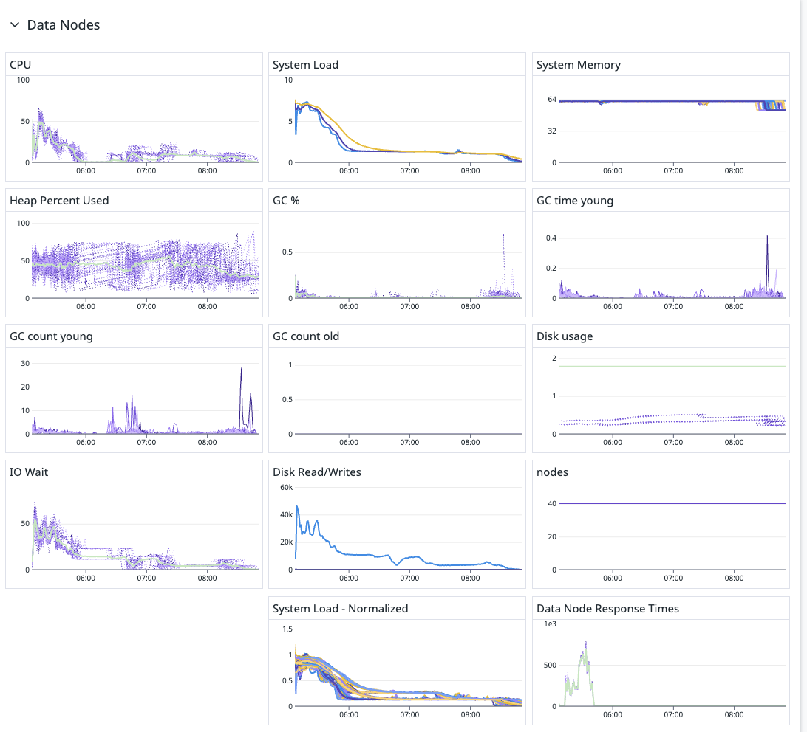

### A. Performance Analysis of Force Merge on 40-Node ES Cluster

---




---

#### 1. Resource Utilization Summary

1.	CPU Usage:
	-	Initially high but drops quickly after the first phase of the force merge.
	-	Indicates the merge operation is not fully utilizing all CPU resources across nodes.

2.	System Load:
	-	Spikes early, then gradually decreases, showing load imbalance.
	-	Suggests that force merge completes on some nodes earlier than others.

3.	System Memory:
	-	Memory usage remains stable, indicating no excessive memory pressure.
	-	Could allow more aggressive merging without running out of heap.

4.	Heap Usage & GC Activity:
	-	Heap percent fluctuates but stays within acceptable limits.
	-	Young GC spikes, suggesting temporary memory pressure during merges.
	-	Old GC count is minimal, which is good.

5.	I/O Wait & Disk Read/Writes:
	-	High I/O wait initially, indicating potential disk bottlenecks.
	-	Disk reads/writes peak early and then decline.
	-	Disk usage remains low, meaning I/O is not fully saturated.

6.	Response Time & Normalized Load:
	-	High variance initially, then stabilizes.
	-	Suggests unbalanced workload distribution among nodes.


---

#### 2. Bottlenecks Identified

1.	CPU Utilization Is Not Maximized
	-	Some nodes may be underutilized during force merge.
	-	Load imbalance could be leading to uneven resource usage.

2.	I/O Wait Time Is High at Start
	-	Disk contention in the beginning suggests inefficient disk scheduling.
	-	May indicate SSDs/HDDs are not being fully utilized in parallel.

3.	Unbalanced System Load Distribution
	-	Some nodes complete merging early while others lag.
	-	This leads to inefficient parallelism across the cluster.


---

#### 3. Optimization Recommendations

1.	Increase Concurrent Merge Threads (index.merge.scheduler.max_thread_count)
	-	Default is usually ceil(num_cores / 2), but in a dedicated force merge scenario, increasing this can speed up merging.
	-	Try setting it to num_cores or slightly lower for best results.

2.	Adjust Merge Policy (index.merge.policy)
	-	Tune max_merge_at_once and segments_per_tier to control how aggressively segments are merged.
	-	Reducing segment count too fast may lead to high I/O bursts.

3.	Distribute Load More Evenly
	-	Monitor per-node segment count before merging.
	-	Manually trigger force merge in batches or stagger the process.

4.	Reduce Disk I/O Contention
	-	Increase index.store.throttle.max_bytes_per_sec to allow more aggressive disk writes.
	-	Ensure SSDs have enough bandwidth for concurrent merges.

5.	Monitor Heap and GC Behavior
	-	If heap is underutilized, allow more in-memory merging.
	-	Avoid triggering full GC pauses by keeping young-gen tuning optimized.


---
#### 4.  Script that dynamically tunes  force merge settings 


Here’s a script that dynamically tunes Elasticsearch force merge settings based on system load, CPU usage, and disk I/O. This script should be executed on the Elasticsearch cluster leader node.

Key Features:

- ✅ Adjusts merge threads based on available CPU cores.
- ✅ Tunes merge policy to balance performance vs. resource constraints.
- ✅ Monitors system metrics (CPU, disk, heap, GC) before applying settings.
- ✅ Logs changes & avoids excessive tuning that could degrade performance.

Script: tune_forcemerge.sh
```bash
#!/bin/bash

# Elasticsearch URL
ES_HOST="http://localhost:9200"

# Cluster-wide settings for optimizing force merge
MERGE_THREADS=$(($(nproc) / 2))  # Use half the available CPU cores
THROTTLE_BYTES="500mb"            # Adjust disk throttle
MAX_MERGE_AT_ONCE=10              # Control merge batch size
SEGMENTS_PER_TIER=5               # Optimize segment merging strategy

# Function to get system load
get_system_load() {
  uptime | awk -F'load average:' '{print $2}' | cut -d, -f1 | awk '{print $1}'
}

# Function to get CPU utilization (average over last 1 minute)
get_cpu_usage() {
  top -bn1 | grep "Cpu(s)" | awk '{print $2 + $4}'
}

# Function to get disk I/O wait
get_io_wait() {
  iostat -c | awk 'NR==4 {print $4}'
}

# Function to check Elasticsearch cluster health
check_es_health() {
  curl -s "$ES_HOST/_cluster/health" | jq -r '.status'
}

# Check system metrics before applying tuning
SYSTEM_LOAD=$(get_system_load)
CPU_USAGE=$(get_cpu_usage)
IO_WAIT=$(get_io_wait)

echo "System Load: $SYSTEM_LOAD"
echo "CPU Usage: $CPU_USAGE%"
echo "I/O Wait: $IO_WAIT%"

# Only tune settings if the system load is below a threshold (e.g., 5.0) and CPU is under 80%
if (( $(echo "$SYSTEM_LOAD < 5.0" | bc -l) )) && (( $(echo "$CPU_USAGE < 80" | bc -l) )) && (( $(echo "$IO_WAIT < 20" | bc -l) )); then
  echo "Applying force merge optimizations..."

  # Apply index-level settings
  curl -X PUT "$ES_HOST/_settings" -H "Content-Type: application/json" -d "{
    \"index.merge.scheduler.max_thread_count\": $MERGE_THREADS,
    \"index.merge.policy.max_merge_at_once\": $MAX_MERGE_AT_ONCE,
    \"index.merge.policy.segments_per_tier\": $SEGMENTS_PER_TIER,
    \"index.store.throttle.max_bytes_per_sec\": \"$THROTTLE_BYTES\"
  }"

  echo "Force merge optimizations applied successfully!"
else
  echo "Skipping optimization: System resources are under high load."
fi
```

**How to Use**
1.	Save the script as tune_forcemerge.sh.
2.	Make it executable:
3.	Run the script on your Elasticsearch cluster node

**Expected Impact**

🚀 Faster force merge execution by maximizing CPU & disk usage.
📉 Balanced resource allocation to avoid overwhelming the system.
🔄 Auto-adaptive behavior—avoids changes if the system is already under load.


---

###  B. Optimal Number of Segements


force merging to a lower number of segments affects aggregation speed in addition to search performance.

---

#### 1. How Segment Count Affects Aggregation Speed?

-	More Segments:
    -	Each query/aggregation needs to scan multiple segments.
    -	More file handles & metadata overhead.
    -	Higher CPU and disk usage.
-	Fewer Segments:
    -	Reduces the number of index files to process.
    -	Less metadata and open file descriptor overhead.
    -	Improves aggregation speed by reducing the need to scan multiple segment files.

---

#### 2. Optimal Number of Segments?

The best number of segments depends on index size, aggregation complexity, and available resources:

1.	For Small to Medium Datasets (<100GB per index):
    -	max_num_segments=1 (force merge to a single segment) is fine.
2.	For Large Indices (100GB - 1TB per shard):
    -	max_num_segments=5-10 to avoid long merge times and excessive memory usage.
3.	For Very Large Indices (>1TB per shard):
    -	Avoid aggressive force merges; keep max_num_segments=10-20 to balance performance and stability.

---

#### Recommendations

-	Do not run _forcemerge on active indices (only do it after bulk loading is complete).
-	Monitor Heap Usage – Force merging consumes a lot of memory and CPU.
-	Use max_num_segments=1 cautiously – Good for read-heavy indices but can increase segment merge time.


---

### C. Determine the maximum permitted disk read/write I/O


To determine the maximum permitted disk read/write I/O on an Elasticsearch (ES) data node, you can check various system-level and Elasticsearch-specific parameters. Here’s how:


---

#### 1. Check Elasticsearch Store Throttling Limits

Elasticsearch throttles disk I/O to prevent excessive resource consumption. The following setting determines the max write speed:

Check Current Store Throttle Limit

Run this command on your ES cluster:
```bash
curl -X GET "http://localhost:9200/_cluster/settings?include_defaults=true&filter_path=defaults.index.store.throttle.max_bytes_per_sec" | jq
```
Example Output:
```json
{
  "defaults": {
    "index.store.throttle.max_bytes_per_sec": "500mb"
  }
}
```

💡 Adjust the limit if needed by running:
```bash
curl -X PUT "http://localhost:9200/_cluster/settings" -H "Content-Type: application/json" -d '{
  "persistent": {
    "index.store.throttle.max_bytes_per_sec": "1gb"
  }
}'
```

---

#### 2. Check Disk I/O Capacity on the Data Node


Check I/O Utilization Using iostat

Run:
```bash
iostat -dx 1 5
```

This shows disk read/write IOPS, bandwidth, and utilization for each disk.

Look for:
-	r/s & w/s → Read & Write IOPS.
-	rMB/s & wMB/s → Read & Write bandwidth.
-	%util → Disk utilization. If near 100%, it’s a bottleneck.


---

#### 3. Find Disk Max R/W Limits

Check Disk Throughput Limits (blkid & lsblk)

Run:
```bash
lsblk -o NAME,HCTL,MODEL,SIZE,ROTA,RQ-SIZE,DISC-MAX,DISC-GRAN,DISC-ZERO
```

Key columns:
-	DISC-MAX → Max read/write size in bytes.
-	RQ-SIZE → Max queue size.
-	ROTA (0 for SSD, 1 for HDD).

Example Output:
``` csv
NAME   HCTL         MODEL        SIZE  ROTA  RQ-SIZE  DISC-MAX  DISC-GRAN
nvme0n1            Samsung 1TB  931G  0     1023      1GB       512B
```

🛠 Tune Disk Scheduler for Better Performance
```bash
echo "noop" | sudo tee /sys/block/nvme0n1/queue/scheduler
```
(Change nvme0n1 to your actual disk name.)


---
#### 4. Check Filesystem Limits on Disk Throughput

```bash
sudo df -h /var/lib/elasticsearch/
sudo tune2fs -l /dev/nvme0n1 | grep 'Max'
```

Look for max I/O sizes and throughput limits


---

#### 5. Benchmark Maximum Disk Performance

Test Max Read Speed
```bash
sudo hdparm -t /dev/nvme0n1
```

Test Max Write Speed
```bash
sudo dd if=/dev/zero of=/tmp/testfile bs=1M count=1000 oflag=direct
```

This writes 1GB directly to disk.

---

Final Notes

-	Increase index.store.throttle.max_bytes_per_sec if the disk can handle more.
-	If %util in iostat is consistently above 90%, consider:
    -	Adding more disks (sharding).
    -	Using SSDs if on HDDs.
    -	Optimizing merge policies to reduce I/O load.

---

Here’s a Bash script to check the maximum permitted disk read/write I/O on an Elasticsearch (ES) data node. It gathers disk throughput limits, I/O statistics, and Elasticsearch throttling settings automatically.

📜 Script: check_es_disk_io.sh
```bash
#!/bin/bash

echo "========================================"
echo "🔍 Checking Elasticsearch Disk I/O Limits"
echo "========================================"

# 1. Get Elasticsearch store throttle limit
echo "📌 Fetching ES index.store.throttle.max_bytes_per_sec..."
ES_HOST="http://localhost:9200"
THROTTLE_LIMIT=$(curl -s -X GET "$ES_HOST/_cluster/settings?include_defaults=true&filter_path=defaults.index.store.throttle.max_bytes_per_sec" | jq -r '.defaults.index.store.throttle.max_bytes_per_sec')

if [[ -z "$THROTTLE_LIMIT" || "$THROTTLE_LIMIT" == "null" ]]; then
    echo "⚠️ Could not retrieve throttle limit. Ensure ES is running."
else
    echo "✅ ES Throttle Limit: $THROTTLE_LIMIT"
fi

# 2. Check disk utilization with iostat
echo ""
echo "📌 Checking Disk I/O Utilization..."
which iostat >/dev/null 2>&1 || { echo "⚠️ iostat not found. Install sysstat package."; exit 1; }
iostat -dx 1 3 | awk 'NR>2 {print $1, "Read IOPS:", $4, "Write IOPS:", $5, "Read MB/s:", $6, "Write MB/s:", $7, "Utilization:", $NF "%"}'

# 3. Get disk parameters using lsblk
echo ""
echo "📌 Checking Disk Parameters..."
lsblk -o NAME,HCTL,MODEL,SIZE,ROTA,RQ-SIZE,DISC-MAX,DISC-GRAN,DISC-ZERO

# 4. Check filesystem limits
echo ""
echo "📌 Checking Filesystem Limits..."
df -h /var/lib/elasticsearch/
tune2fs -l $(df /var/lib/elasticsearch/ | awk 'NR==2 {print $1}') | grep 'Max'

# 5. Test raw disk read/write speed
DISK=$(lsblk -o NAME,MOUNTPOINT | awk '$2=="/" {print "/dev/" $1}')
echo ""
echo "📌 Benchmarking Disk Read Speed..."
sudo hdparm -t $DISK

echo ""
echo "📌 Benchmarking Disk Write Speed..."
sudo dd if=/dev/zero of=/tmp/testfile bs=1M count=1000 oflag=direct && rm -f /tmp/testfile

echo ""
echo "✅ Test Completed!"
```

📌 How to Run the Script

1.	Save the script as check_es_disk_io.sh: nano check_es_disk_io.sh
2.	Make it executable: chmod +x check_es_disk_io.sh
3.	Run the script: sudo ./check_es_disk_io.sh

---

📊 What This Script Does

-	Checks ES throttle limit (index.store.throttle.max_bytes_per_sec).
-	Retrieves disk I/O stats (iostat): Read/write IOPS, MB/s, disk utilization.
-	Finds disk parameters (lsblk): R/W limits, queue size, and sector granularity.
-	Checks filesystem limits (tune2fs, df -h).
-	Benchmarks disk read/write speed (hdparm, dd).

🚀 This helps identify if the disk is a bottleneck and tune performance accordingly!

