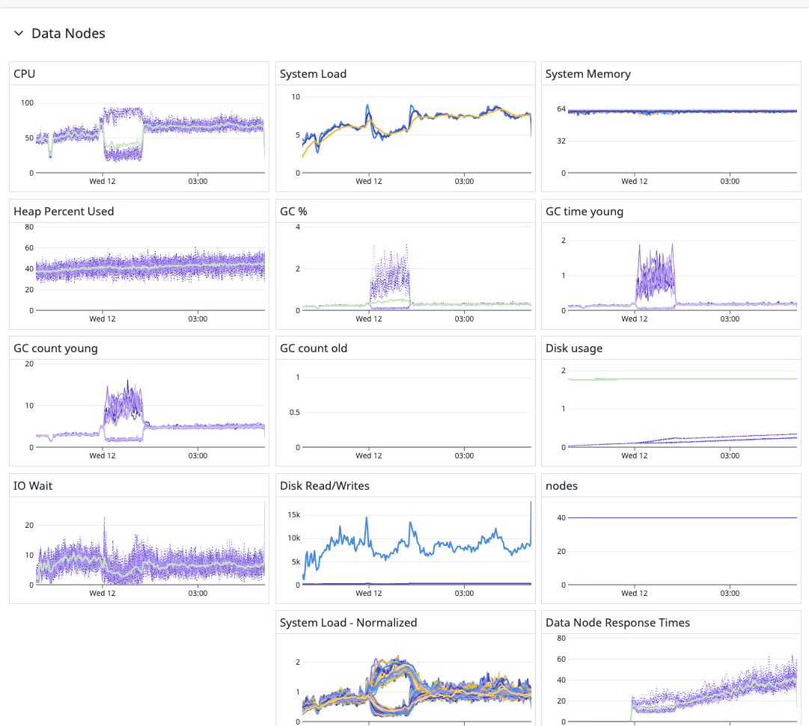

----
### A. Summary of DD Performance Data for Elasticsearch Data Loading

---
Based on the resource usage charts from Datadog during data loading onto a 40-node Elasticsearch cluster, here are the key observations and improvement recommendations:




---

#### 1. CPU Utilization

-	Observation: CPU usage fluctuates significantly but never reaches 100% consistently.
-	Potential Bottleneck: The workload might be CPU-bound, but some nodes have underutilized CPU, indicating imbalanced resource usage.
-	Optimization Suggestion:
	-	Check shard allocation to ensure an even distribution across nodes.
	-	Adjust threadpool settings (indexing, bulk, search) to better utilize CPU resources.
	-	Consider increasing the bulk request size if CPU is underutilized.


---

#### 2. System Load
   
-	Observation: System load spikes at intervals but remains mostly within a reasonable range.
-	Potential Bottleneck: Spikes in system load might indicate periodic heavy indexing operations.
-	Optimization Suggestion:
	-	Optimize bulk indexing rate by monitoring queue rejections and tuning refresh intervals.
	-	Check for thread contention and increase available worker threads if necessary.

---

#### 3. System Memory
   
-	Observation: Memory usage remains stable across the timeline.
-	Potential Bottleneck: No memory saturation, suggesting it is not a limiting factor.
-	Optimization Suggestion:
	-	If indexing speed is slow, check if JVM heap settings are optimal (e.g., heap size should be 50% of available memory).
	-	Tune Elasticsearch fielddata cache and query cache settings if search performance is impacted.

---

#### 4. Heap Usage

-	Observation: Heap usage is stable and not peaking, but could be slightly optimized.
-	Potential Bottleneck: Heap utilization shows gradual increases, indicating GC tuning might improve performance.
-	Optimization Suggestion:
	-	Enable G1GC or CMS GC tuning to reduce GC pause times.
	-	Ensure large fields are not causing unnecessary heap pressure.
	-	Monitor old-gen GC count to detect long-lived object accumulation.

---


#### 5. Garbage Collection (GC) Metrics

-	Observation: GC activity shows spikes in young GC and minimal old GC counts.
-	Potential Bottleneck: Frequent young GC events could cause indexing latency.
-	Optimization Suggestion:
	-	Increase young generation heap size to reduce frequent GC pauses.
	-	Analyze GC logs to check for excessive full GC events.

---


#### 6. Disk Usage & Read/Writes

-	Observation: Disk usage remains steady, but read/write operations fluctuate significantly.
-	Potential Bottleneck: Disk I/O contention could slow down bulk indexing.
-	Optimization Suggestion:
	-	If using spinning disks, consider upgrading to NVMe or SSDs.
	-	Reduce segment merging frequency by increasing index.refresh_interval.
	-	If disk saturation is observed, consider dedicating separate nodes for indexing vs. querying.

---

#### 7. IO Wait

-	Observation: IO Wait has noticeable spikes.
-	Potential Bottleneck: Indexing workload could be waiting on disk writes.
-	Optimization Suggestion:
	-	Increase disk buffer size (indices.store.throttle.max_bytes_per_sec).
	-	Reduce flush frequency by adjusting index.translog.flush_threshold_size.


---

#### 8. Data Node Response Times
-	Observation: Response times increase towards the end, indicating resource saturation.
-	Potential Bottleneck: As indexing progresses, CPU, GC, or disk I/O might be limiting response times.
-	Optimization Suggestion:
	-	Tune indexing pressure settings (indexing_pressure.memory.limit).
	-	Distribute shard leadership across nodes to avoid hotspots.
	-	If response times degrade consistently, consider adding more data nodes.

---


#### Final Recommendations to Improve Data Loading Performance

1.	Increase Bulk Request Size – Optimize bulk_size to maximize indexing throughput.
2.	Balance Shard Allocation – Ensure shards are evenly distributed to avoid CPU hotspots.
3.	Optimize JVM Heap & GC – Reduce young GC pauses and check heap allocation efficiency.
4.	Tune Disk I/O Performance – Optimize refresh_interval and disk-related settings.
5.	Monitor Network Bottlenecks – If inter-node latency is high, consider optimizing discovery.zen.ping_unicast.hosts.
6.	Scale Cluster if Needed – If resource saturation is observed, consider adding nodes or increasing replica counts.


#### Conclusion

The cluster is not fully utilizing CPU resources and experiencing I/O wait spikes, suggesting that disk and indexing configurations can be tuned for better performance. Adjusting GC settings, optimizing bulk load sizes, and balancing shard allocation should improve efficiency. 


---

### B. Optimized Elasticsearch Settings for Faster Data Loading


Based on the performance analysis from your Datadog resource usage charts, here are detailed Elasticsearch settings optimizations to maximize data loading performance while ensuring stability.

---

### 1. Bulk Indexing Optimization

#### 1.1 Increase Bulk Request Size
-	Current Issue: CPU is underutilized, and I/O wait is high.
-	Fix: Increase bulk request size to maximize throughput.
-	Settings:

```yaml
thread_pool:
  write:
    size: 8  # Adjust based on CPU cores (set ~1.5x the core count)
    queue_size: 1000  # Increase if bulk rejections occur
```

Other bulk settings:
```json
{
  "index": {
    "refresh_interval": "-1",  // Disable refresh during bulk indexing
    "number_of_replicas": "0", // Disable replicas temporarily
    "translog.durability": "async", // Reduce disk I/O pressure
    "merge.scheduler.max_thread_count": "1", // Prevent excessive merges
    "merge.policy.max_merged_segment": "5gb" // Control merge segment size
  }
}
```

Why?
-	Disabling refreshing (refresh_interval=-1) prevents frequent small segment merges.
-	Setting number_of_replicas=0 avoids unnecessary replication overhead during indexing.
-	async translog reduces unnecessary disk writes.

✅ Enable refresh & replicas after indexing completion:

```sh
curl -XPUT "http://localhost:9200/_settings" -H 'Content-Type: application/json' -d '{
  "index": {
    "refresh_interval": "1s",
    "number_of_replicas": "1"
  }
}'
```

---

### 2. Shard & Index Management Optimization

#### 2.1 Optimize Shard Count
-	Current Issue: Imbalanced load across nodes.
-	Fix: Ensure optimal shard count per node.

Formula for shard count:
```yaml
(Number of Nodes * Number of CPU cores) / 2 = Optimal shard count
```

Example for 40-node cluster with 8-core nodes:
```yaml
(40 * 8) / 2 = 160 shards max.
```

✅ Ensure that each shard is ~10-50GB for best performance.


---
#### 2.2 Pre-Create Indices with Correct Shard Count

-	Command:
```sh
curl -XPUT "http://localhost:9200/my_index" -H 'Content-Type: application/json' -d '{
  "settings": {
    "index": {
      "number_of_shards": 160,
      "number_of_replicas": 0
    }
  }
}'
```
Why? Prevents Elasticsearch from auto-creating indices with suboptimal settings.

---

### 3. JVM & Garbage Collection (GC) Tuning

#### 3.1 Optimize JVM Heap Memory

-	Current Issue: GC % and GC time spikes → Heap pressure issues
-	Fix: Set heap size to 50% of total memory, up to 32GB max.
-	Settings:

```sh
export ES_JAVA_OPTS="-Xms32g -Xmx32g"
```

**Why?**
-	JVM heap > 32GB increases GC latency due to compressed OOPs loss.
-	Lower heap leads to more frequent GC pauses.

---

#### 3.2 Switch to G1GC (Better for indexing-heavy workloads)

-	Settings: Modify jvm.options file:
```sh
-XX:+UseG1GC
-XX:InitiatingHeapOccupancyPercent=75
-XX:G1HeapRegionSize=16m
```

**Why?**
-	Reduces full GC pauses during indexing
-	Optimizes young-gen collection

---

### 4. Disk I/O & Merge Optimization

#### 4.1 Reduce Merge Overhead
-	Current Issue: High disk read/writes → Merge thrashing
-	Fix: Increase merge throttle settings
-	Settings:
```sh
curl -XPUT "http://localhost:9200/my_index/_settings" -H 'Content-Type: application/json' -d '{
  "index": {
    "merge.policy.max_merge_at_once": "4",
    "merge.policy.segments_per_tier": "10",
    "merge.policy.max_merged_segment": "5gb",
    "merge.scheduler.max_thread_count": "1"
  }
}'
```

**Why?**
-	Prevents excessive segment merges (CPU & disk-intensive).
-	Limits merging to 4 segments at once, avoiding merge storms.


---

### 5. Network & Query Performance Optimization

#### 5.1 Reduce Search & Indexing Thread Contention
-	Current Issue: High system load & CPU spikes
-	Fix: Increase thread pools
-	Settings:
```sh
curl -XPUT "http://localhost:9200/_cluster/settings" -H 'Content-Type: application/json' -d '{
  "persistent": {
    "thread_pool.search.size": "20",
    "thread_pool.write.size": "16",
    "thread_pool.search.queue_size": "2000"
  }
}'
```

**Why?**
-	Ensures search & indexing do not block each other.
-	Increasing queue size prevents request drops.

---

### 6. Post-Indexing Cleanup


#### 6.1 Force Merge Segments After Bulk Load
-	Command:
```sh
curl -XPOST "http://localhost:9200/my_index/_forcemerge?max_num_segments=1"
```


**Why?**
-	Reduces storage usage by merging small segments.
-	Improves query speed (fewer segments = faster searches).


----

### Final Checklist for Performance Optimization


# Final Checklist for Performance Optimization  

| Optimization            | Setting                                                | Why? |
|------------------------|------------------------------------------------------|------|
| **Bulk Indexing**      | `refresh_interval=-1`, `number_of_replicas=0`, `translog.durability=async` | Avoids unnecessary disk writes |
| **Shard Management**   | `number_of_shards=160` (based on nodes & CPU)        | Prevents hotspotting |
| **JVM Heap & GC**      | `-Xms32g -Xmx32g`, `UseG1GC`                         | Reduces GC pauses & improves memory efficiency |
| **Disk I/O**          | `merge.policy.max_merged_segment=5gb`, `merge.scheduler.max_thread_count=1` | Prevents excessive segment merges |
| **Thread Optimization** | `thread_pool.search.size=20`, `thread_pool.write.size=16` | Prevents search/write contention |
| **Post-Indexing Cleanup** | `/_forcemerge?max_num_segments=1`                  | Reduces query latency |

---


🚀 Next Steps

1.	Apply these settings on a staging cluster & monitor performance.
2.	Use Datadog alerts for CPU spikes, GC pressure, and disk I/O.
3.	Test with a 10% production load before full deployment.
4.	Refine bulk request size based on node performance (e.g., start with 10MB bulk size and adjust).

🚀 Next Steps
	1.	Apply these settings on a staging cluster & monitor performance.
	2.	Use Datadog alerts for CPU spikes, GC pressure, and disk I/O.
	3.	Test with a 10% production load before full deployment.
	4.	Refine bulk request size based on node performance (e.g., start with 10MB bulk size and adjust).

---

Since you are loading data offline and there are no search requests, the focus should be on maximizing bulk indexing performance while fully utilizing available resources. Below is the optimized checklist in Markdown format:


# Final Checklist for Maximizing Elasticsearch Bulk Loading Performance  

| Optimization Aspect        | Recommended Setting/Action                                      | Purpose |
|---------------------------|----------------------------------------------------------------|---------|
| **Index Refresh**         | `refresh_interval=-1`                                         | Disables auto-refresh to avoid frequent segment merges |
| **Replica Count**         | `number_of_replicas=0`                                        | Avoids unnecessary duplication during bulk loading |
| **Translog Durability**   | `translog.durability=async`                                   | Reduces I/O overhead by not syncing every request |
| **Bulk Request Size**     | Tune `bulk_size` (e.g., `5MB - 50MB`)                         | Finds the best balance between throughput and memory usage |
| **Shard Allocation**      | Pre-create `number_of_shards` based on available nodes & CPU  | Distributes indexing load efficiently |
| **Merge Policy**          | `index.merge.scheduler.max_thread_count=1`                    | Prevents excessive merging contention |
| **Heap & GC**            | `-Xms32g -Xmx32g`, `UseG1GC`                                  | Ensures stable memory allocation and minimizes GC impact |
| **Thread Pool**          | `thread_pool.write.size=16` (or higher based on CPU cores)    | Maximizes indexing throughput |
| **Disk Write Optimization** | Use fast SSDs, disable `swap`                               | Reduces I/O bottlenecks |
| **Post-Indexing Optimization** | Run `/_forcemerge?max_num_segments=1` after indexing is complete | Minimizes segment count for better query performance |

### Additional Notes:
- Monitor **CPU, I/O, and memory usage** to fine-tune bulk size.
- If using **hot-warm architecture**, ensure new indices are allocated to **hot nodes** with faster disks.
- After indexing, **reenable replicas** (`number_of_replicas=1` or more) for fault tolerance.