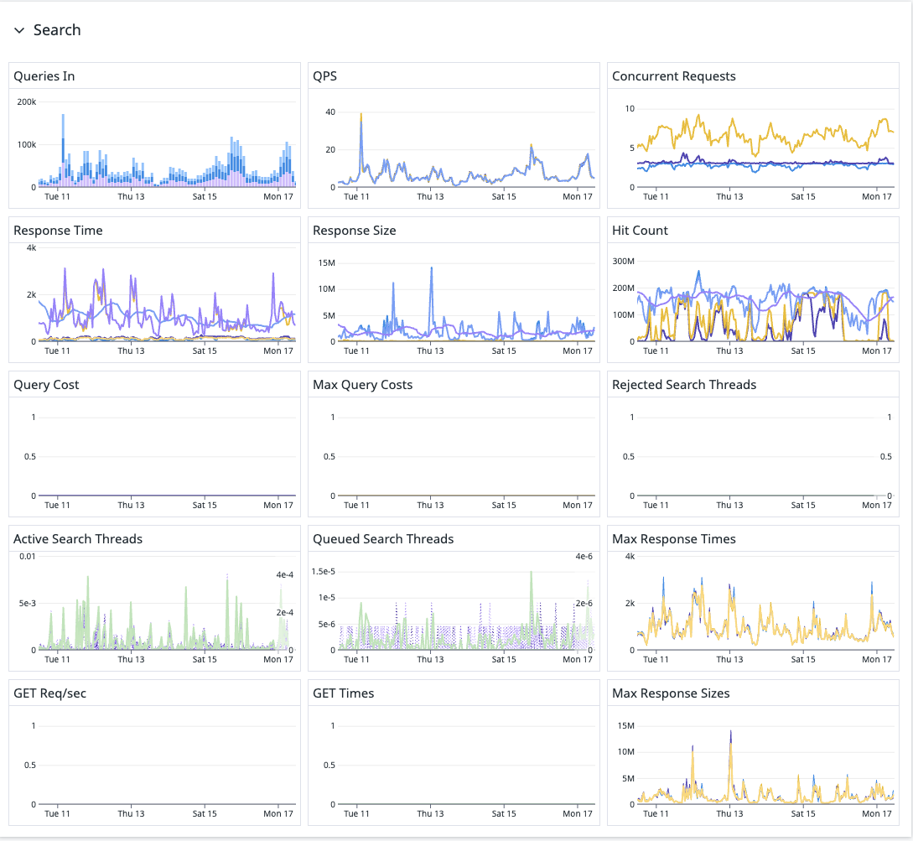
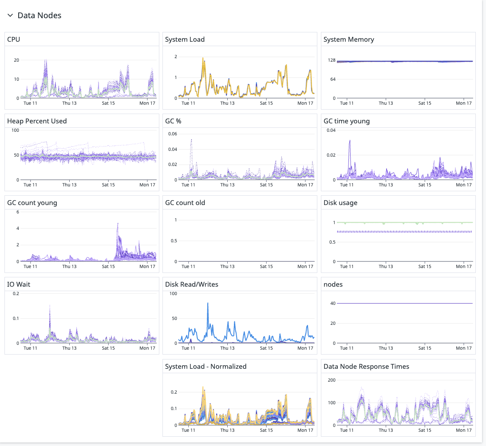
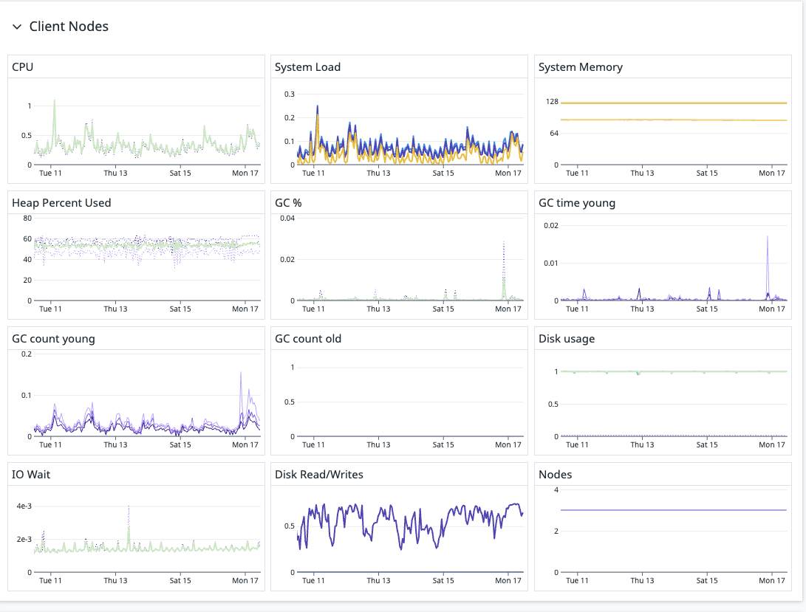

**Prompt:**

This is a resource usage chart from Datadog for the data node during Elasticsearch data loading onto a 40-node cluster. Please extract the performance data from the chart, summarize the resource usage, and evaluate if there is potential to improve loading performance by optimizing the use of computing resources.

