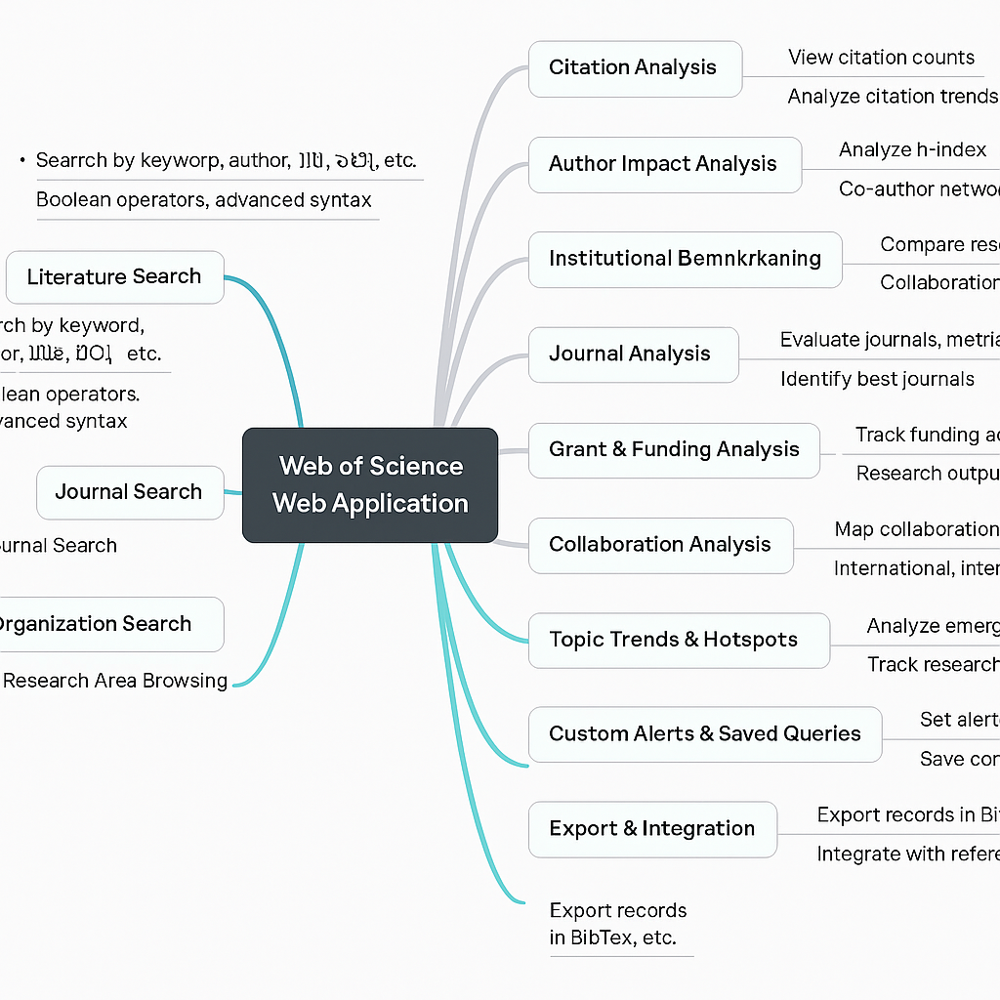

## Web of Science (WoS) web  – Research Capabilities


The Web of Science (WoS) web application is a powerful research platform developed by Clarivate Analytics. It offers a wide range of functionalities for academic researchers, librarians, administrators, and research managers to discover, analyze, and manage scholarly information.

Below is a comprehensive list of core research tasks and advanced functionalities that can be performed using the Web of Science web application.

---


### 📚 Core Research Tasks

| **Core Research Tasks**       | **Category** | **Tasks**                                                                 |
|------------------------------|--------------|---------------------------------------------------------------------------|
| Literature Search            |              | - Search for scholarly articles, books, conference papers by keyword, author, title, DOI, etc. <br> - Use Boolean operators and advanced search syntax <br> - Search by publication name or subject category |
| Author Search                |              | - Find all publications by a specific author <br> - Disambiguate authors with similar names using Author Search tool |
| Citation Search              |              | - Track who has cited a specific paper (forward citation search) <br> - View cited references of a publication (backward citation search) |
| Journal Search               |              | - Identify journals by name, ISSN, or subject area <br> - Evaluate impact factor and quartile of a journal |
| Organization Search          |              | - Search publications by institution/organization |
| Research Area Browsing       |              | - Filter or browse by research domains (e.g., Neuroscience, Materials Science) |

---

### 🔍 Advanced Research & Analysis Tasks

| **Advanced Research Tasks**    | **Category** | **Advanced Tasks**                                                                 |
|--------------------------------|--------------|-------------------------------------------------------------------------------------|
| Citation Analysis              |              | - View citation count per article, author, or institution <br> - Analyze citation trends over time <br> - Identify highly cited and hot papers |
| Author Impact Analysis         |              | - Analyze h-index and citation performance of researchers <br> - Explore co-author networks |
| Institutional Benchmarking     |              | - Compare research output and citation metrics across universities or institutions <br> - Identify collaboration networks and co-authorship patterns |
| Journal Analysis               |              | - Evaluate journals by metrics such as Impact Factor, Eigenfactor, JCI <br> - Identify best journals for publication based on scope and metrics |
| Grant & Funding Analysis       |              | - View funding acknowledgements in articles <br> - Track research outputs funded by specific agencies or programs |
| Collaboration Analysis         |              | - Map collaboration by country, institution, or author <br> - Analyze international or interdisciplinary collaborations |
| Topic Trends & Hotspots        |              | - Analyze emerging topics and subject trends <br> - Track research development over time |
| Custom Alerts & Saved Queries  |              | - Set alerts for new articles, citations, or author publications <br> - Save complex search queries for reuse |
| Export & Integration           |              | - Export records in BibTeX, EndNote, RIS, or plain text formats <br> - Integrate with EndNote or other reference managers |

---

###  🧰 Specialized Tools & Features

| **Specialized Tools & Features**     | **Feature**                     | **Functionality**                                                                   |
|--------------------------------------|----------------------------------|--------------------------------------------------------------------------------------|
| Web of Science Core Collection       | Access                          | Curated, high-quality journals across disciplines                                   |
| InCites Integration                  | Analytics                        | Performance benchmarking, normalized metrics, and custom dashboards                 |
| Journal Citation Reports (JCR)       | Journal Metrics                  | Analyze journal rankings and metrics across fields                                  |
| ResearcherID / Publons               | Author Tools                     | Claim author profiles, track personal metrics, and verify peer review history       |
| Open Access Filtering                | Filtering                        | Filter results by gold/green open access                                            |
| Research Area Tagging                | Classification                   | Classify articles under specific WoS research areas                                 |
| Citation Maps                        | Visualization                    | Visualize relationships between citing and cited works                              |


### Summary

- Search & Discovery of scholarly content
- Author, Journal, Institution, and Funding analysis
- Citation & Impact Metrics
- Visualization and Collaboration Network Mapping
- Export, Alerting, and Integration


---

### ✅ 1. Visual Mind Map: Web of Science Research Capabilities





---

### ✅ 2.  Web of Science Research Capabilities 


| **Category**               | **Task**                    | **Description**                                                                 | **Tool/Feature Used**                     |
|----------------------------|-----------------------------|----------------------------------------------------------------------------------|-------------------------------------------|
| Literature Search          | Keyword Search              | Search for articles using keywords, title, author, etc.                         | Web of Science Core Collection            |
| Literature Search          | Advanced Search             | Use Boolean operators, truncation, proximity searching                          | Advanced Search Interface                  |
| Author Search              | Author Lookup               | Find all articles by an author, disambiguate names                              | Author Search Tool                         |
| Citation Search            | Cited Reference Search      | Find papers that cite a specific article                                        | Citation Index                             |
| Citation Analysis          | View Citation Count         | See how often a work is cited                                                   | Citation Reports                           |
| Citation Analysis          | Trend Analysis              | Track citation growth over time                                                 | Citation Report                            |
| Author Impact Analysis     | h-index                     | Calculate an author's h-index                                                   | Citation Report                            |
| Author Impact Analysis     | Co-author Network           | Map co-authorship relationships                                                 | Author Record                              |
| Institutional Benchmarking | Research Output             | Compare publication counts across institutions                                  | InCites (if integrated)                    |
| Institutional Benchmarking | Collaboration Networks      | View networks by institution                                                    | InCites + WoS Collaboration Maps           |
| Journal Analysis           | Impact Factor               | Evaluate journals by JIF, Eigenfactor, etc.                                     | Journal Citation Reports (JCR)            |
| Journal Analysis           | Quartile Rankings           | Check Q1–Q4 ranking per category                                                | JCR                                        |
| Grant & Funding Analysis   | Funding Agency Lookup       | View articles by funder (e.g., NIH, EU)                                         | Funding Acknowledgment field               |
| Grant & Funding Analysis   | Output per Funder           | Track research supported by a specific grant agency                             | Web of Science Filters                     |
| Collaboration Analysis     | Collaboration Mapping       | Map institutional or international collaborations                               | Collaboration Visualization Tool           |
| Topic Trends & Hotspots    | Trend Detection             | Identify trending research areas over time                                      | Analyze Results + Research Areas           |
| Topic Trends & Hotspots    | Emerging Topics             | Find newly emerging themes                                                      | Hot Papers & Highly Cited Papers           |
| Custom Alerts & Saved Queries | Create Alerts            | Track new publications, citations, author activity                              | Alert & Saved Search System                |
| Export & Integration       | Export Results              | Export to EndNote, BibTeX, RIS, CSV                                             | Export Manager                             |
| Export & Integration       | Reference Management        | Manage references with EndNote                                                  | EndNote Integration                        |


---

### ✅ 3. Use Case Walkthrough


✅ Use Case Walkthrough: Find Top-Cited AI Papers (Last 5 Years)

#### 🎯 Objective
Identify **top-cited Artificial Intelligence (AI)** publications from the past 5 years using the Web of Science web application.

---

#### 🧭 Step-by-Step Instructions

#####  Step 1: Go to Web of Science
- Open: [https://www.webofscience.com](https://www.webofscience.com)
- Log in via your institution if required.

---

#####  Step 2: Perform a Keyword Search
1. Select **Basic Search**.
2. Choose **“Topic”** from the dropdown.
3. Enter:  "artificial intelligence"

4. Set the **Timespan** to the last 5 years (e.g., 2020–2024).
5. Click **Search**.

---
#####  Step 3: Refine and Sort Results
1. (Optional) **Refine Document Types**:
- Filter for “Article,” “Review,” or “Proceedings Paper”.

2. (Optional) **Refine by Subject Area**:
- Select relevant categories like *Computer Science, Artificial Intelligence*.

3. **Sort by Citations**:
- Use the **“Sort by”** dropdown and choose **“Times Cited – highest to lowest”**.

---

#####  Step 4: Analyze the Results

- Browse the top results to identify:
  - Top-cited papers
  - Leading authors/institutions
  - Journals publishing the most cited AI work

- Review top records for:
  - Citation count
  - Top journals
  - Prominent authors and institutions

- Click any title to view:
  - Abstract
  - Cited references
  - Authors
  - Funding acknowledgements
  - Citing articles

---

#####  Step 5: Export or Save Results
- Select one or more records.
- Click **Export**.
- Choose format:
  - EndNote, BibTeX, RIS, or CSV
  - Include: *Full Record and Cited References* (recommended)

---

#####  Step 6: Create Alerts (Optional)
- Click **“Create Alert”** to monitor for future papers.
- You’ll receive email alerts for new matches.

---

#####  🧠 Tips
- Use quotes to search exact phrases: `"artificial intelligence"`
- Use **Advanced Search** for more control:
```sql
TS=("artificial intelligence") AND PY=(2020-2024) AND LA=(English)
```
---