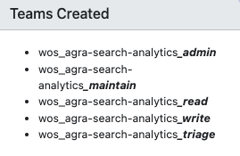

## Creating a Databricks Pipeline Project


### 📘 Steps to Create a New Pipeline Workflow Project in Databricks


#### 1. Clone the Template Repository

```bash
git clone ssh://git@git.clarivate.io/agcds/databricks-job-template.git /<LOCAL_FOLDER>
```

#### 2. Create and Clone Your Project Repository

- Use the CGMC tool: [https://cgmc.clarivate.io/](https://cgmc.clarivate.io/) to create a new repository.
- Clone your new repository locally:

```bash
git clone git@github.com:clarivate-prod/<REPOSITORY>.git /<LOCAL_FOLDER>
```

#### 3. Initialize the Project with the Databricks Template

- Run the bootstrap script (installs Databricks CLI if needed):

```bash
./bootsrap.sh
```

#### 4. Commit and Push Initial Changes

```bash
git add .
git commit -m "Initial commit with project-specific configurations"
git push origin main
```

#### 5. Request DevOps Review and Jenkins Job Creation

- Create a Jira ticket for DevOps.
- Provide the GitHub project URL.
- Assign admin permission to David Trigo or Amitesh Chandra.

#### 6. Run the Jenkins Job

- Trigger the Jenkins job to deploy your pipeline.

---

- **DLT Template Project**: `databricks-dlt-job-template` – for streaming data in Live tables.
- **General Template Project**: `databricks-job-template` – for baseline & batch data in Delta Lake or S3.

---

### 📘 Configuration

Two configuration files, `databricks.yml` and `job.yml`, control pipeline workflow settings such as clusters, data sources, destinations, scheduling, triggers, libraries, and other parameters.

**databricks.yml**

```yaml
variables:
    deploy_version:
        description: version to deploy
        default: 1.0.2
    upstream_catalog_name:
        description: upstream unity catalog
        default: ag-content-pre-prod
    upstream_data_version:
        description: upstream data version
        default: 1.0.0
    downstream_catalog_name:
        description: downstream unity catalog
        default: agra_wosg_searchdata_dev
    downstream_data_version:
        description: downstream data version
        default: 1.0.0

targets:
    dev:
        default: true
    int:
        variables:
            # overwrite default value if required
    uat:
        variables:
            # overwrite default value if required
    prod:
        variables:
            # overwrite default value if required
```

**job.yml**

Parameters under `parameters` are available in the Workflows Job UI and can be modified when running jobs.

```yaml
resources:
    jobs:
        agra-sa-researcher-profiles-workflow_job:
            name: "${bundle.name}_${bundle.environment}_${var.deploy_version}"
            run_as:
                user_name: r.chen@clarivate.com
            run_as_owner: false
            email_notifications:
                on_failure:
                    - r.chen@clarivate.com
            on_success:
                trigger_job:
                    job_name: Summarization_Job
            tasks:
                - task_key: "${bundle.name}_extract_data"
                    notebook_task:
                        notebook_path: "../src/extract_data.ipynb"
                    job_cluster_key: "${bundle.name}_${bundle.environment}_compute"
                    max_retries: 3
                - task_key: "${bundle.name}_main"
                    notebook_task:
                        notebook_path: "../src/researcher-profiles.ipynb"
                    job_cluster_key: "${bundle.name}_${bundle.environment}_compute"
                    max_retries: 3
                    depends_on:
                        - task_key: "${bundle.name}_extract_data"
            libraries:
                - pypi:
                        package: "clarivate-data-utils>=1.8"
                        repo: "https://repo-int.clarivate.io/artifactory/api/pypi/wos-central-pypi/simple/"
                - maven:
                        coordinates:
                            - "org.opensearch.client:opensearch-hadoop:1.0.0"
                            - "com.amazonaws:aws-java-sdk-bundle:1.12.772"
                            - "com.databricks:spark-xml_2.12:0.18.0"
            parameters:
                - name: "deploy_version"
                    default: "${var.deploy_version}"
                - name: "environment"
                    default: "${bundle.environment}"
                - name: "upstream_catalog_name"
                    default: "${var.upstream_catalog_name}"
                - name: "upstream_data_version"
                    default: "${var.upstream_data_version}"
```

---

### 📘 Manage Repository Permission

- Use the team name `wos_agra-search-analytics` to manage repository permissions.

Team Roles:



---

### 📘 Project Naming Convention

**Format:**  
`{BU}-{Department}-{ProjectName}-{Type}`

**Components:**

- **BU**: agra – Academia & Government - Research & Analytics.
- **Department**: sa – Search & Analytics Team.
- **ProjectName**: Your specific project name.
- **Type** (Optional): service, api, workflow, pipeline, processor, dataflow, etc.

**Naming Rules:**

- Use lowercase letters.
- Separate words with hyphens (-).

**Examples:**

- agra-sa-clinicaltrials-workflow
- agra-sa-wosri-loader
- agra-sa-org-typeahead-service

---

### 📘 Parameter Naming Convention

Consistent naming for configuration parameters across the pipeline workflow.

#### 1. Upstream Data Source Parameters

**Format:**  
`upstream_{storage_type}_{dataset}_{optional_attribute}_{environment}`

**Examples:**

| Parameter                        | Description                        |
|-----------------------------------|------------------------------------|
| upstream_catalog_content          | Content data catalog name          |
| upstream_catalog_content_version  | Content catalog data version       |
| upstream_s3_wos                   | WOS data S3 bucket name            |
| upstream_s3_wos_version           | WOS data version in S3             |
| upstream_s3_udm                   | UDM data S3 bucket name            |
| upstream_catalog_ct               | Clinical trials data catalog name  |
| upstream_postgre_myorg            | MyOrg data PostgreSQL database     |

#### 2. Downstream Data Source Parameters

**Format:**  
`downstream_{storage_type}_{dataset}_{optional_attribute}_{environment}`

**Examples:**

| Parameter                           | Description                              |
|--------------------------------------|------------------------------------------|
| downstream_catalog_wosri             | WOSRI data catalog name                  |
| downstream_catalog_wosri_version     | WOSRI catalog data version               |
| downstream_s3_wosri                  | WOSRI data S3 bucket name                |
| downstream_s3_wosri_version          | WOSRI data version in S3                 |
| downstream_catalog_ct                | Clinical trials data catalog name        |
| downstream_catalog_metrics           | Research metrics catalog name            |
| downstream_s3_wosri_typeahead        | Typeahead data S3 bucket name            |
| downstream_s3_wosri_askri            | askri normalization data S3 bucket name  |

#### 3. Service Endpoints

**Format:**  
`{system}_{service_type}_{service}_endpoint`

**Examples:**

- incites_ui_service_endpoint
- incites_champ_endpoint
- wosri_auth_service_endpoint
- wosri_askri_endpoint
- wosri_es_endpoint
- wosri_org_typeahead_endpoint
- agai_embeddings_endpoint
- agai_llm_endpoint

---

### 📘 Scala Source File Naming Standard

#### 1. Match File Name to Top-Level Class/Object/Trait

- File name matches the public top-level definition.
- Use PascalCase and `.scala` extension.

```scala
// File: CustomerAccount.scala
class CustomerAccount { ... }

// File: DataProcessor.scala
object DataProcessor { ... }
```

#### 2. One Top-Level Class/Object/Trait per File (Recommended)

```scala
// File: OrderService.scala
class OrderService { ... }
```

#### 3. Package Directory Structure Mirrors Package Name

```text
src/
 └── main/
            └── scala/
                     └── com/
                                └── example/
                                         └── analytics/
                                                    └── MetricsCalculator.scala
```

File content:

```scala
package com.example.analytics

object MetricsCalculator { ... }
```

#### 4. Naming Rules for Files and Identifiers

| Element                | Convention      | Example                       |
|------------------------|----------------|-------------------------------|
| Class/Object/Trait     | PascalCase     | CustomerOrder, DataLoader     |
| Method/Variable        | camelCase      | loadData(), userName          |
| Constants (vals)       | UPPER_SNAKE_CASE | MAX_RETRY_COUNT            |
| Package name           | lowercase      | com.example.analytics         |
| Test files             | Append Test/Spec | CustomerOrderTest.scala, MetricsCalculatorSpec.scala |


#### 5. Checkstyle/Scalastyle rule

If you’re using Scalastyle (Scala’s version of Checkstyle), enable the rule:

```xml
<check level="error" class="org.scalastyle.scalariform.FileNamesChecker">
  <parameters>
    <parameter name="regex">^[A-Z][A-Za-z0-9]*\.scala$</parameter>
  </parameters>
</check>

```

This ensures all Scala files start with an uppercase letter and use valid CamelCase naming.


#### ✅ Summary

| **Rule** | **Standard** |
|-----------|---------------|
| File name matches top-level class/object name | `MyService.scala` → `class MyService` |
| Use PascalCase | `DataProcessor.scala` |
| One top-level definition per file | Recommended |
| Directory path matches package name | `com/example/project/MyClass.scala` |
| Tests follow naming pattern | `MyServiceTest.scala` |
