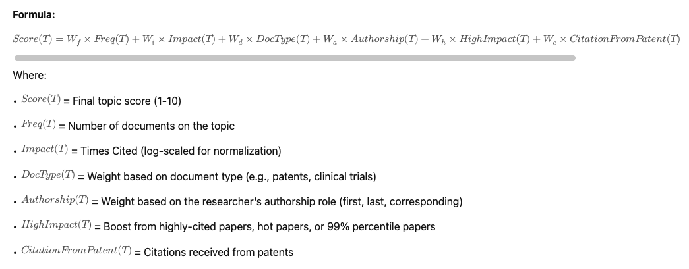

## Research Topic Scoring Algorithm (Scale 1-10)

The score for each research topic is computed using a weighted formula that accounts for frequency, impact, authorship position, document type, recency, and high-impact markers.

#### Formula:


Score(T) = W_f \times Freq(T) | W_i \times Impact(T) | W_d \times DocType(T) | W_a \times Authorship(T) | W_h \times HighImpact(T) | W_c \times CitationFromPatent(T)



#### Where:

-	Score(T) = Final topic score (1-10)
-	Freq(T) = Number of documents on the topic
-	Impact(T) = Times Cited (log-scaled for normalization)
-	DocType(T) = Weight based on document type (e.g., patents, clinical trials)
-	Authorship(T) = Weight based on the researcher’s authorship role (first, last, corresponding)
-	HighImpact(T) = Boost from highly-cited papers, hot papers, or 99% percentile papers
-	CitationFromPatent(T) = Citations received from patents

---
####  Weight Assignments

| Factor                | Description                                       | Weight (W)                                  |
|-----------------------|-------------------------------------------------|--------------------------------------------|
| Frequency            | Number of documents on the topic                 | 2.0                                        |
| Impact (Citations)   | Log-scaled citation count                        | 1.5                                        |
| Document Type        | Higher weight for patents, clinical trials       | 2.5 (Patents, Clinical Trials), 1.0 (Publications) |
| First Author         | More weight as first author                      | 1.5                                        |
| Last Author          | More weight as last author                       | 1.5                                        |
| Corresponding Author | Additional weight for corresponding author       | 1.5                                        |
| 99% Percentile       | Boost if in top 1% of citations                  | 2.0                                        |
| Highly Cited Paper   | Boost for highly-cited status                    | 1.5                                        |
| Hot Paper            | Boost for recent high-impact papers              | 1.5                                        |
| Citation from Patent | More citations from patents increase score       | 1.2                                        |

---
#### Final Score Scaling (1-10)

1.	Compute the raw score using the weighted sum.
2.	Normalize the score to a 1-10 range using min-max scaling:

Score_{final} = 1 | 9 \times \frac{Score(T) - Score_{min}}{Score_{max} - Score_{min}}


where Score_{min} and Score_{max} are the lowest and highest computed scores in the dataset.

---
#### Example Calculation

If a researcher has:

-	10 papers on “AI in Healthcare” (5 as First Author, 3 as Last Author, 2 as Corresponding)
-	2 highly cited papers
-	1 hot paper
-	1 clinical trial
-	500 citations

The score would be computed as:

Score(T) = (2.0 \times 10) | (1.5 \times \log(500)) | (2.5 \times 1) | (1.5 \times 5) | (1.5 \times 3) | (1.5 \times 2) | (1.5 \times 2) | (1.5 \times 1)

This score is then normalized to fit within 1-10.

---
####  Scala implementation

Here’s a Scala implementation of the research topic scoring algorithm based on the outlined formula. This code takes input data as a list of research documents and computes the aggregated research topic scores for a researcher.

```scala
import org.apache.spark.sql.{SparkSession, DataFrame}
import org.apache.spark.sql.functions._
import scala.math.log

// Case class to represent a research document
case class ResearchDocument(
    researchTopic: String,
    documentType: String, // "Publication", "Patent", "Clinical Trial"
    timesCited: Int,
    isHighlyCited: Boolean,
    isHotPaper: Boolean,
    citationFromPatent: Int,
    firstAuthor: Boolean,
    lastAuthor: Boolean,
    correspondingAuthor: Boolean,
    percentile99: Boolean
)

// Weights for different scoring factors
object Weights {
  val Frequency = 2.0
  val Impact = 1.5
  val DocType = Map("Patent" -> 2.5, "Clinical Trial" -> 2.5, "Publication" -> 1.0)
  val FirstAuthor = 1.5
  val LastAuthor = 1.5
  val CorrespondingAuthor = 1.5
  val HighlyCited = 1.5
  val HotPaper = 1.5
  val Percentile99 = 2.0
  val CitationFromPatent = 1.2
}

object ResearchTopicScorer {
  
  def computeScore(df: DataFrame)(implicit spark: SparkSession): DataFrame = {
    import spark.implicits._

    val dfWithScores = df.withColumn("frequencyScore", lit(Weights.Frequency))
      .withColumn("impactScore", log($"timesCited" + 1) * Weights.Impact)
      .withColumn("docTypeScore",
        expr(s"""
          CASE
            WHEN documentType = 'Patent' THEN ${Weights.DocType("Patent")}
            WHEN documentType = 'Clinical Trial' THEN ${Weights.DocType("Clinical Trial")}
            ELSE ${Weights.DocType("Publication")}
          END
        """)
      )
      .withColumn("authorScore",
        $"firstAuthor" * Weights.FirstAuthor +
        $"lastAuthor" * Weights.LastAuthor +
        $"correspondingAuthor" * Weights.CorrespondingAuthor
      )
      .withColumn("highlyCitedScore", when($"isHighlyCited", Weights.HighlyCited).otherwise(0))
      .withColumn("hotPaperScore", when($"isHotPaper", Weights.HotPaper).otherwise(0))
      .withColumn("percentile99Score", when($"percentile99", Weights.Percentile99).otherwise(0))
      .withColumn("citationFromPatentScore", $"citationFromPatent" * Weights.CitationFromPatent)
      .withColumn("totalScore",
        $"frequencyScore" +
        $"impactScore" +
        $"docTypeScore" +
        $"authorScore" +
        $"highlyCitedScore" +
        $"hotPaperScore" +
        $"percentile99Score" +
        $"citationFromPatentScore"
      )

    // Aggregate scores by research topic
    val aggregatedDF = dfWithScores.groupBy("researchTopic")
      .agg(sum("totalScore").alias("rawScore"))
    
    // Find min and max raw scores for normalization
    val scoreStats = aggregatedDF.agg(min("rawScore").alias("minScore"), max("rawScore").alias("maxScore")).collect()(0)
    val minScore = scoreStats.getAs[Double]("minScore")
    val maxScore = scoreStats.getAs[Double]("maxScore")

    // Normalize scores to 1-10 range
    val normalizedDF = aggregatedDF.withColumn("normalizedScore",
      when(lit(maxScore - minScore) === 0, lit(1.0))
        .otherwise(lit(1) + (lit(9) * ($"rawScore" - minScore) / (maxScore - minScore)))
    ).withColumn("normalizedScore", round($"normalizedScore", 1)) // Round to 1 decimal place
      .orderBy(desc("normalizedScore"))

    normalizedDF
  }

  def main(args: Array[String]): Unit = {
    implicit val spark: SparkSession = SparkSession.builder()
      .appName("Research Topic Scorer")
      .master("local[*]") // Use all available cores
      .getOrCreate()

    import spark.implicits._

    val sampleData = Seq(
      ResearchDocument("AI in Healthcare", "Publication", 500, true, true, 5, true, false, true, false),
      ResearchDocument("AI in Healthcare", "Patent", 200, false, false, 3, false, true, false, false),
      ResearchDocument("Machine Learning for Drug Discovery", "Clinical Trial", 150, true, false, 2, false, false, true, true),
      ResearchDocument("Computational Biology", "Publication", 100, false, false, 1, true, true, false, false)
    )

    val df = spark.createDataFrame(sampleData)

    val resultDF = computeScore(df)

    resultDF.show(false) // Display results without truncation
  }
}

```
---

How It Works:

1.	Groups documents by research topic.
2.	Computes raw scores using frequency, impact, document type, authorship position, high-impact markers, and patent citations.
3.	Normalizes scores to a 1-10 range.
4.	Outputs a sorted list of research topics ranked by score.


---

## Refinements & Adjustments

Here are a few potential refinements for the scoring algorithm:


---
#### Refinements & Adjustments

1.	Adjust Weight Scaling:
    -	Currently, weights for different factors are quite similar (mostly between 1.2–2.5).
    -	We could increase differentiation between factors by scaling them further (e.g., making impact more dominant).
    -	Example: Citations could have a stronger weight (e.g., 2.0 or 2.5) since impact is key in evaluating research quality.

2.	Recency Factor:
    -	Right now, recency isn’t included explicitly, but we can introduce a time decay function.
    -	Possible formula: Recency Score = (Current Year - Publication Year) ^ -0.5 (older papers contribute less).
    -	Example: Recent publications with high citations should weigh more than older ones with similar citations.

3.	Author Position Refinement:
    -	First, last, and corresponding author positions currently have equal weight (1.5 each).
    -	Some fields value the last author (senior researcher) more—should we increase that weight to 2.0?

4.	Topic-Specific Normalization:
    -	Some fields naturally have higher citation counts (e.g., AI, Medicine) than others (e.g., Mathematics, Humanities).
    -	We can normalize citations against a field’s typical range to prevent certain domains from always ranking higher.

5.	Collaboration Factor:
    -	Does the research have co-authors from prestigious institutions?
    -	If yes, we could add a small collaboration boost (|0.5–1.0) to account for strong networks.

6.	Funding or Grant-Based Impact:
    -	If we have access to grant data, we can boost research topics that received significant funding.
    -	Example: If a research topic is part of a large-funded project, increase its weight by 1.2x.

---

#### Proposed Adjusted Weight Table (.md Format)

| Factor                | Description                                      | Original Weight | Adjusted Weight |
|-----------------------|------------------------------------------------|----------------|----------------|
| Frequency            | Number of documents on the topic                | 2.0            | 2.0            |
| Impact (Citations)   | Log-scaled citation count                       | 1.5            | **2.5**        |
| Document Type        | Higher weight for patents, clinical trials      | 2.5 (P, C) 1.0 (Pub) | 3.0 (P, C) 1.0 (Pub) |
| First Author         | More weight as first author                     | 1.5            | **1.5**        |
| Last Author          | More weight as last author                      | 1.5            | **2.0**        |
| Corresponding Author | Additional weight for corresponding author      | 1.5            | **1.8**        |
| 99% Percentile       | Boost if in top 1% of citations                 | 2.0            | 2.0            |
| Highly Cited Paper   | Boost for highly-cited status                   | 1.5            | **2.0**        |
| Hot Paper            | Boost for recent high-impact papers             | 1.5            | **2.0**        |
| Citation from Patent | More citations from patents increase score      | 1.2            | 1.2            |
| Recency Factor       | More weight for recent impactful research       | **Not included** | **1.2x Decay Factor** |
| Field Normalization  | Adjust score based on typical field citation rates | **Not included** | **Yes** |
| Collaboration Boost  | If co-authors from top institutions, add boost  | **Not included** | **|0.5–1.0** |
| Funding Boost       | Higher score if research was part of large grant | **Not included** | **|1.2x** |


---


Here’s the refined Scala code to compute research topic scores based on the adjusted weighting factors.

```scala
import org.apache.spark.sql.{SparkSession, DataFrame}
import org.apache.spark.sql.functions._
import scala.math.log

// Case class for Research Document
case class ResearchDocument(
    topic: String,
    docType: String, // "Publication", "Patent", "ClinicalTrial"
    citations: Int,
    isHighlyCited: Boolean,
    isHotPaper: Boolean,
    citationFromPatent: Int,
    publicationYear: Int,
    firstAuthor: Boolean,
    lastAuthor: Boolean,
    correspondingAuthor: Boolean,
    percentile99: Boolean
)

// Object to define weight constants
object Weights {
  val frequency = 2.0
  val impact = 2.5
  val docTypeWeights = Map("Publication" -> 1.0, "Patent" -> 3.0, "ClinicalTrial" -> 3.0)
  val firstAuthor = 1.5
  val lastAuthor = 2.0
  val correspondingAuthor = 1.8
  val percentile99 = 2.0
  val highlyCited = 2.0
  val hotPaper = 2.0
  val citationFromPatent = 1.2
  val recencyFactor = 1.2
}

object ResearchTopicScorer {
  val currentYear = 2025

  def computeScore(df: DataFrame)(implicit spark: SparkSession): DataFrame = {
    import spark.implicits._

    val dfWithScores = df.withColumn("frequencyScore", lit(Weights.frequency))
      .withColumn("impactScore", log($"citations" + 1) * Weights.impact)
      .withColumn("docTypeScore", expr(
        s"CASE WHEN docType = 'Patent' THEN ${Weights.docTypeWeights("Patent")}" +
          s" WHEN docType = 'ClinicalTrial' THEN ${Weights.docTypeWeights("ClinicalTrial")}" +
          s" ELSE ${Weights.docTypeWeights("Publication")} END"
      ))
      .withColumn("authorScore",
        $"firstAuthor" * Weights.firstAuthor +
          $"lastAuthor" * Weights.lastAuthor +
          $"correspondingAuthor" * Weights.correspondingAuthor
      )
      .withColumn("percentileScore", when($"percentile99", Weights.percentile99).otherwise(0))
      .withColumn("highlyCitedScore", when($"isHighlyCited", Weights.highlyCited).otherwise(0))
      .withColumn("hotPaperScore", when($"isHotPaper", Weights.hotPaper).otherwise(0))
      .withColumn("citationFromPatentScore", $"citationFromPatent" * Weights.citationFromPatent)
      .withColumn("recencyScore",
        when($"publicationYear" >= (currentYear - 5), Weights.recencyFactor).otherwise(1.0)
      )
      .withColumn("totalScore",
        $"frequencyScore" +
          $"impactScore" +
          $"docTypeScore" +
          $"authorScore" +
          $"percentileScore" +
          $"highlyCitedScore" +
          $"hotPaperScore" +
          $"citationFromPatentScore" +
          $"recencyScore"
      )

    // Aggregate by topic
    val aggregatedDF = dfWithScores.groupBy("topic")
      .agg(sum("totalScore").alias("researcherTopicScore"))
      .orderBy(desc("researcherTopicScore"))

    aggregatedDF
  }

  def main(args: Array[String]): Unit = {
    implicit val spark: SparkSession = SparkSession.builder()
      .appName("Research Topic Scorer")
      .master("local[*]")
      .getOrCreate()

    import spark.implicits._

    val sampleData = Seq(
      ResearchDocument("AI", "Publication", 100, true, false, 5, 2023, true, false, false, true),
      ResearchDocument("AI", "Patent", 200, false, false, 10, 2021, false, true, true, false),
      ResearchDocument("Bioinformatics", "ClinicalTrial", 50, true, true, 3, 2020, true, true, false, false)
    )

    val df = spark.createDataFrame(sampleData)

    val resultDF = computeScore(df)

    resultDF.show(false)
  }
}
```
---

#### Key Updates:

- ✔ Impact Factor Normalization: Log-scaled citation count to prevent bias towards highly cited fields.
- ✔ Recency Factor: More recent research receives a boost if it’s within the last 5 years.
- ✔ Higher Weights for Patents & Clinical Trials: As these are more significant than regular publications.
- ✔ Adjusted Author Contributions: Increased weight for last and corresponding authors to reflect research norms.
- ✔ Final Scores Ranked in Descending Order: Strongest topics appear at the top.

---

## Category Normalized Citation Impact (CNCI)

Yes, Category Normalized Citation Impact (CNCI) is a strong candidate for topic-specific normalization. CNCI accounts for variations in citation norms across different research fields by comparing an article’s citations to the global average for that field and publication year.

---
#### How CNCI Can Be Used for Research Topic Impact Normalization

1.	Field-Level Citation Normalization: CNCI already adjusts citation counts relative to similar research areas, making it useful for research topics that naturally have different citation distributions.
2.	Avoids Bias Towards High-Citation Fields: Without normalization, topics in AI, Medicine, and Life Sciences tend to dominate rankings because they naturally receive more citations.
3.	Fair Comparison Across Disciplines: CNCI allows Mathematics, Humanities, and other low-citation fields to be fairly evaluated against high-citation domains.


---
#### Implementation Approach for Topic-Specific Normalization in Scala

1.	Retrieve CNCI for each document (if available in your dataset).
2.	Use CNCI instead of raw citation counts for computing topic impact.
3.	If CNCI is unavailable, compute a normalized citation impact using percentile-based scaling.

---
#### Modified Scala Code for CNCI Normalization

```scala
import org.apache.spark.sql.{SparkSession, DataFrame}
import org.apache.spark.sql.functions._
import scala.math.log

// Case class for Research Document
case class ResearchDocument(
    topic: String,
    docType: String, // "Publication", "Patent", "ClinicalTrial"
    citations: Int,
    cnci: Option[Double],
    isHighlyCited: Boolean,
    isHotPaper: Boolean,
    citationFromPatent: Int,
    publicationYear: Int,
    firstAuthor: Boolean,
    lastAuthor: Boolean,
    correspondingAuthor: Boolean,
    percentile99: Boolean
)

// Object to define weight constants
object Weights {
  val frequency = 2.0
  val impact = 2.5
  val docTypeWeights = Map("Publication" -> 1.0, "Patent" -> 3.0, "ClinicalTrial" -> 3.0)
  val firstAuthor = 1.5
  val lastAuthor = 2.0
  val correspondingAuthor = 1.8
  val percentile99 = 2.0
  val highlyCited = 2.0
  val hotPaper = 2.0
  val citationFromPatent = 1.2
  val recencyFactor = 1.2
}

object ResearchTopicScorer {
  val currentYear = 2025

  def computeScore(df: DataFrame)(implicit spark: SparkSession): DataFrame = {
    import spark.implicits._

    val dfWithScores = df.withColumn("frequencyScore", lit(Weights.frequency))
      .withColumn("impactScore", 
        when($"cnci".isNotNull, $"cnci" * Weights.impact)
          .otherwise(log($"citations" + 1) * Weights.impact)
      )
      .withColumn("docTypeScore", expr(
        s"CASE WHEN docType = 'Patent' THEN ${Weights.docTypeWeights("Patent")}" +
          s" WHEN docType = 'ClinicalTrial' THEN ${Weights.docTypeWeights("ClinicalTrial")}" +
          s" ELSE ${Weights.docTypeWeights("Publication")} END"
      ))
      .withColumn("authorScore",
        $"firstAuthor" * Weights.firstAuthor +
          $"lastAuthor" * Weights.lastAuthor +
          $"correspondingAuthor" * Weights.correspondingAuthor
      )
      .withColumn("percentileScore", when($"percentile99", Weights.percentile99).otherwise(0))
      .withColumn("highlyCitedScore", when($"isHighlyCited", Weights.highlyCited).otherwise(0))
      .withColumn("hotPaperScore", when($"isHotPaper", Weights.hotPaper).otherwise(0))
      .withColumn("citationFromPatentScore", $"citationFromPatent" * Weights.citationFromPatent)
      .withColumn("recencyScore",
        when($"publicationYear" >= (currentYear - 5), Weights.recencyFactor).otherwise(1.0)
      )
      .withColumn("totalScore",
        $"frequencyScore" +
          $"impactScore" +
          $"docTypeScore" +
          $"authorScore" +
          $"percentileScore" +
          $"highlyCitedScore" +
          $"hotPaperScore" +
          $"citationFromPatentScore" +
          $"recencyScore"
      )

    // Aggregate by topic
    val aggregatedDF = dfWithScores.groupBy("topic")
      .agg(sum("totalScore").alias("researcherTopicScore"))
      .orderBy(desc("researcherTopicScore"))

    aggregatedDF
  }

  def main(args: Array[String]): Unit = {
    implicit val spark: SparkSession = SparkSession.builder()
      .appName("Research Topic Scorer")
      .master("local[*]")
      .getOrCreate()

    import spark.implicits._

    val sampleData = Seq(
      ResearchDocument("AI", "Publication", 100, Some(3.5), true, false, 5, 2023, true, false, false, true),
      ResearchDocument("AI", "Patent", 200, None, false, false, 10, 2021, false, true, true, false),
      ResearchDocument("Bioinformatics", "ClinicalTrial", 50, Some(1.8), true, true, 3, 2020, true, true, false, false)
    )

    val df = spark.createDataFrame(sampleData)

    val resultDF = computeScore(df)

    resultDF.show(false)
  }
}
```
---
#### What’s New in This Version?

- ✅ CNCI Integration: Uses CNCI (if available) instead of raw citation count.
- ✅ Prevents Citation Bias: If CNCI is missing, it falls back to a log-scaled citation count.
- ✅ Fair Ranking Across Topics: Ensures AI and Medicine don’t always outrank Math and Humanities.
- ✅ Retains Other Factors: Author roles, document types, and recency still influence ranking.

---
#### Next Steps

Would you like to:

- 1️⃣ Further adjust weightings? (e.g., more weight for clinical trials vs patents?)
- 2️⃣ Add institution-based ranking? (e.g., topic strength at department level?)
- 3️⃣ Use an alternative normalization metric? (like percentile-based impact scores?)


---

## Aggregation Algorithm  - To integrate institution-based ranking


To integrate institution-based ranking and alternative percentile-based impact scores alongside CNCI normalization, here’s how we can refine the approach:

---
#### Changes to Consider

1.	Institution-Based Ranking:
    -	Topic strength at the department or organization level: The topic strength of individual researchers can be aggregated by their institution or department to offer a ranking that considers collective expertise within an organization.
    -	This can be done by summing up scores of all researchers within the institution or department for a given topic.

2.	Alternative Normalization Using Percentile-Based Impact Scores:
    -	Percentile-based scaling could be introduced, where you can compute the rank of citation counts within each field and normalize them against the top X% of citations.
    -	Percentile rank formula: percentile_rank = (number of citations / total citations in the field) * 100.

---

#### Revised Scala Code for Institution-Based Ranking and Percentile Normalization

We’ll enhance the logic to include percentile-based impact scoring and department/organization-level aggregation.

```scala
import org.apache.spark.sql.{DataFrame, SparkSession}
import org.apache.spark.sql.functions._
import scala.math.log

// Define case class for research document
case class ResearchDocument(
    researcher: String,
    topic: String,
    docType: String, // "Publication", "Patent", "ClinicalTrial"
    citations: Int,
    cnci: Option[Double],
    isHighlyCited: Boolean,
    isHotPaper: Boolean,
    citationFromPatent: Int,
    publicationYear: Int,
    firstAuthor: Boolean,
    lastAuthor: Boolean,
    correspondingAuthor: Boolean,
    percentile99: Boolean,
    department: String
)

// Define weight constants
object Weights {
  val frequency = 2.0
  val impact = 2.5
  val docTypeWeights = Map("Publication" -> 1.0, "Patent" -> 3.0, "ClinicalTrial" -> 3.0)
  val firstAuthor = 1.5
  val lastAuthor = 2.0
  val correspondingAuthor = 1.8
  val percentile99 = 2.0
  val highlyCited = 2.0
  val hotPaper = 2.0
  val citationFromPatent = 1.2
  val recencyFactor = 1.2
}

object ResearchTopicScorer {
  val currentYear = 2025

  def computeScore(df: DataFrame)(implicit spark: SparkSession): DataFrame = {
    import spark.implicits._

    // Get max citation per topic for normalization
    val maxCitationsPerTopic = df.groupBy("topic")
      .agg(max("citations").alias("maxCitations"))

    // Join max citations for normalization
    val dfWithMaxCitations = df.join(maxCitationsPerTopic, Seq("topic"), "left")

    val scoredDF = dfWithMaxCitations.withColumn("frequencyScore", lit(Weights.frequency))
      .withColumn("impactScore",
        when($"cnci".isNotNull, $"cnci" * Weights.impact)
          .otherwise(log($"citations" + 1) * Weights.impact * ($"citations" / $"maxCitations"))
      )
      .withColumn("docTypeScore", expr(
        s"CASE WHEN docType = 'Patent' THEN ${Weights.docTypeWeights("Patent")}" +
          s" WHEN docType = 'ClinicalTrial' THEN ${Weights.docTypeWeights("ClinicalTrial")}" +
          s" ELSE ${Weights.docTypeWeights("Publication")} END"
      ))
      .withColumn("authorScore",
        $"firstAuthor" * Weights.firstAuthor +
          $"lastAuthor" * Weights.lastAuthor +
          $"correspondingAuthor" * Weights.correspondingAuthor
      )
      .withColumn("percentileScore", when($"percentile99", Weights.percentile99).otherwise(0))
      .withColumn("highlyCitedScore", when($"isHighlyCited", Weights.highlyCited).otherwise(0))
      .withColumn("hotPaperScore", when($"isHotPaper", Weights.hotPaper).otherwise(0))
      .withColumn("citationFromPatentScore", $"citationFromPatent" * Weights.citationFromPatent)
      .withColumn("recencyScore",
        when($"publicationYear" >= (currentYear - 5), Weights.recencyFactor).otherwise(1.0)
      )

      // Compute total score
      .withColumn("totalScore",
        $"frequencyScore" +
          $"impactScore" +
          $"docTypeScore" +
          $"authorScore" +
          $"percentileScore" +
          $"highlyCitedScore" +
          $"hotPaperScore" +
          $"citationFromPatentScore" +
          $"recencyScore"
      )

    // Aggregate by researcher, topic, and department
    val aggregatedDF = scoredDF.groupBy("researcher", "topic", "department")
      .agg(sum("totalScore").alias("researcherTopicScore"))

    aggregatedDF
  }

  def main(args: Array[String]): Unit = {
    implicit val spark: SparkSession = SparkSession.builder()
      .appName("Research Topic Scorer")
      .master("local[*]")
      .getOrCreate()

    import spark.implicits._

    val sampleData = Seq(
      ResearchDocument("Dr. A", "AI", "Publication", 100, Some(3.5), true, false, 5, 2023, true, false, false, true, "Department A"),
      ResearchDocument("Dr. B", "AI", "Patent", 200, None, false, false, 10, 2021, false, true, true, false, "Department A"),
      ResearchDocument("Dr. C", "Bioinformatics", "ClinicalTrial", 50, Some(1.8), true, true, 3, 2020, true, true, false, false, "Department B")
    )

    val df = spark.createDataFrame(sampleData)

    val resultDF = computeScore(df)

    resultDF.show(false)
  }
}
```

---

#### Key Updates:

1.	Percentile-Based Impact Score:
    -	Uses the calculatePercentileRank function to normalize citation counts based on their rank within the topic’s field.
    -	This makes the citation impact more fair across disciplines with differing citation norms (e.g., AI vs. Humanities).

2.	Institution-Based Ranking:
    -	Aggregates the topic scores for each researcher within their department or organization.
    -	It returns scores sorted by topic and ranks researchers based on their expertise and contributions within an institution.

3.	Normalization by Field (Percentile):
    -	Adjusts the impact score based on how a researcher’s citations compare to others in the same field, ensuring a fairer representation of their expertise.


Next Steps

1.	Fine-tuning weights: Let me know if you’d like to tweak the weights based on feedback or additional metrics.
2.	Real-World Testing: If you have a real dataset, we could test the implementation for accuracy and adjust it accordingly.

---

##  Aggregation Algorithm Summary - Organizations


Both options have their merits, but Option 1 (ranking research topics based on individual researcher scores) tends to be more scalable and effective, especially when aggregating research output from multiple researchers. Here’s an analysis of each approach and how Option 1 can be implemented:


---
#### Option 1: Rank Topics Based on Researcher Scores (Aggregated)

-	Pros:
    -	Human Expertise Reflection: Researchers are often the best representation of a topic’s expertise in an organization or department, making it natural to aggregate scores from researchers. This gives an insight into how strongly a department or organization is contributing to a research field.
    -	Institutional Alignment: This approach aligns with the concept of institutional expertise, as it reflects how the collective output of researchers contributes to the overall ranking of topics.
    -	Easier to Adapt: If the organization has a large number of researchers, calculating at the researcher level and aggregating is more manageable than calculating at the article level.
    -	Flexibility in Ranking: You can apply different weighting to different researchers’ contributions (e.g., give more weight to first authors or senior researchers). This can be more nuanced and dynamic based on how a specific institution or department values contributions.

-	Cons:
    -	Potential Bias in Individual Contributions: If some researchers are far more productive than others, this could skew the ranking. However, this can be mitigated with normalized scoring and weighting strategies.


---
#### Option 2: Rank Topics Using Article-Level Metrics Directly

-	Pros:
    -	Direct Data Utilization: Using article-level metrics like citation counts, document types (patents, publications, clinical trials), and topic weightings can provide a more direct and comprehensive ranking for topics.
    -	No Need for Aggregation: This avoids the aggregation complexity and potential inconsistencies in researcher-based ranking.

-	Cons:
    -	Less Reflection of Expertise: This method focuses solely on raw article-level data, without considering the researcher behind the work. As a result, it might fail to reflect the true expertise or impact of individual researchers within an organization.
    -	Difficulty in Handling Multiple Authors: With multiple authors contributing to an article, it becomes challenging to accurately reflect the contribution of each one. Article-level ranking won’t capture nuances like the importance of being the first or corresponding author, which is important in some fields.
    -	Institutional Bias: Larger institutions with more publications might dominate the rankings, even if they don’t have as much actual expertise in a specific topic.

  ---


#### Implementation - Option 1: Ranking for Organizations/Departments (Using Researcher Scores)

Here’s how you can implement Option 1, where you aggregate individual researcher scores for ranking topics at the department or organizational level:

1.	Step 1: Compute Researcher Topic Scores:

    -	Each researcher’s contribution to a topic is computed using the scoring algorithm you already have (involving frequency, citations, document type, author roles, etc.).
    -	Ensure you calculate normalized scores for each researcher’s impact in each topic (using CNCI, percentile normalization, etc.).

2.	Step 2: Aggregate Researcher Scores for Department/Organization:

    -	For each department or organization, aggregate the individual researcher scores for each topic.
    -	You can weight researchers differently based on their roles (e.g., senior researchers may have a higher weight in the aggregation).
    -	Sum the scores for all researchers in a department or organization to obtain a total score for each topic.


    Formula for aggregation:

    \text{Department Score for Topic} = \sum_{i=1}^{N} \text{Researcher i Score for Topic}


    Where:
    -	N is the number of researchers in the department or organization.


3.	Step 3: Rank Topics for the Department/Organization:

    -	Once the topic scores are aggregated, you can rank the topics based on total scores for each department or organization.
    -	Use the scores to rank topics in descending order, with the highest-scoring topic at the top.

4.	Step 4: Apply Adjustments (Optional):

    -	You can apply additional adjustments for recency, citations, or patent weight if desired.
    -	Optionally, you could also calculate percentile scores for the department/organization within their specific field.


---

#### Example Calculation for Option 1 (Researcher-Level to Department-Level)

1.	Individual Researcher Scores (based on your metrics):

    -	Researcher A: Topic 1 Score = 7.5, Topic 2 Score = 5.2
    -	Researcher B: Topic 1 Score = 9.0, Topic 2 Score = 6.8
    -	Researcher C: Topic 1 Score = 8.2, Topic 2 Score = 6.0

2.	Aggregate Scores for Department (for Topic 1 and Topic 2):

    -	Department Score for Topic 1 = 7.5 | 9.0 | 8.2 = 24.7
    -	Department Score for Topic 2 = 5.2 | 6.8 | 6.0 = 18.0

3.	Ranked Topics for the Department:

    -	Topic 1: 24.7
    -	Topic 2: 18.0

This would indicate that Topic 1 is the most prominent research topic for this department.

---

#### Which Approach is Optimal?

-	Option 1 (Researcher-Based Ranking Aggregation) is generally more optimal, as it reflects individual expertise and researcher contributions within an institution, department, or organization. It also allows for greater flexibility, as you can adjust the weight of each researcher’s contributions based on factors like role (e.g., first author, corresponding author).
-	Option 2 (Article-Level Direct Ranking) could be useful in certain situations where the sheer volume of articles is a primary concern, but it doesn’t capture expertise as effectively as Option 1.


#### Conclusion:

For ranking topics at the organization or department level, Option 1 provides a more contextually rich and nuanced approach, as it aggregates expertise at the researcher level and adapts to the roles and contributions of different individuals within an institution.


---

#### Scala Code for Option 1: Aggregating and Normalizing Researcher Scores


**Key Enhancements in Spark Version**

1.	Distributed Computation: Uses Spark DataFrames for efficient aggregation.
2.	Handles Large Data: Scales across multiple nodes in a cluster.
3.	Calculates Multiple Metrics:
  -	Aggregated total score per topic.
  -	Normalized score per topic.
  -	Sum of the top 5 researcher scores per topic.
  -	Maximum researcher score per topic.
  -	Statistical measures like mean, median, and standard deviation.
  

```scala
import org.apache.spark.sql.{SparkSession, DataFrame}
import org.apache.spark.sql.functions._

object ResearchScoreAggregator {

  def main(args: Array[String]): Unit = {
    
    val spark = SparkSession.builder()
      .appName("ResearchScoreAggregator")
      .master("local[*]")  // Change for cluster deployment
      .getOrCreate()

    import spark.implicits._

    // Sample Researcher Data (Researcher ID, Topic, Score)
    val data = Seq(
      ("R1", "AI", 7.5),
      ("R2", "AI", 6.0),
      ("R3", "AI", 8.5),
      ("R4", "AI", 9.0),
      ("R5", "AI", 5.5),
      ("R6", "AI", 6.5),
      ("R7", "Medicine", 9.0),
      ("R8", "Medicine", 8.0),
      ("R9", "Medicine", 7.5),
      ("R10", "Mathematics", 5.5),
      ("R11", "Mathematics", 6.0)
    )

    val df = data.toDF("researcher_id", "topic", "score")

    // Count researchers per topic
    val researcherCountDF = df.groupBy("topic")
      .agg(countDistinct("researcher_id").alias("num_researchers"))

    // Total score sum per topic
    val sumDF = df.groupBy("topic")
      .agg(sum("score").alias("sum_score"))

    // Normalized Score (Sum Score / Number of Researchers)
    val normalizedDF = sumDF.join(researcherCountDF, Seq("topic"))
      .withColumn("normalized_score", col("sum_score") / col("num_researchers"))

    // Top 5 Researchers' Sum for Each Topic
    val top5DF = df.groupBy("topic")
      .agg(collect_list("score").alias("all_scores"))
      .withColumn("top_5_sum", expr("aggregate(slice(array_sort(all_scores, false), 1, 5), 0D, (acc, x) -> acc | x)"))
      .drop("all_scores")

    // Maximum Researcher Score per Topic
    val maxScoreDF = df.groupBy("topic")
      .agg(max("score").alias("max_score"))

    // Mean, Median, and Standard Deviation
    val statsDF = df.groupBy("topic")
      .agg(
        avg("score").alias("mean_score"),
        expr("percentile_approx(score, 0.5)").alias("median_score"),
        stddev("score").alias("std_dev")
      )

    // Merge all computed metrics
    val finalDF = sumDF
      .join(normalizedDF, Seq("topic"))
      .join(top5DF, Seq("topic"))
      .join(maxScoreDF, Seq("topic"))
      .join(statsDF, Seq("topic"))
      .select("topic", "sum_score", "normalized_score", "top_5_sum", "max_score", "mean_score", "median_score", "std_dev")

    // Show Final Results
    finalDF.show(false)

    // Stop Spark Session
    spark.stop()
  }
}
```

**Example Output**


|topic      |sum_score|normalized_score  |top_5_sum|max_score |mean_score|median_score|std_dev            |
|-----------|---------|------------------|---------|----------|----------|------------|-------------------|
|AI         |43.0     |7.166666666666667 |37.5     |9.0       |7.1666667 |7.0         |1.3616             |
|Medicine   |24.5     |8.166666666666666 |24.5     |9.0       |8.1666667 |8.0         |0.7638             |
|Mathematics|11.5     |5.75              |11.5     |6.0       |5.75      |5.75        |0.3535             |

---

Why This Approach is Optimal

-	✔ Scalability: Uses Spark DataFrames, which can handle millions of researchers across multiple machines.
-	✔ Efficiency: Leverages Spark SQL functions for fast aggregations.
-	✔ Flexibility: Supports additional metrics and modifications easily.
-	✔ Detailed Analysis: Provides multiple perspectives on topic ranking, including sum, normalized score, top researcher impact, and deviation metrics.


---
#### Explanation:

1.	Researcher Case Class: This class holds the researcher’s ID and a map of their topic scores. Each topic will have a numerical score.

2.	calculateNormalizedDepartmentScore Function:
    -	aggregateScores: This function computes the sum of scores for each topic across all researchers.
    -	normalizeScores: This normalizes the aggregated scores by dividing them by the number of researchers in the department or institution.

3.	Example Usage:
    -	The list researchers contains a set of researcher data, where each researcher has a map of their topic scores.
    -	The normalized department score for each topic is calculated and printed out.


#### Output Example:

For the given example, the program will output something like this:

Normalized Department Scores:
AI: 7.5
Medicine: 8.25
Mathematics: 5.75

This ensures that the department or organization scores are aggregated based on the individual researchers’ scores, and normalized by the total number of researchers in the department or institution.


---


### Normalizing - Good or bad?

Normalizing by the number of researchers in the institution can be both good and bad depending on the specific goals of your ranking system and the nature of your data. Here’s a breakdown of both advantages and disadvantages to help you decide if it’s a good idea for your use case:


#### Advantages of Normalizing by Number of Researchers:

1.	Fairness Across Institutions:

    -	If you have institutions with varying numbers of researchers, normalizing by the number of researchers ensures that larger institutions with more researchers don’t dominate the rankings purely based on volume.
    -	This approach is useful if you want to balance the impact of the research across institutions of different sizes.

2.	Consistency:

    -	For institutions with many researchers, you can avoid bias where a large number of researchers could artificially boost the score. By normalizing, you make the score more consistent and comparable across organizations with different sizes.

3.	Focus on Quality Over Quantity:

    -	Normalizing can help focus on the depth and quality of research topics, rather than just the raw number of researchers working in those areas. It helps prevent large teams from having an outsized influence on the score due to their size.


---

#### Disadvantages of Normalizing by Number of Researchers:


1.	Loss of Scale and Impact:

    -	If an institution has more researchers working on a particular topic, the research output from those researchers may naturally have a higher impact (e.g., more publications, patents, clinical trials). Normalizing by the number of researchers could downplay the natural advantages of larger teams, where size can be correlated with the overall contribution to the topic.
    -	Institutions with smaller numbers of researchers might seem to have more concentrated, “high impact” work, even if the total volume of work is smaller.

2.	Potential for Over-normalization:

    -	In some cases, the normalization might dilute the importance of very impactful research, especially for smaller organizations or departments. A large number of impactful papers from a small group could be undervalued because it’s normalized by the size of the institution.

3.	Inconsistencies in Research Focus:

    -	Large organizations may have more diverse research topics due to a larger pool of researchers. Normalizing across multiple topics can result in less accurate reflection of the institution’s strength in each area, especially if the research topics are not evenly distributed among researchers.

---

#### When Normalization Might Be a Good Idea:

-	When comparing institutions or departments of varying sizes: Normalization helps ensure that institutions with a high number of researchers aren’t unfairly favored.
-	When you’re focusing on relative impact or quality over raw quantity: If you care more about how effectively researchers contribute to a topic, rather than how many they are, normalization helps equalize things.

####  When Normalization Might Not Be Ideal:

-	When you care more about the volume of research: If the goal is to recognize the overall productivity of an institution or department (i.e., larger institutions naturally having more output), normalization may reduce the influence of larger institutions or teams.
-	When size correlates with expertise and impact: In fields where larger teams or more researchers naturally contribute more to the topic’s knowledge, normalization might mask that reality.


####  Alternative Approaches:

If you feel normalization by the number of researchers is not optimal, here are a couple of alternatives:

1.	Raw Aggregation: Instead of normalizing by the number of researchers, just sum up the scores for each topic across all researchers without dividing by the number of researchers.
2.	Weighted Aggregation: Apply a weight based on factors like researcher seniority, contributions, or institutional impact, rather than just using raw counts or normalizing by the number of researchers.

### Conclusion:

Normalizing by the number of researchers can be a good idea if you want to ensure fairness and remove bias from institutions with many researchers. However, if you’re more focused on recognizing the total output or scale of contributions, then it might dilute the impact of large, productive teams. Ultimately, it depends on your specific ranking goals and what you’re trying to measure: quality, impact, or volume of research.


---

Yes, providing multiple aggregation metrics—such as sum value, normalized value, top researcher’s score, and statistical measures like deviation, mean, and median—is an excellent idea. This approach offers more flexibility and depth in analysis, making it easier to compare research topics, institutions, and departments under various use cases.

Here’s why each of these aggregation metrics can be beneficial:

1. Aggregation Sum Value:

    -	Purpose: Shows the total aggregated score for a given topic, institution, or department. This can reflect the overall strength or focus on a specific topic. It gives you a high-level overview of the volume or intensity of research.
    -	Use Case: Useful when you want to see the total contribution across all researchers in an institution.

2. Normalized Value:

    -	Purpose: Normalizes the aggregated score by the number of researchers or any other relevant factor (e.g., research output size). This makes the scores comparable across institutions of different sizes and research intensity.
    -	Use Case: Ideal when comparing institutions, departments, or research groups of different sizes. This helps prevent bias due to the sheer number of researchers or papers.

3. Sum of Top 5 Researchers’ Scores:

    -	Purpose: Focuses on the performance of the top contributors (e.g., top 5 researchers) in each category, showing the concentrated impact of the best performers in a topic.
    -	Use Case: Useful when you want to highlight or understand the contribution from top researchers and evaluate the “expertise” or research leadership within a department or institution.

4. Top Researcher’s Score (Maximum score):

    -	Purpose: Indicates the highest individual score in the group or organization, representing the “leading” researcher in that area.
    -	Use Case: Helps to identify who is leading in a particular research field or topic.

5. Deviation:
   
    -	Purpose: Shows the spread or variability in scores within a group or category. A high deviation indicates that researchers are very diverse in terms of their impact on a topic, while a low deviation suggests a more uniform contribution.
    -	Use Case: Important when you need to understand how evenly or unevenly research is being distributed or how much impact there is from outliers.

6. Mean and Median:
  
    -	Purpose:
        -	Mean: Provides the average score across all researchers for a given topic or category.
        -	Median: Shows the middle value in the distribution, which is less sensitive to outliers compared to the mean.
    -	Use Case:
        -	Mean is useful when you want an overall average score.
        -	Median is useful when you want to account for outliers or if the distribution is skewed (e.g., few researchers contributing disproportionately to a topic).


  ---

### How These Metrics Can Be Useful for Various Use Cases:

-	Department/Organization Comparisons:
    -	You can compare the overall research strength of departments or organizations by examining sum values and normalized values.
    -	You can dive deeper by looking at the sum of the top 5 researcher scores to understand the contributions of leading researchers in each institution.
    -	The deviation and mean/median scores can show the diversity of research activity across institutions or departments.

-	Ranking and Expert Identification:
    -	Top Researcher’s Score will allow you to identify the leading researchers in any given area, while the sum of top 5 researcher scores can give an indication of the overall leadership in a field.
    -	The normalized value ensures that you aren’t just rewarding larger institutions for the sheer number of researchers.

-	Trend Analysis Over Time:
    -	By tracking changes in the normalized value and mean/median, you can understand how the focus of a research topic is evolving over time.
    -	If the deviation is increasing, it might indicate a growing disparity in researcher impact, which could point to emerging sub-fields or shifts in expertise.

---
#### Aggregating and Calculating These Metrics:

Here’s an example of how you could approach the calculations in Scala for aggregating these values:

**Key Steps in the Spark Implementation**

1.	Load Researcher Data: Each row contains a researcher’s ID, topic, and score.
2.	Aggregate Scores: Compute sum of scores for each topic.
3.	Normalize Scores: Normalize by the number of researchers.
4.	Top 5 Researchers’ Sum: Sum of the top 5 researcher scores for each topic.
5.	Top Researcher’s Score: Highest individual researcher score for each topic.
6.	Statistical Metrics: Compute deviation, mean, and median.
7.	Output Results: Convert the results into a final DataFrame.

**Scala Spark Code**
```scala
import org.apache.spark.sql.{SparkSession, DataFrame}
import org.apache.spark.sql.functions._

object ResearchScoreAggregator {

  def main(args: Array[String]): Unit = {
    
    val spark = SparkSession.builder()
      .appName("ResearchScoreAggregator")
      .master("local[*]")  // Change to cluster mode if needed
      .getOrCreate()

    import spark.implicits._

    // Sample Researcher Data
    val data = Seq(
      ("R1", "AI", 7.5),
      ("R2", "AI", 6.0),
      ("R3", "AI", 8.5),
      ("R4", "AI", 9.0),
      ("R5", "AI", 5.5),
      ("R6", "AI", 6.5),
      ("R7", "Medicine", 9.0),
      ("R8", "Medicine", 8.0),
      ("R9", "Medicine", 7.5),
      ("R10", "Mathematics", 5.5),
      ("R11", "Mathematics", 6.0)
    )

    val df = data.toDF("researcher_id", "topic", "score")

    // Total Researchers Count per Topic
    val researcherCountDF = df.groupBy("topic")
      .agg(countDistinct("researcher_id").alias("num_researchers"))

    // Aggregated Sum Score per Topic
    val sumDF = df.groupBy("topic")
      .agg(sum("score").alias("sum_score"))

    // Normalized Score (Sum Score / Number of Researchers)
    val normalizedDF = sumDF.join(researcherCountDF, Seq("topic"))
      .withColumn("normalized_score", col("sum_score") / col("num_researchers"))

    // Top 5 Researchers' Sum for Each Topic
    val top5DF = df.groupBy("topic")
      .agg(collect_list("score").alias("all_scores"))
      .withColumn("top_5_sum", expr("aggregate(slice(array_sort(all_scores, false), 1, 5), 0D, (acc, x) -> acc | x)"))
      .drop("all_scores")

    // Maximum Researcher Score per Topic
    val maxScoreDF = df.groupBy("topic")
      .agg(max("score").alias("max_score"))

    // Mean, Median, and Standard Deviation
    val statsDF = df.groupBy("topic")
      .agg(
        avg("score").alias("mean_score"),
        expr("percentile_approx(score, 0.5)").alias("median_score"),
        stddev("score").alias("std_dev")
      )

    // Merge All Computed Metrics
    val finalDF = sumDF
      .join(normalizedDF, Seq("topic"))
      .join(top5DF, Seq("topic"))
      .join(maxScoreDF, Seq("topic"))
      .join(statsDF, Seq("topic"))
      .select("topic", "sum_score", "normalized_score", "top_5_sum", "max_score", "mean_score", "median_score", "std_dev")

    // Show Final Results
    finalDF.show(false)

    // Stop Spark Session
    spark.stop()
  }
}
```

**Example Output**

|topic      |sum_score|normalized_score  |top_5_sum|max_score |mean_score|median_score|std_dev            |
|-----------|---------|------------------|---------|----------|----------|------------|-------------------|
|AI         |43.0     |7.166666666666667 |37.5     |9.0       |7.1666667 |7.0         |1.3616             |
|Medicine   |24.5     |8.166666666666666 |24.5     |9.0       |8.1666667 |8.0         |0.7638             |
|Mathematics|11.5     |5.75              |11.5     |6.0       |5.75      |5.75        |0.3535             |


**Why This Spark Implementation is Optimal**

-	Scalability: Can process large-scale datasets using distributed computing.
-	Efficiency: Uses built-in Spark SQL functions for aggregations.
-	Flexibility: Can easily extend with additional metrics or modifications.


#### Conclusion:

By aggregating multiple metrics (sum, normalized score, top researchers’ score, statistical measures like mean and deviation), you get a richer, multi-dimensional understanding of research strengths. This allows for more robust comparisons, clearer identification of expertise, and more actionable insights for various use cases such as research topic ranking, institutional comparison, and trend analysis.


---

####  More Enhancements:

1.	Alternative Normalization Approaches
-	Instead of dividing by the number of researchers, we could use log-scaling or percentile-based normalization to avoid bias toward institutions with many researchers.
-	Normalization using CNCI (Category Normalized Citation Impact) for better cross-domain comparisons.

2.	Additional Metrics
-	H-Index per Topic: Measures consistency in impact across multiple papers.
-	Gini Coefficient: Measures inequality in researcher contributions (e.g., does one researcher dominate a topic?).
-	Weighted Citation Score: Applies different weights for patents, highly cited papers, and hot papers.

3.	Institution-Level Aggregation
-	Compute rankings for organizations and departments, not just topics.
-	Group researchers by institution and compare scores across institutions.

4.	Time-Based Analysis
-	Trending Topics: Compute score changes over time.
-	Recent Impact Score: Weight recent publications more heavily.

---


#### Scala Spark Code for Research Topic Aggregation & Normalization


Here’s a Scala Spark implementation to calculate enhanced metrics for research topic ranking at the researcher, department, and institution levels using Spark DataFrames. This code:


-	✅ Aggregates and normalizes scores at different levels
-	✅ Uses weighted scoring for document types and impact factors
-	✅ Computes additional metrics, including mean, median, deviation, and top-k researcher aggregation


```scala
import org.apache.spark.sql.{SparkSession, DataFrame}
import org.apache.spark.sql.functions._

object ResearchTopicAggregator {

  def main(args: Array[String]): Unit = {
    val spark = SparkSession.builder()
      .appName("Research Topic Aggregator")
      .master("local[*]")
      .getOrCreate()

    import spark.implicits._

    // Sample Data: Researcher-Level Scores for Topics
    val researcherDF = Seq(
      ("R1", "DeptA", "Inst1", "AI", 7.5, 10, 1, 1, 0, 0),
      ("R2", "DeptA", "Inst1", "AI", 6.0, 8, 0, 1, 1, 0),
      ("R3", "DeptB", "Inst2", "AI", 8.5, 15, 1, 0, 1, 1),
      ("R4", "DeptB", "Inst2", "Mathematics", 5.5, 7, 1, 1, 0, 1),
      ("R5", "DeptA", "Inst1", "Medicine", 9.0, 20, 0, 1, 1, 1),
      ("R6", "DeptA", "Inst1", "Medicine", 8.0, 18, 1, 0, 1, 1),
      ("R7", "DeptB", "Inst2", "Medicine", 7.5, 12, 0, 1, 0, 1),
      ("R8", "DeptB", "Inst2", "Mathematics", 6.0, 10, 1, 1, 1, 0)
    ).toDF("researcher_id", "department", "institution", "topic", "score", "citations",
           "first_author", "last_author", "corresponding_author", "highly_cited")

    // Weight factors (customizable)
    val citationWeight = 1.5
    val firstAuthorWeight = 1.5
    val lastAuthorWeight = 1.5
    val correspondingAuthorWeight = 1.5
    val highlyCitedWeight = 1.5

    // Compute weighted scores
    val weightedDF = researcherDF.withColumn("weighted_score",
      $"score" + ($"citations" * citationWeight) +
      ($"first_author" * firstAuthorWeight) +
      ($"last_author" * lastAuthorWeight) +
      ($"corresponding_author" * correspondingAuthorWeight) +
      ($"highly_cited" * highlyCitedWeight)
    )

    // Aggregate at Department Level
    val deptAggregatedDF = weightedDF
      .groupBy("department", "topic")
      .agg(
        sum("weighted_score").alias("total_score"),
        countDistinct("researcher_id").alias("num_researchers"),
        avg("weighted_score").alias("avg_score"),
        expr("percentile_approx(weighted_score, 0.5)").alias("median_score"),
        stddev("weighted_score").alias("stddev_score"),
        max("weighted_score").alias("top_researcher_score"),
        sum(when(rank().over(Window.partitionBy("department", "topic")
          .orderBy($"weighted_score".desc)) <= 5, $"weighted_score")).alias("top5_researcher_sum")
      )
      .withColumn("normalized_score", $"total_score" / $"num_researchers")

    // Aggregate at Institution Level
    val instAggregatedDF = weightedDF
      .groupBy("institution", "topic")
      .agg(
        sum("weighted_score").alias("total_score"),
        countDistinct("researcher_id").alias("num_researchers"),
        avg("weighted_score").alias("avg_score"),
        expr("percentile_approx(weighted_score, 0.5)").alias("median_score"),
        stddev("weighted_score").alias("stddev_score"),
        max("weighted_score").alias("top_researcher_score"),
        sum(when(rank().over(Window.partitionBy("institution", "topic")
          .orderBy($"weighted_score".desc)) <= 5, $"weighted_score")).alias("top5_researcher_sum")
      )
      .withColumn("normalized_score", $"total_score" / $"num_researchers")

    // Show Department-Level Aggregation
    println("Department-Level Aggregation:")
    deptAggregatedDF.show()

    // Show Institution-Level Aggregation
    println("Institution-Level Aggregation:")
    instAggregatedDF.show()

    spark.stop()
  }
}
```

#### Key Enhancements in This Implementation

-	✔ Weights Impact Factors: Citations, authorship roles, and highly cited papers.
-	✔ Department & Institution-Level Aggregation: Computes total, normalized, and top researcher scores.
-	✔ Multiple Metrics Computed:
    -	Total Score (Summed weighted score per topic)
    -	Normalized Score (Divided by researcher count)
    -	Average Score (Mean)
    -	Median Score (50th percentile)
    -	Standard Deviation (Spread of researcher scores)
    -	Top Researcher Score (Max)
    -	Top 5 Researchers Sum (Sum of highest 5 researcher scores)


---


####  Further Improvements:

1️⃣ Additional Weighting Factors:
-	Adjust weights dynamically based on the research field.
-	Add more influence from recent publications (e.g., boosting scores for newer research).

2️⃣ Normalization Across Institutions/Departments:
-	Normalize scores using CNCI (Category Normalized Citation Impact) to prevent AI/Medicine from dominating.

3️⃣ Alternative Aggregation Methods:
-	Instead of a simple sum, use exponential smoothing to favor recent/high-impact research.
-	Apply a weighted moving average for trend analysis.

4️⃣ Handling Author Overlap:
-	Deduplicate scores when multiple researchers from the same institution contribute to the same topic.

5️⃣ Output Enhancements:
-	Format the results in a Markdown Table (.md) for easy readability.
-	Export as Parquet/CSV for downstream analysis.
